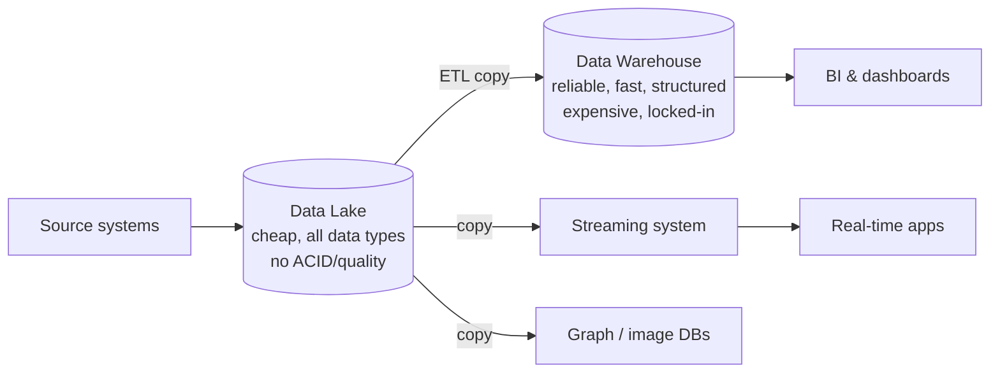
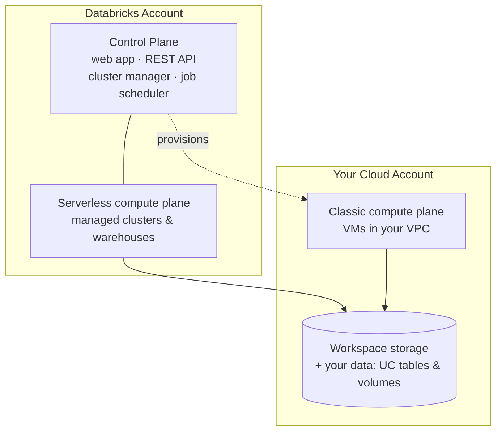

# Chapter 1: From Data Warehouse to the Databricks Lakehouse

> **Sources:** Lakehouse (Armbrust et al., CIDR 2021) · What Is a Lakehouse? (Databricks, 2020) · The Data Lakehouse For Dummies Ch 1–2 (2026) · DCDE-SG Ch 1 (2025) · Databricks high-level architecture docs · DA-FREE M1 Workspace Walkthrough
> **Added:** 2026-06-11 · **Restructured:** 2026-06-20

## What you'll learn

- Why analytics evolved through **data warehouses → data lakes → the lakehouse**, and what problem each step solved
- How **Delta Lake** turns a cheap data lake into a transactional lakehouse
- What **Databricks** is — the Data Intelligence Platform — and how its surfaces map to the lakehouse
- The **Databricks architecture**: account, workspace, Unity Catalog metastore, and the control-plane / compute-plane split
- How to navigate the **workspace**, pick the right **compute**, and run code via notebooks, VS Code, and the CLI

## Introduction

Every data platform decision in this book traces back to one question: *where does the data live, and how many copies of it do you have to operate?* For two decades the answer forced a painful trade-off — a cheap, flexible **data lake** that couldn't be trusted, or a reliable, fast **data warehouse** that was expensive and rigid. Most companies ran both, copied data between them constantly, and paid for the privilege in staleness, cost, and fractured governance.

The **lakehouse** is the architecture that collapses that trade-off into one system holding one copy of the data. Databricks is the platform that commercialised it. This chapter builds the idea from the ground up — the evolution that motivated it, the Delta Lake table format that makes it real, and the Databricks architecture that delivers it — before touring the workspace you'll actually click in.

---

## 1. The evolution of data analytics

### 1.1 The data warehouse era — reliable but rigid

Data warehouses have powered decision support and BI since the late 1980s. Massively parallel processing (MPP) let them scale, and they excel at one thing: **structured data served fast and reliably**. ACID transactions, schema enforcement, governance, and mature SQL/BI tooling all came built in. Data was loaded **schema-on-write** — validated and structured *as it lands*, optimised for downstream BI ([Lakehouse CIDR 2021](../sources/databricks-papers/lakehouse-cidr-2021.md)). The CIDR paper calls this the **first generation** of data analytics platforms.

Their limits showed as data changed shape. Warehouses are **not suited — and not cost-efficient — for unstructured and semi-structured data** (text, JSON, images, audio, video) arriving at high variety, velocity, and volume. Storage and compute are coupled, so scaling one means paying for both. And proprietary formats mean **vendor lock-in**: your data is only readable by the warehouse that owns it.

On the data & AI maturity curve, the warehouse sits at the **descriptive** stage — *what happened* (historical sales, logs, canned reports).

### 1.2 The data lake era — cheap and flexible but untrustworthy

Around the early 2010s — starting with Hadoop/HDFS, then cheap cloud **object storage** (S3, ADLS, GCS) — a new pattern became possible: dump raw data of any type into a **data lake** in open formats, store first and structure later. This is **schema-on-read** — structure is applied at query time, not at load. Lakes nailed the warehouse's two weaknesses — they're inexpensive, and they hold any data type — which pushed organisations into the **predictive** stage of the maturity curve (*what may happen*: data science, ML on unstructured data). The CIDR paper calls this the **second generation**.

But a bare lake gives up everything that made the warehouse trustworthy:

- **No transactions (no ACID)** — concurrent appends and reads, or mixing batch and streaming, are "almost impossible" to do safely.
- **No schema enforcement** — nothing stops bad data landing; quality rots over time.
- **No isolation or consistency** — a failed job can leave half-written, corrupt output.

The result: many data-lake promises never materialised, and in chasing flexibility companies *lost* the reliability of the warehouse. A lake without guarantees is often called a **data swamp**.

### 1.3 The two-tier tax

Because neither system alone was enough, the industry's de-facto architecture became **both, wired together**: a data lake for cheap storage and ML, feeding one or more data warehouses for BI, plus specialised systems for streaming, time-series, graph, and image data. The CIDR paper calls this the **two-tier architecture** and notes it became dominant — *"used at virtually all Fortune 500 enterprises."*



Every arrow is a copy. The Lakehouse paper pins down exactly **four problems** this causes — much of it *accidental complexity* from how the platforms are wired, not anything intrinsic to the work:

- **Reliability** — keeping lake and warehouse consistent needs continuous, bug-prone ETL; the two systems differ in data types, SQL dialects, and schemas.
- **Data staleness** — the warehouse lags the lake by hours or days; a cited survey found **86% of analysts work with out-of-date data**.
- **Limited advanced-analytics support** — TensorFlow/PyTorch/XGBoost can't run efficiently over a warehouse via ODBC/JDBC; exporting to files adds a *third* ETL hop.
- **Total cost of ownership** — you pay **double storage** for the copied data, plus proprietary-format **lock-in** that makes migration costly.

This duplication — paying to move and re-store the same data across systems — is the **two-tier tax** the lakehouse exists to kill.

### 1.4 The lakehouse — one system, one copy

A **lakehouse** is *"a new, open architecture that combines the best elements of data lakes and data warehouses … implementing similar data structures and data management features to those in a data warehouse directly on top of low-cost cloud storage in open formats"* ([Databricks, 2020](../sources/databricks-blog/what-is-a-lakehouse.md)). The authors framed it as **"what you would get if you had to redesign data warehouses in the modern world,"** now that cheap, reliable object stores exist.

The payoff is consolidation: **one system, one copy** of the data serving SQL/BI, data science, ML, and streaming — covering the *whole* maturity curve (descriptive → predictive → **prescriptive** → **GenAI on proprietary data**) on a single architecture, instead of a different system at each stage.

Eight features define a lakehouse — and the rest of this book is largely the story of how Databricks delivers each one:

| # | Lakehouse feature | Where Databricks delivers it |
|---|---|---|
| 1 | Transaction support (ACID) | Delta Lake — *Ch 5* |
| 2 | Schema enforcement & governance | Delta Lake + Unity Catalog — *Ch 5, 14* |
| 3 | BI on source data (no second copy) | Databricks SQL + Photon — *Ch 15, 23* |
| 4 | Storage decoupled from compute | Compute model — *this chapter* |
| 5 | Openness (open formats + APIs) | Parquet / Delta, UniForm — *Ch 5, 22* |
| 6 | Diverse data types | Unity Catalog volumes, unstructured data — *Ch 14* |
| 7 | Diverse workloads (ETL, SQL, DS, ML) | One platform — *whole book* |
| 8 | End-to-end streaming | Structured Streaming, Lakeflow — *Ch 9, 10* |

Two of these properties do the heavy lifting and are worth fixing early:

- **Decoupled storage & compute** (feature 4) — storage (cheap object store) and compute (clusters/warehouses) scale independently, so you pay for one without the other. This is what lets one copy serve many concurrent workloads *at lake economics*.
- **Openness → no lock-in** (feature 5) — data stays in open formats (Parquet under Delta/Iceberg) readable by any engine. *Lock-in* = dependence on one vendor so switching is prohibitively costly (license fees, forced data copies, custom integration code); open formats are the escape hatch.

> 💡 **The data & AI maturity curve** ([Lakehouse-Dummies Ch 2](../sources/lakehouse-dummies/02-explaining-lakehouses.md)) places the lakehouse cleanly: organisations climb **descriptive** (DB/DW) → **predictive** (lakes) → **prescriptive** → **GenAI on proprietary data**. Legacy stacks force a different system at each stage; the lakehouse covers the whole curve on one architecture.

> 📎 Primary source: [What Is a Lakehouse? (Databricks, 2020)](../sources/databricks-blog/what-is-a-lakehouse.md) — the post that named the architecture. The same warehouse→lake→lakehouse case is retold for a business audience in [Lakehouse-Dummies Ch 1–2](../sources/lakehouse-dummies/01-making-the-case.md).

---

## 2. Delta Lake — the engine of the lakehouse

An architecture diagram doesn't enforce ACID — a **table format** does. The lakehouse only became real when an open format learned to put warehouse guarantees on top of object-store files. On Databricks that format is **Delta Lake**.

A plain data lake stores bare **Parquet** files in a folder. Readers see whatever files happen to be there — including half-written ones from a job still running. Delta Lake wraps those same Parquet files with a **transaction log** (the `_delta_log/` directory): an ordered record of every commit. Readers consult the log to see *exactly* which files belong to the table at a given version, and writers commit atomically by appending to the log. The Lakehouse paper names this general idea a **transactional metadata layer** — a layer over object-store files that tracks which objects form a table version. Delta Lake, Apache **Iceberg** (Netflix), and Apache **Hudi** (Uber) are the three leading implementations, all descending from Apache Hive ACID.

That one mechanism delivers the lakehouse's hardest features directly on cheap storage:

- **ACID transactions** (feature 1) — a commit is all-or-nothing; concurrent readers never see a partial write. Batch and streaming can write to the same table safely.
- **Schema enforcement & evolution** (feature 2) — writes that don't match the schema are rejected; schema changes are explicit and versioned.
- **Time travel** — because the log keeps history, you can query the table *as of* an earlier version or timestamp.
- **Incremental data quality** — Delta is designed to let you progressively refine data (raw → cleaned → curated) until it's fit for consumption — the foundation of the medallion architecture in *Ch 7*.

Delta is **open** (a Linux Foundation project, Parquet underneath) so it isn't a lock-in trap. And via **Delta UniForm** the same table can be read as Apache **Iceberg** or Hudi, so external engines interoperate without copies (*Ch 22*). Apache Iceberg is a fully supported alternative table format on Databricks; the principles are the same.

This is the "**Delta lakehouse**": the lakehouse architecture made concrete by the Delta table format. Chapters 5 and 12 go deep on the transaction log, `OPTIMIZE`, `MERGE`, time travel, and CDC. For now, hold one idea: **Delta Lake is what turns a folder of files into a table you can trust.**

> 💡 **The deliberate trade-off:** a classic warehouse hides its storage format so it can optimise freely (*data independence*). A lakehouse **gives that up on purpose** — the open format becomes part of the public API so ML and analytics engines can read it directly. The [Lakehouse paper](../sources/databricks-papers/lakehouse-cidr-2021.md) shows the lost performance is won back with format-independent optimisations (caching, data-skipping statistics, data layout) — and proves it on **TPC-DS**, where the Databricks **Delta Engine** matched or beat four cloud warehouses at lower cost. Delta Engine is the direct ancestor of **Photon** (§6.3).

> 📌 The **Databricks Runtime (DBR)** ships Spark + Delta Lake pre-installed, so every table you create on Databricks is a Delta table by default.

---

## 3. Databricks: the Data Intelligence Platform

**Databricks** is the unified platform built on the lakehouse, founded by the original creators of Apache Spark. Its current name is the **Data Intelligence Platform (DIP)** — the lakehouse *plus* an AI layer that learns your organisation's semantics (table/column descriptions, metrics, jargon, usage, human feedback) so search, BI, and agents understand *your* business, not just generic SQL ([DIP-Dummies Ch 1, 3](../sources/dip-dummies/ch03-databricks-platform.md)).

You don't need every surface for data engineering, but knowing the map stops you reaching for the wrong tool. The platform is a stack of surfaces over one governed copy of data:

| Layer | Surface | What it is | In this book |
|---|---|---|---|
| **Storage** | Open Data Lake | One copy in open formats — **Delta Lake** or **Apache Iceberg** | Ch 5, 12, 22 |
| **Governance** | **Unity Catalog (UC)** | One governance layer for data *and* AI: `catalog.schema.object`, ACLs, lineage, semantics | Ch 14 |
| **Engineering** | **Lakeflow** | Declarative ETL: **Connect** (ingest), **Spark Declarative Pipelines** (transform), **Jobs** (orchestrate) | Ch 8, 10, 13, 18 |
| **Analytics** | **Databricks SQL** + **Photon** | Serverless data warehouse for ETL + BI on governed data | Ch 15, 23 |
| **OLTP** | **Lakebase** | Serverless Postgres transactional DB for the agentic era. June 2026's **LTAP** (Lake Transactional/Analytical Processing) unifies it with the lakehouse on one storage copy + one governance model | awareness only |
| **AI/agents** | **Agent Bricks** | Build/evaluate/govern composable AI agents on your data | awareness only |
| **Self-serve BI** | **AI/BI Genie / Dashboards** | NL chatbot over your data (Genie) + self-serve dashboards | Ch 15 (Genie) |
| **Apps** | **Databricks Apps** | Deploy data/AI apps on serverless compute, governed by UC | awareness only |
| **Sharing** | **OpenSharing**, **Marketplace**, **Clean Rooms**, **Lakehouse Federation** | Share live data / query external sources with zero copy | Ch 22 |
| **Assist** | **Databricks Assistant** | Context-aware AI in notebooks/SQL editor — generate, document, debug | *this chapter* |

> 💡 The through-line is **Unity Catalog** — every surface above governs through it. *"Learn UC once, it secures everything else"* is the single highest-leverage idea in the platform. The newer AI surfaces (Lakebase, Agent Bricks, Apps) are out of scope for a data-engineering path but appear here so you recognise them; this book stays on the **storage → governance → engineering → analytics** spine.

---

## 4. Databricks architecture

Underneath the surfaces, every Databricks deployment is organised the same way: an **account** at the top, **workspaces** where work happens, **Unity Catalog metastores** governing the data, and a **control plane / compute plane** split that determines where your data is processed.

> 📎 Primary source: [Databricks high-level architecture](../sources/databricks-docs/high-level-architecture.md) (docs).

### 4.1 The object hierarchy: account → workspace → metastore

A **Databricks account** is the top-level construct for managing Databricks across your organisation. At the account level you manage:

- **Identity & access** — users, groups, service principals, SCIM provisioning, SSO
- **Workspace management** — create/update/delete workspaces across regions
- **Unity Catalog metastore management** — create metastores and attach them to workspaces
- **Usage management** — billing, compliance, policies

One account can hold **many workspaces and many metastores**.

- **Workspaces** are the collaboration environment where users run compute workloads — ingestion, interactive exploration, scheduled jobs, ML training.
- **Unity Catalog metastores** are the central governance system for data assets (tables, ML models), organised under the three-level namespace **`<catalog>.<schema>.<object>`**. A single metastore can attach to multiple workspaces *in the same region*, giving each the same data view with access controls managed across all of them.

### 4.2 Control plane vs compute plane

Databricks operates out of a **control plane** and a **compute plane**:

- **Control plane** — the backend services Databricks manages: the web application, REST API, cluster manager, job scheduler, notebooks store. It lives in the **Databricks account, not your cloud account**.
- **Compute plane** — where your data is actually processed. Two kinds:
    - **Serverless compute plane** — runs in the **Databricks account** (in the same cloud region as your workspace). Databricks manages the infrastructure; you pay per second of use.
    - **Classic compute plane** — runs in **your own cloud account**, inside each workspace's virtual network. It has natural isolation because it's your account; you manage the VMs.



> ⚠️ The "your data stays in your cloud account" guarantee is strongest for **classic** compute. **Serverless** compute runs in a Databricks-managed plane, within a per-workspace network boundary with multiple isolation layers. DCDE-SG's #1 exam fact — *"customer data lives in the compute plane, not the control plane"* — assumes classic compute. (Older docs and courses call the compute plane the **data plane**; same thing, renamed.)

### 4.3 Workspace storage

Each workspace also keeps **workspace storage**, which is **separate from your own data objects** (UC tables and volumes). It holds two categories:

- **Workspace file-system data** — assets you create in the UI: notebooks, SQL queries, dashboards, alerts, Git folders, libraries (`.whl`, `.jar`), small config files.
- **Workspace system data** — generated internally by Databricks features: query/job results, notebook revisions, query plans for observability, cluster logs.

How it's stored depends on workspace type:

- **Serverless workspaces** use **default storage** — a fully managed location for system data *and* UC data assets; they can also connect to your own cloud storage.
- **Classic workspaces** get **three cloud buckets** in your account: one for system data, one for the (legacy, often disabled) **DBFS root**, and — if auto-enabled for UC — one for the default workspace catalog.

> ⚠️ **Never delete or modify classic workspace storage.** A workspace depends on both its control-plane databases and its workspace storage; if the storage is deleted, **the workspace cannot be recovered.**

> 📌 **DBFS is legacy.** DBFS root and mounts (the `dbfs:/` namespace) are a **deprecated** pattern. New workspaces are Unity Catalog–only; use **UC Volumes** (`/Volumes/<catalog>/<schema>/<volume>/`) for file storage. The read-only `/databricks-datasets/` sample path still works.

---

## 5. Navigating the workspace

The workspace UI is your window into the control plane. The left sidebar groups activities:

```
+ New             → create any asset (notebook, job, cluster, warehouse…)
Workspace         → file browser for notebooks and folders
Catalog           → Unity Catalog browser (tables, volumes, functions, models)
Jobs & Pipelines  → Lakeflow Jobs and Declarative Pipelines
Compute           → clusters, SQL Warehouses, pools, policies
SQL               → SQL Editor, Dashboards, Genie
Data Engineering  → Runs, Data Ingestion
```

The **top bar** has AI-powered **Search** (natural language across tables, notebooks, dashboards), a workspace switcher, the **Databricks Assistant** (UC-aware AI for generate/explain/debug), and profile/settings.

The **Catalog Explorer** browses the Unity Catalog hierarchy — inspect schemas, manage permissions, and view lineage without writing SQL. Unity Catalog gets a full chapter (*Ch 14*); for now the key fact is that **every table, view, function, model, and volume lives in `catalog.schema.object`**.

The **Workspace browser** is a hierarchical file tree: **Home** (your personal area), **Workspace** root (all users' homes under `Users/`), **Trash** (deleted items kept 30 days). **Repos** is the legacy Git UI — replaced by **Git folders** (§8.3).

---

## 6. Compute on Databricks

Compute is where code runs. Picking the right type is the first cost and performance decision you make.

> 📌 **On Free Edition, all compute is serverless** — there's no cluster creation, no GPU, and no custom compute ([Free Edition limitations](https://docs.databricks.com/aws/en/getting-started/free-edition-limitations)). The classic-cluster types and access modes below are **conceptual for a Free Edition learner** and apply to paid workspaces; you can still do every hands-on exercise in this chapter on serverless.

| Type | Use case | Billing |
|------|----------|---------|
| **All-Purpose** | Interactive notebooks, EDA | All-Purpose DBU rate (highest) |
| **Job Compute** | Scheduled jobs | Job DBU rate (~70% cheaper) |
| **SQL Warehouse** | SQL Editor, dashboards, BI | SQL DBU rate |
| **Serverless** | Notebooks, jobs, SQL | Per-second, fully managed |
| **Vector Search** | Embedding-index queries | Dedicated DBU |

A cluster is a **driver** node (orchestrates) plus **worker** nodes (execute tasks in parallel). **DBU** (Databricks Unit) is the billing unit — processing capacity per hour. **Autoscaling** (min/max workers) and **auto-termination** (shut down after N idle minutes) control cost.

The key modern default: **Serverless compute is the default** for notebooks on current workspaces. You attach immediately — no cluster startup wait — and pay only for the seconds you use.

### 6.1 Classic cluster access modes

Every classic (non-serverless) cluster has an **access mode** controlling isolation and feature availability — one of the most exam-tested distinctions:

| Access mode | Users | RDD | GPU | Spark config override | Lakeguard | Best for |
|---|---|---|---|---|---|---|
| **Standard** | Multi-user | ❌ | ❌ | ❌ (blocked) | ✅ enforced | Data engineering, SQL, most ETL |
| **Dedicated** | Single user/group | ✅ | ✅ | ✅ | ❌ | ML, GPU, RDD-dependent code |
| **No Isolation Shared** | Multi-user | ✅ | ❌ | Limited | ❌ | Dev/test only; not for production |

- **Standard** (formerly "Shared") uses **Spark Connect** — each user's code runs in an isolated server process. **Lakeguard** enforces the isolation: users can't read each other's in-memory DataFrames or `SparkContext`, can't override cluster Spark config, and can't use RDD APIs. Automatic per-user isolation with no teardown.
- **Dedicated** (formerly "Single User") gives one user (or group) full Spark access — `SparkContext`, `RDD`, GPU kernels, arbitrary config. Required for RDD-API code or GPU ML libraries.

> ⚠️ **Standard/Dedicated is the current (2025+) terminology.** Older docs, courses, and the DCDE-SG book say "Shared" and "Single User" — same modes, renamed. The Terraform API (`data_security_mode`) still uses the string values `USER_ISOLATION` (Standard) and `SINGLE_USER` (Dedicated).

### 6.2 SQL Warehouse types

SQL Warehouses power the SQL Editor, dashboards, and BI connections:

| Type | Cold start | Management | Best for |
|---|---|---|---|
| **Serverless** | ~1–3 sec | Fully managed | Interactive SQL, dashboards, most cases |
| **Pro** | ~2–4 min | Self-managed | DBSQL + Lakeflow Pipelines as a source |
| **Classic** | ~2–4 min | Self-managed | Legacy BI compatibility, fixed config |

Serverless SQL Warehouses always run on Photon. **Pro** is required when a SQL Warehouse is the source for a Lakeflow Spark Declarative Pipeline materialized view.

### 6.3 Photon

**Photon** is a C++ vectorised query engine that replaces JVM-based Spark execution for SQL and DataFrame operations. Enabled at the cluster level, it speeds up aggregations, sorts, and joins — but does **not** accelerate Python UDFs, which still run on the JVM/Python interpreter. It's available on classic clusters and SQL Warehouses (always on for Serverless SQL). Photon is the productised descendant of the **Delta Engine** that carried the [Lakehouse paper's](../sources/databricks-papers/lakehouse-cidr-2021.md) TPC-DS performance results (§2) — the proof that an open-format lakehouse can match a closed warehouse. *Ch 23* covers internals and cost trade-offs.

### 6.4 Compute pools

**Compute pools** (instance pools) are a fleet of pre-warmed cloud instances clusters draw from, eliminating cold-start: a cluster borrows pre-allocated VMs and starts in seconds instead of minutes. Useful for many short-lived clusters (CI runs) or tight SLAs. Note: Databricks doesn't charge for idle pool VMs, **but your cloud provider does** — they're real running machines. Optional infrastructure most teams add after hitting cold-start friction.

---

## 7. Working with notebooks

### 7.0 Your first notebook

Before the mechanics, run something. In a new workspace: **+ New → Notebook**, click **Connect → Serverless**, then run one cell:

```python
spark.range(10).display()
```

`spark` is already there (§8.1 explains why), `display()` renders a sortable, chartable table, and Serverless attached in seconds with no cluster to configure. That round trip — write, attach, run — is the whole inner loop; everything below refines it.

A Databricks notebook has four cell types: **Code** (Python, SQL, Scala, or R), **Markdown** (`%md` — headers populate the notebook's table of contents), **Result** (output below each code cell), and **Visualization** (inline chart). Switch a single cell's language with the `%python`, `%sql`, `%scala`, or `%r` magic.

Other everyday magics: **`%run`** (execute another notebook inline; §7.3) and **`%fs`** (quick file-system ops, e.g. `%fs ls /databricks-datasets`). `dbutils` is the richer programmatic equivalent — `dbutils.fs.ls(...)` returns a list you can store and loop over; `display(x)` renders it as a sortable, chartable table (`print(x)` doesn't).

> ⚠️ Calling `dbutils.fs.ls(...)` in a **SQL** cell raises a syntax error — the cell runs as SQL. Prefix the cell with `%python`. (A classic exam trap.)

### 7.1 Setting the default catalog and schema

Avoid typing fully-qualified names on every query:

```sql
USE CATALOG my_catalog;
USE SCHEMA my_schema;

-- Now unqualified names resolve to my_catalog.my_schema
SELECT * FROM my_table;
```

```python
spark.catalog.setCurrentCatalog("my_catalog")
spark.catalog.setCurrentDatabase("my_schema")
```

Confirm with `SELECT current_catalog(), current_schema()` at the start of a notebook — creating tables in the wrong place is a common slip.

### 7.2 Databricks widgets — parameterising notebooks

Widgets add input controls and let jobs or `%run` calls pass parameters. Four types: `text`, `dropdown`, `combobox`, `multiselect`.

```python
# Create a dropdown (default CA; choices CA, IL, MI, NY)
dbutils.widgets.dropdown("state", "CA", ["CA", "IL", "MI", "NY"])

# Read the value anywhere
state = dbutils.widgets.get("state")

# SQL — use parameter markers (DBR 15.2+; protects against injection)
# SELECT * FROM orders WHERE state = :state
```

Widgets accept **string values only**. In SQL cells use parameter markers (`:name`), not string interpolation, to prevent injection.

> ⚠️ Default on-change behaviour is **"Run Accessed Commands"** — it reruns only cells that call `dbutils.widgets.get()`; **SQL cells are not rerun**. Switch to "Run Notebook" if SQL cells must refresh on change.

For rich interactive Python controls (sliders, buttons), use **ipywidgets** — but ipywidgets **cannot** pass values to jobs or between notebooks; use Databricks widgets for that.

### 7.3 Sharing code: `%run` vs workspace files

- **Workspace files** (recommended): store functions in a `.py` file and `import` it like any Python module (DBR 11.3 LTS+). Importable, testable, version-controllable.
- **`%run ./path`**: includes another notebook inline — its functions and variables enter the caller's scope. Must be alone in its cell.

```python
%run ./utils/transforms
# everything defined in transforms is now in scope
result = my_transform_function(df)
```

For separate execution with parameter passing and return values, use `dbutils.notebook.run()` — but prefer **Lakeflow Jobs** for any production scheduling. Rule: **`%run` merges scopes; `dbutils.notebook.run()` starts a separate job.**

> ⚠️ **Never schedule a production job with the notebook's schedule button** — it targets the latest *working* copy (unsaved edits included). Schedule a **Lakeflow Job** against the committed version in a Git folder instead.

### 7.4 Interactive debugger

The built-in Python debugger (DBR 14.3 LTS+ on Standard; 13.3 LTS+ on Dedicated; Serverless) sets breakpoints, steps through code, and inspects variables live. Enable: **Settings → Developer → Python Notebook Interactive Debugger**. Start with **Run → Debug cell** (`Alt+Shift+D`); the **Variable Explorer** (right) shows in-scope values, the **Debug Console** (bottom) runs Python in the current frame.

> ⚠️ Debug sessions auto-terminate after **30 min** idle; the console has a **15-second** per-execution timeout and doesn't support `display()`.

---

## 8. Running code on Databricks

### 8.1 Porting a local notebook

A notebook written for a local Spark install needs three changes before it runs on Databricks ([worked example: `notebooks/intro.ipynb`](../../notebooks/intro.ipynb)):

**1 — Remove the `SparkSession` block.** Databricks pre-creates `spark` in every notebook. Delete any `SparkSession.builder` block and local-only setup (`os.environ["SPARK_LOCAL_IP"]`, log4j paths, custom UI ports).

**2 — Fix local file paths.** Local paths don't exist on a cluster. Use a **UC Volume** (recommended — persists, works on all compute):

```python
spark.sql("CREATE CATALOG IF NOT EXISTS learning")
spark.sql("CREATE SCHEMA IF NOT EXISTS learning.chap1")
spark.sql("CREATE VOLUME IF NOT EXISTS learning.chap1.intro")

import urllib.request
urllib.request.urlretrieve(
    "https://www.gutenberg.org/files/1342/1342-0.txt",
    "/Volumes/learning/chap1/intro/1342-0.txt",
)

book = spark.read.text("/Volumes/learning/chap1/intro/1342-0.txt")
```

The `/Volumes/<catalog>/<schema>/<volume>/` path works directly in `spark.read` with no URI prefix. Avoid `file:/tmp/` — Databricks restricts local-filesystem access to `/Workspace` paths and raises `LocalFilesystemAccessDeniedException`.

**3 — Remove `spark.stop()`.** It kills the shared cluster context for *every* user attached. Databricks manages the lifecycle; never stop Spark manually.

Import via the UI (**Workspace → ⋮ → Import → choose `.ipynb`**) or the CLI (§8.3). Then **Connect → Serverless** (or an All-Purpose cluster) → **Run all**.

### 8.2 Beyond the UI: VS Code and the CLI

You don't have to live in the browser. Two local paths matter for now; both authenticate against a profile in `~/.databrickscfg`. A dedicated tooling chapter covers DABs and CI/CD later (*Ch 20, 25*).

**VS Code** — the **Databricks extension** runs notebooks on your workspace from a local folder. Click the Databricks icon → **Create configuration** → pick a workspace and compute. Two modes: **Interactive** (Databricks Connect — Spark runs on remote compute, the rest locally; works on Serverless or a classic cluster) and **Run as Job** (submits the notebook as a Lakeflow Job run).

**CLI** — the current CLI is the Go binary from [github.com/databricks/cli](https://github.com/databricks/cli) (**not** the legacy `databricks-cli` pip package). Install, authenticate with OAuth, and you can script workspace operations:

```bash
winget install Databricks.DatabricksCLI                       # Windows; brew on macOS/Linux
databricks auth login --host https://<workspace>.cloud.databricks.com
databricks workspace import /Users/you@example.com/intro \
  --file notebooks/intro.ipynb --format JUPYTER --overwrite
```

Each `auth login` saves a named profile; pass `-p <profile>` to target one. Workspace URLs differ by cloud — `*.cloud.databricks.com` (AWS), `*.azuredatabricks.net` (Azure), `*.gcp.databricks.com` (GCP).

> 📌 **Databricks Free Edition** runs on AWS (sign up at `login.databricks.com`); serverless, no cloud account needed. **Community Edition retired January 1, 2026.**

### 8.3 Git folders

**Git folders** (formerly Repos) bring real Git into the workspace. Create via **+ New → Git folder → paste repo URL**. Public repos clone with no auth; private repos/push need a linked provider (**Settings → Linked accounts**; prefer the **Databricks GitHub App** over a PAT). Branch, commit, and push from the Git dialog — but **pull requests happen on the provider** (GitHub/GitLab), not in Databricks. Built-in notebook version history exists but has no branching and can be deleted by users — use Git folders for anything serious.

---

## Exercises

1. **Recall** — Trace the warehouse → lake → lakehouse evolution: what did each step solve, and what did it give up?
2. **Locate the planes** — For each of these, say whether it runs in the **control plane** or the **compute plane**, and whose cloud account it lives in: (a) the workspace web UI, (b) a query in a serverless notebook, (c) a classic job cluster running ETL.
3. **Apply** — Open a workspace, create a notebook, attach Serverless, run `SELECT current_catalog(), current_schema()`, then change the schema with `USE SCHEMA`.

## Summary

- Analytics evolved **warehouse → lake → lakehouse**: warehouses were reliable but rigid and locked-in; lakes were cheap and flexible but had no ACID, schema, or isolation; the lakehouse unifies both as **one system, one copy**.
- The **two-tier tax** — copying data between lake, warehouses, and specialised systems — is the cost the lakehouse exists to kill.
- **Eight features** define a lakehouse; the load-bearing two are **decoupled storage/compute** (lake economics for many workloads) and **openness** (no lock-in).
- **Delta Lake** makes the lakehouse real: a **transaction log** over Parquet delivers ACID, schema enforcement, time travel, and incremental quality — *"turns a folder of files into a table you can trust."*
- **Databricks** is the lakehouse platform — the **Data Intelligence Platform** — with **Unity Catalog** as the governance through-line across every surface.
- **Architecture**: account → workspace → UC metastore (`catalog.schema.object`); **control plane** (Databricks-managed) vs **compute plane** — formerly "data plane" — (serverless in Databricks' account, classic in yours). Workspace storage ≠ your data; never delete classic workspace storage.
- **Compute**: All-Purpose vs Job vs SQL Warehouse vs **Serverless** (the modern default); classic clusters have a **Standard** vs **Dedicated** access mode (formerly Shared/Single User).
- **Notebooks** integrate widgets, `%run`/workspace files, and a debugger; run code via the UI, **VS Code** (Databricks Connect), or the **CLI**. **Git folders** replace legacy Repos.

## References

- [Lakehouse: A New Generation of Open Platforms… — Armbrust, Ghodsi, Xin, Zaharia, CIDR 2021](../sources/databricks-papers/lakehouse-cidr-2021.md) — the peer-reviewed paper: three platform generations, the four two-tier problems, the transactional-metadata-layer design, and TPC-DS results proving feasibility.
- [What Is a Lakehouse? — Databricks blog (2020)](../sources/databricks-blog/what-is-a-lakehouse.md) — general-audience companion to the paper; the lakehouse architecture and its eight features.
- [The Data Lakehouse For Dummies — Ch 1–2 (Kaplan & Kara, 2026)](../sources/lakehouse-dummies/01-making-the-case.md) — warehouse→lake→lakehouse case, the data & AI maturity curve, decoupled storage/compute, lock-in.
- [Databricks high-level architecture (docs)](../sources/databricks-docs/high-level-architecture.md) — account/workspace/metastore hierarchy and the control-plane / compute-plane split.
- [DCDE-SG Ch 1 — Getting Started with Databricks (Alhussein, 2025)](../sources/dcde-sg/ch01-getting-started-with-databricks.md) — certification-angle framing of the same architecture, clusters, and workspace tour.

The next chapter goes one layer down — **Apache Spark's execution model** (drivers, executors, DAGs, stages, and tasks) and how Databricks extends it with AQE and Photon.
