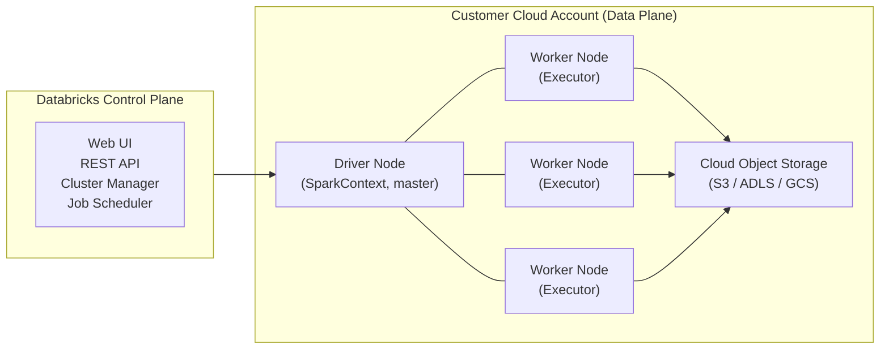
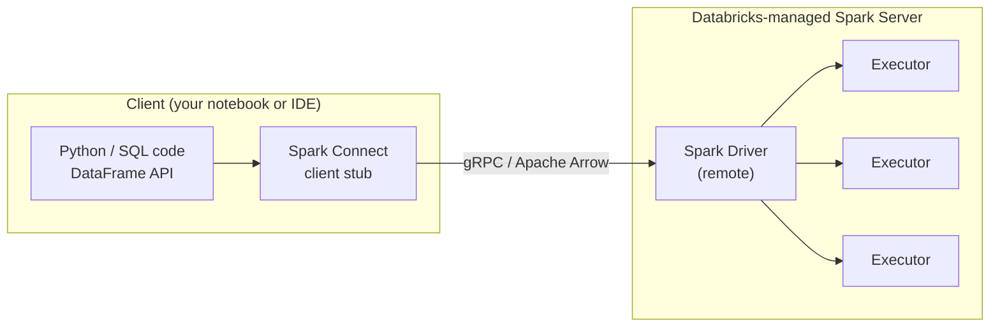
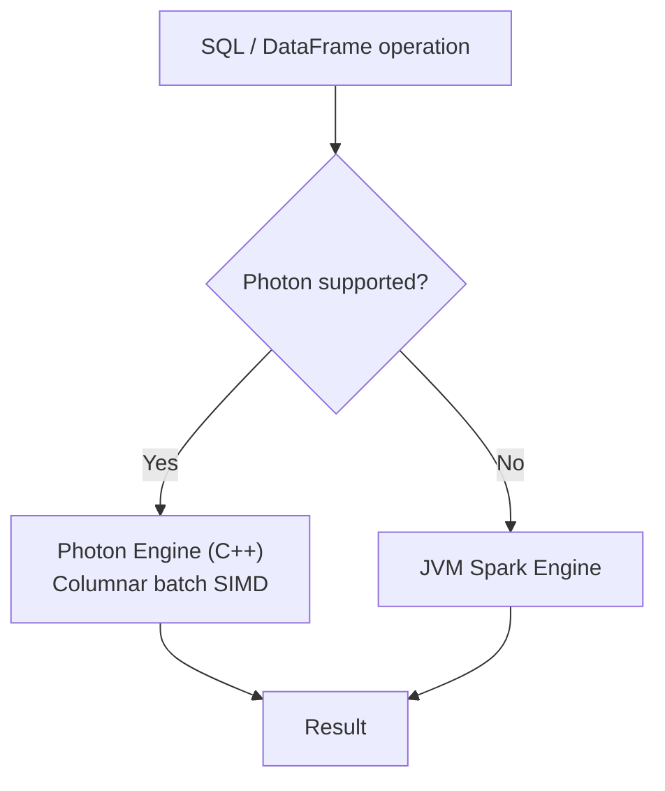

# Ch 02 — Apache Spark Architecture on Databricks

## Why this chapter matters

A data engineer on a tight deadline runs a job that worked fine in testing — 10 million rows, five minutes. In production, the same logic on 2 billion rows runs for six hours and then fails with:

```
ExecutorLostFailure (executor 4 exited caused by one of the running tasks)
Reason: Remote RPC client disassociated.
```

No one reads the error message carefully. They double the cluster, re-run, and get the same failure. The real problem — a window function without a `PARTITION BY` clause loading the entire dataset into one executor's memory — takes another two days to find.

Every performance problem, OOM error, and stuck job in Spark traces back to the execution model. Once you can visualise what happens between `df.count()` and a result appearing, you can read the Spark UI like a diagnostic report instead of an alien artefact.

## Learning outcomes

After this chapter you will be able to:

- Trace a Spark action from DAG through jobs, stages, and tasks to executor results
- Explain how Databricks layers classic compute and serverless compute on top of Spark
- Describe what Spark Connect changes about the driver/executor boundary on serverless
- Understand AQE's four runtime optimisations and their defaults on Databricks
- Know where Photon replaces the JVM Spark engine and where it does not
- Open the Spark UI and identify the DAG, stage list, and task metrics

---

## The Spark execution model

You know this from your Spark studies, but let's state the model precisely before examining how Databricks changes it.

```mermaid
flowchart TD
    A["User code calls an action\n(count, show, write, etc.)"] --> B[SparkContext builds a DAG\nof RDD/DataFrame transformations]
    B --> C[DAGScheduler splits DAG\ninto Stages at shuffle boundaries]
    C --> D1[Stage 1 — n Tasks\nScan + Filter + Project]
    C --> D2[Stage 2 — m Tasks\nAggregate after shuffle]
    D1 -->|shuffle write| E[Shuffle service\n(disk)]
    E -->|shuffle read| D2
    D2 --> F[Driver collects result]
```

**Key invariants:**

| Concept | Rule |
|---|---|
| **Action** | Only actions trigger execution. Transformations are lazy. |
| **Job** | One action = one job. A single cell may trigger multiple actions and therefore multiple jobs. |
| **Stage** | Stages are separated by shuffle operations. Data within a stage flows without network transfer. |
| **Task** | One task = one partition = one CPU core. Task count = partition count. |
| **Partition** | The unit of parallelism. Too few = idle cores. Too many = scheduling overhead. |

**The cost of a shuffle:** When a stage boundary is crossed, each executor writes its output to local disk, and the downstream stage reads across the network. This is the most expensive operation in Spark — wide transformations like `groupBy`, `join`, and `distinct` all cause shuffles.

---

## How Databricks runs Spark

Vanilla Spark gives you a SparkContext and a cluster. Databricks wraps this in a managed platform with specific opinions about compute topology, security modes, and runtime versions.

### Control plane and data plane

(Covered in Ch 01 — quick summary here for continuity.)



The **control plane** (Databricks-managed) handles cluster lifecycle, job scheduling, and the notebook UI. The **data plane** (your cloud account) is where your Spark driver and executors actually run and where your data lives.

**Databricks runs exactly one executor per worker node.** The terms "executor" and "worker" are interchangeable in Databricks documentation. This simplifies the model: cores and memory on a worker are the resources for one executor.

### The driver node

The driver is always on-demand, even when workers use spot/preemptible instances. It:

- Hosts the SparkContext and Spark master
- Interprets notebook commands and library calls
- Builds and submits the DAG to executors
- Collects results from `collect()`, `show()`, `display()`

> **Sizing the driver:** If your code calls `collect()` or `display()` on large DataFrames, the results land in driver memory. Upsize the driver independently of workers in those cases. Detach unused notebooks from the driver — every attached notebook keeps state alive on the driver heap.

### Worker nodes (executors)

Each worker runs one executor. The executor:

- Receives tasks from the driver
- Executes tasks on its local partition(s)
- Writes shuffle output to local disk
- Reads shuffle input from other executors' local disks
- Writes final output to cloud storage

Executor memory is divided between on-heap JVM memory (for task computation) and off-heap storage (for cached DataFrames). When either fills, Spark spills to local disk — which is dramatically slower and often signals a tuning problem.

### Single-node compute

A single-node cluster runs the driver and executor on the same machine. Spark runs in local mode, spawning one executor thread per logical core minus one (reserved for the driver).

- Use for: small datasets, single-node ML libraries, local development
- Cannot be converted to multi-node
- All logs go to the driver log
- **Not suitable for data at scale** — no distributed execution

---

## Compute types on Databricks

Databricks has two broad compute models: **classic compute** (you manage it) and **serverless compute** (Databricks manages it). Each has a different relationship to the Spark execution model.

### Classic compute

Classic compute runs in your cloud account. You choose the instance types, runtime version, autoscaling bounds, and access mode. Three varieties:

| Type | Use case | Lifecycle |
|---|---|---|
| **All-purpose** | Interactive notebooks, development, EDA | Long-lived, manual start/stop |
| **Job clusters** | Production jobs, scheduled pipelines | Ephemeral — created at run start, terminated on completion |
| **Pipeline compute** | Lakeflow Spark Declarative Pipelines | Managed by the pipeline engine |

**The most common mistake:** using an all-purpose cluster for production jobs. All-purpose clusters are expensive because they idle between commands. Job clusters cost less and guarantee a clean environment for each run.

#### Access modes and what they mean for Spark

The access mode controls who can attach to a cluster and what Spark features are available.

| Access mode | Multi-user | RDD APIs | Python UDFs | GPU | R |
|---|---|---|---|---|---|
| **Standard** (formerly Shared) | Yes | No | Yes (sandboxed) | No | No |
| **Dedicated** (formerly Single user) | No* | Yes | Yes | Yes | Yes |

*Dedicated can be assigned to a group (Public Preview), but it is not fully open multi-user like Standard.

**Standard compute** uses **Lakeguard** to isolate each user's code from the underlying Spark infrastructure and from other users. Lakeguard achieves this through Spark Connect (on DBR 13+) combined with container sandboxing. Name resolution of temporary views is deferred to execution time — code that reuses the same temp view name across users will behave differently than on vanilla Spark.

**Dedicated compute** gives a single user full access to the JVM, RDD APIs, and lower-level Spark features. Use it when you need:

- RDD or Dataset APIs
- GPU-accelerated workloads
- R language
- Distributed ML frameworks requiring privileged machine access

**Default access mode (Auto):** Databricks selects Standard unless the ML runtime or DBR < 14.3 is chosen, in which case it selects Dedicated.

#### Autoscaling

Databricks autoscaling adds or removes workers dynamically within a min/max range. Two behaviours depending on your plan:

| Plan | Scale-up | Scale-down |
|---|---|---|
| **Premium (Optimised)** | Max 2 scaling events to reach max | 40 s (job clusters), 150 s (all-purpose); can scale down non-idle clusters by inspecting shuffle file state |
| **Standard** | Adds 8 nodes, then exponential | 90% of nodes idle for 10 min + 30 s idle |

> **Never set `spark.dynamicAllocation.enabled = true` alongside Databricks autoscaling.** They conflict: both try to manage executor count independently, causing executor churn and `NODES_LOST` errors.

Autoscaling is **not available for `spark-submit` jobs** and has limited scale-down ability during Structured Streaming workloads (use enhanced autoscaling via Lakeflow Spark Declarative Pipelines instead).

---

### Serverless compute and Spark Connect

Serverless compute is the biggest architectural shift in how Databricks runs Spark in 2025–2026. On serverless, you do not provision clusters. Databricks manages the compute in its own infrastructure — you see neither driver node configuration nor worker instance types.

Under the hood, serverless uses **Spark Connect** as the execution protocol.

#### What Spark Connect changes

Classic compute has the driver and executor on the same machine (or the same network), tightly coupled to your notebook process. Spark Connect decouples them:



Key differences vs classic compute:

| Behaviour | Classic compute | Serverless (Spark Connect) |
|---|---|---|
| Driver location | Your cloud VPC | Databricks-managed |
| RDD/Dataset API | Available (Dedicated mode) | **Not supported** |
| Temp view resolution | At creation time | **At execution time** (lazy) — can cause errors if you reuse view names |
| `SparkContext` access | Direct | Not available |
| Spark version | Pinned to DBR version | Versionless — Databricks upgrades automatically |
| Startup time | 2–8 min (cold) | 2–6 seconds |

**Versionless Spark:** Serverless notebooks and jobs run on "environment versions" that Databricks upgrades automatically across Spark releases. As of early 2026, Databricks has auto-upgraded over 2 billion workloads without user intervention.

**Practical implication for code:** The vast majority of PySpark DataFrame API and SQL code runs identically on serverless and classic. You hit the limits only when you use `SparkContext` directly, RDD API, or reuse temp view names across cells in the same session with Standard classic compute.

---

## Adaptive Query Execution (AQE)

AQE is **enabled by default on Databricks** (`spark.databricks.optimizer.adaptive.enabled = true`). It re-optimises the query plan at runtime, after each shuffle exchange, using actual row counts and sizes instead of statistics-based estimates.

AQE applies to non-streaming queries that have at least one exchange (join, aggregate, window with shuffle) or sub-query.

### Four AQE capabilities

**1. Dynamic broadcast join conversion**

A sort-merge join requires both sides to be sorted and shuffled. If one side turns out to be ≤ 30 MB at runtime (after shuffle), AQE converts it to a broadcast hash join, eliminating the sort on the larger side.

> Note: static `BROADCAST` hints beat AQE — AQE may shuffle both sides first and then decide to broadcast. If you know a table is small, the hint is faster.

**2. Partition coalescing**

After a shuffle, many partitions may be tiny. AQE merges adjacent small partitions up to a target size (default 64 MB). This reduces task scheduling overhead and improves I/O throughput.

```
spark.sql.adaptive.advisoryPartitionSizeInBytes = 64MB  # target size
spark.sql.adaptive.coalescePartitions.minPartitionSize = 1MB  # floor
```

Setting `spark.sql.shuffle.partitions = auto` (recommended on Databricks) lets AQE manage partition count dynamically rather than using the static default of 200.

**3. Skew join splitting**

A skewed partition has far more data than average, causing one task to run ten times longer than its siblings while the rest of the cluster idles. AQE detects skew and splits (and replicates if needed) skewed partitions automatically.

A partition is considered skewed when **both** conditions are true simultaneously:

```
partition size > 256 MB   (skewedPartitionThresholdInBytes)
partition size > 5× median partition size  (skewedPartitionFactor)
```

If your skew is moderate (3× median), AQE will not trigger — lower `spark.sql.adaptive.skewJoin.skewedPartitionFactor` to catch it.

**4. Empty relation propagation**

If a relation is empty at runtime (e.g., a filter returns zero rows), AQE short-circuits downstream joins and aggregations by replacing the subtree with an empty `LocalTableScan`. This avoids executing expensive joins against empty inputs.

### AQE configuration reference

| Config | Default | When to change |
|---|---|---|
| `spark.databricks.optimizer.adaptive.enabled` | `true` | Never disable; AQE is always beneficial |
| `spark.sql.shuffle.partitions` | `200` | Set to `auto` for adaptive sizing |
| `spark.databricks.adaptive.autoBroadcastJoinThreshold` | `30MB` | Raise if small tables > 30 MB are not being broadcast |
| `spark.sql.adaptive.skewJoin.skewedPartitionFactor` | `5` | Lower if moderate skew not being caught |
| `spark.sql.adaptive.skewJoin.skewedPartitionThresholdInBytes` | `256MB` | Lower if skewed partitions are < 256 MB |

### Reading the AQE plan

`DataFrame.explain()` shows both the initial plan and the current/final plan after AQE runs:

```python
df.explain(mode="formatted")
```

Before execution, all statistics show `isRuntime=false` (compile-time estimates). After each shuffle stage, completed nodes show `isRuntime=true` with actual sizes and row counts. AQE-applied queries have an `AdaptiveSparkPlan` node at the root; `isFinalPlan=true` signals the plan is complete.

| Signal in plan | Meaning |
|---|---|
| `CustomShuffleReader` with `Coalesced` | AQE merged small partitions |
| `SortMergeJoin` with `isSkew=true` | AQE split a skewed partition |
| Physical join changed vs initial plan | AQE converted sort-merge → broadcast hash |
| `LocalTableScan` with empty relation | AQE short-circuited an empty input |

---

## Photon: the C++ execution layer

Photon is Databricks' native vectorised query engine, written in C++, that replaces the JVM-based Spark SQL execution engine for supported operations. It processes data in columnar batches using SIMD instructions, enabling parallel processing across thousands of rows simultaneously.



**Photon is transparent:** a single query can have some stages accelerated by Photon and others running on the JVM Spark engine, with no manual intervention. Unsupported operations silently fall back.

### Where Photon helps and where it does not

| Scenario | Photon benefit |
|---|---|
| Wide-table scans (Delta, Parquet) | High — columnar reads + filter pushdown |
| Hash aggregations and joins | High — replaces sort-merge join with hash join |
| `MERGE INTO`, `UPDATE`, `DELETE` | High — native Parquet writer + dynamic file pruning |
| Sub-2-second queries | None |
| Python UDFs | None — falls back to JVM |
| RDD or Dataset APIs | None — not supported |
| Stateful streaming | None — stateless streaming is supported |

### Enabling Photon

- **Serverless compute and SQL warehouses:** on by default, no toggle
- **Classic compute (DBR 9.1 LTS+):** on by default; toggle in the Compute UI under Performance
- **API (clusters/jobs):** set `runtime_engine: PHOTON`
- **API (pipelines):** set `photon: true`

### Monitoring Photon

In the **Spark UI:** Photon operators appear in **orange** in the query DAG.

In the **Query profile** (SQL warehouses / serverless): Photon operators show in **purple**; standard Spark operators in **grey**.

### Two features that require Photon

- **Predictive IO** — speeds up selective scan operations (available on serverless and Pro warehouses)
- **Dynamic file pruning** — for `MERGE`, `UPDATE`, `DELETE` — data-skipping at the file level during write operations

---

## Reading the Spark UI on Databricks

The Spark UI is your primary diagnostic instrument. This chapter gives you the orientation; Chapter 16 (Spark Performance Tuning) goes deep on the diagnostic workflow.

**Access:** Compute → your cluster → Spark UI tab (available to users with CAN ATTACH TO permission and above).

### The five views you will use

| Tab | What it shows |
|---|---|
| **Jobs** | Every action as a job; duration timeline; failed jobs in red |
| **Stages** | All stages across all jobs; input/output/shuffle sizes; task counts |
| **Storage** | Cached DataFrames and their memory/disk usage |
| **Executors** | Memory, disk, cores, GC time per executor; dead executors |
| **SQL / DataFrame** | Query DAG with time per node (times are cumulative across all tasks) |

### What to look for immediately

**In the Jobs timeline:** gaps > 1 minute between jobs mean the driver is blocked — doing computation, waiting on I/O, or blocked on a Python operation. Long gaps are never "Spark thinking"; they are always something to investigate.

**In the stage list:** sort by Duration. Click the longest stage. Look at:

- **Task count:** if it's 1, you have a parallelism problem (unsplittable file, unbounded window, explicit `coalesce(1)`)
- **Spill statistics:** any value shown = spill. No spill columns = no spill.
- **Skew:** compare Max task duration against 75th-percentile duration. If Max > 1.5× the 75th percentile, you likely have skew.

**In the SQL/DataFrame tab:** times are cumulative (total across all tasks in a node, not wall-clock). A node showing 2 hours of total time in a 10-minute job just means many tasks each spent a few seconds there — not that one operation took 2 hours.

---

## Pitfalls

**One task per stage.** A stage with one task means one CPU is doing all the work while the rest of the cluster idles. Caused by: unbounded window function (missing `PARTITION BY`), unsplittable file format (Gzip), `multiLine=true` on large JSON/CSV, explicit `repartition(1)`/`coalesce(1)`, or schema inference on a large file.

**`collect()` on large DataFrames.** `collect()` pulls the entire dataset to the driver. On large data, this OOMs the driver. Use `show(n)`, `display()`, or write to storage and read a sample.

**All-purpose cluster for production.** All-purpose clusters are billed when running, even when idle. Job clusters provision fresh, run, and terminate — always use them for scheduled production pipelines.

**`spark.dynamicAllocation.enabled = true` with Databricks autoscaling.** These two executor-management systems conflict. Set one or the other, never both. On Databricks, use the platform's autoscaling.

**Ignoring Photon fallbacks.** If a critical operation falls back to JVM (Python UDF in a hot loop, stateful aggregation), the performance gap is large. Check the Spark UI for orange vs grey nodes and restructure code to keep hot paths in Photon.

**Classic `spark.sql.shuffle.partitions = 200` in high-shuffle jobs.** With AQE on, set `spark.sql.shuffle.partitions = auto`. The static default of 200 either under-partitions large shuffles (causing OOM) or over-partitions small ones (scheduling overhead).

---

## Summary

- Spark execution: action → DAG → jobs → stages (split at shuffle boundaries) → tasks (one per partition per core)
- Databricks runs one executor per worker node; driver is always on-demand
- Classic compute: **all-purpose** for development, **job clusters** for production
- Access modes: **Standard** (multi-user, Lakeguard, no RDD) vs **Dedicated** (single user/group, full Spark)
- Serverless compute uses **Spark Connect** — decoupled client-server, no RDD, lazy temp view resolution, versionless Spark, 2–6 s startup
- **AQE is on by default**: dynamic broadcast join conversion, partition coalescing, skew join splitting, empty relation propagation
- Set `spark.sql.shuffle.partitions = auto` to let AQE manage partition sizing
- **Photon** replaces the JVM engine for supported SQL/DataFrame operations; transparent fallback for UDFs, RDD, stateful streaming
- Spark UI: start at Jobs timeline, drill to longest stage, check task count, look for spill and skew

---

## What comes next

Chapter 3 puts the PySpark DataFrame API in your hands — reading data, transformations, aggregations, and joins. The execution model you've just learned explains why certain operations are expensive (shuffle-producing wide transformations) and why the API is designed to keep as much work as possible within a single stage.

---

## References

- [Apache Spark overview — Databricks docs](https://docs.databricks.com/aws/en/spark)
- [Adaptive query execution — Databricks docs](https://docs.databricks.com/aws/en/optimizations/aqe)
- [Compare Spark Connect to Spark Classic — Databricks docs](https://docs.databricks.com/aws/en/spark/connect-vs-classic)
- [Diagnose cost and performance issues using the Spark UI](https://docs.databricks.com/aws/en/optimizations/spark-ui-guide)
- [Photon — Databricks docs](https://docs.databricks.com/aws/en/compute/photon)
- [Classic compute configuration reference](https://docs.databricks.com/aws/en/compute/configure)
