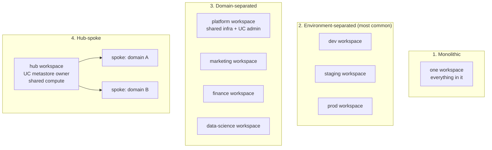
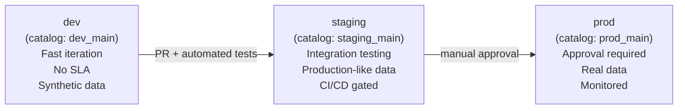
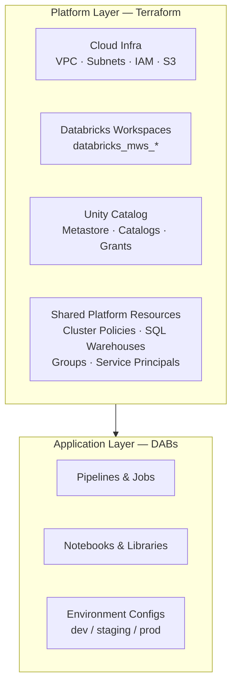
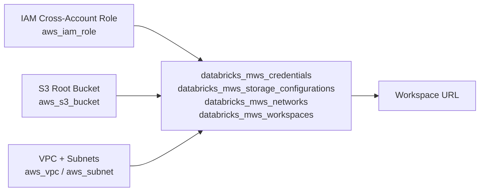
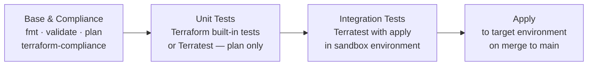
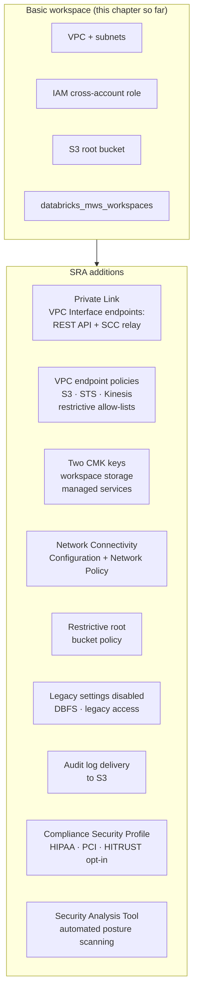

# Chapter 29 — Infrastructure as Code with Terraform

> **Level:** Expert · **Topic code:** E7
>
> **After this chapter you will be able to:**
> - Choose the right workspace topology for your organisation (monolithic, environment-separated, domain-separated, hub-spoke)
> - Design a Unity Catalog namespace that scales — catalog-per-env, catalog-per-domain, or hybrid
> - Apply the correct isolation mechanism — workspace isolation, catalog isolation, row filters, column masking, or dynamic views
> - Separate deployment stages and decide what constitutes a "stage" boundary in a Databricks platform
> - Provision a Databricks workspace on AWS entirely from Terraform using the `databricks_mws_*` resource family
> - Set up Unity Catalog — metastore, catalogs, schemas, and grants — programmatically
> - Organise Terraform code into layered modules with separate state files
> - Drive multi-environment deployments from config rather than copy-pasted HCL
> - Scale with Terragrunt stacks and units
> - Harden a deployment using the Security Reference Architecture (Private Link, CMK, no-public-IP, SAT)
> - Explain exactly which layer of your stack belongs to Terraform versus DABs — and why the boundary matters

---

## Why this matters in production

A team clicks its way through the Databricks UI to stand up workspace number one. The second workspace is mostly right. By workspace ten, nobody is sure whether cluster policies match, whether the Unity Catalog storage credential is pointing at the right S3 bucket, or whether the dev environment has the same group structure as prod. A security audit arrives and the question "what does this workspace actually contain?" has no good answer.

The failure mode is not laziness — it is the natural outcome of treating cloud infrastructure as a set of interactive forms rather than a set of declarations. Terraform fixes this by making the desired state of every Databricks resource explicit, reviewable, and reproducible. But Terraform is a tool with a scope: it owns the platform layer. Understanding where that scope ends — and where Declarative Automation Bundles (DABs, covered in Ch 20) begin — is the foundational architectural judgment this chapter is about.

---

## Workspace topology decisions

Before writing a line of Terraform, you need to decide how many workspaces you need and what each one owns. This decision drives everything else: how many VPCs you provision, how Unity Catalog is structured, and how teams are isolated from each other.

### The four patterns



| Pattern | Use when | Trade-off |
|---|---|---|
| **Monolithic** | Prototype, single team, ≤ 10 engineers | Simple to manage; no isolation at all |
| **Environment-separated** | Standard enterprise setup; dev/staging/prod data must not mix | Most common; each env has its own VPC and cost profile |
| **Domain-separated** | Large org with distinct business units each owning their data | Strong team autonomy; cross-domain queries need UC grants |
| **Hub-spoke** | Platform team owns infrastructure; domain teams own data; shared metastore | Cleanest governance; most complex to provision |

### How Unity Catalog changes the calculus

Before Unity Catalog, workspace = isolation boundary. Every workspace had its own Hive metastore with no cross-workspace sharing. You needed separate workspaces for dev/prod data because there was no other way to isolate them.

With Unity Catalog, the catalog is the isolation boundary. One workspace can hold both `dev_catalog` and `prod_catalog` with completely different grants. This collapses many multi-workspace designs into a single workspace — unless you need compute isolation (workspaces have separate cluster pools) or billing isolation (separate AWS accounts).

### Decision guide

```
Do you need compute isolation?    → separate workspaces
(prod jobs must not share resources with dev)

Do you need billing isolation?    → separate workspaces (ideally separate AWS accounts)

Do you need regulatory isolation? → separate workspaces (HIPAA/PCI scope boundaries)

Do you just need data isolation?  → Unity Catalog catalogs within one workspace
```

---

## Environment separation strategies

"Dev, staging, prod" is the goal. The question is what mechanism enforces the boundary. Three options exist, with very different isolation strength and operational cost.

### Option 1 — Workspace per environment (strongest)

```
dev workspace     → dev VPC, dev IAM roles, dev S3 buckets
staging workspace → staging VPC, staging IAM roles, staging S3 buckets
prod workspace    → prod VPC, prod IAM roles, prod S3 buckets
```

A dev engineer cannot access prod data by accident — they don't have credentials to the prod workspace. Prod cluster failures don't affect dev capacity.

**Cost:** Three VPCs, three NAT gateways (~$35/month each), three sets of MWS resources, three Unity Catalog metastore assignments. Higher Terraform surface area.

**When to use:** When "a dev job consuming all cluster capacity" or "a bug in dev schema migration deleting prod data" are risks you cannot accept.

### Option 2 — Catalog per environment (recommended default)

One workspace, multiple catalogs:

```
workspace: prod-workspace
Unity Catalog
├── dev_main      ← dev data, dev grants (data-engineers group only)
├── staging_main  ← staging data, staging grants
└── prod_main     ← prod data, prod grants (read-only for most users)
```

DABs targets each catalog by name:
```yaml
targets:
  dev:
    variables:
      catalog: dev_main
  prod:
    variables:
      catalog: prod_main
```

**Cost:** One VPC, one workspace. Prod and dev share the cluster pool — a runaway dev job can consume prod capacity.

**When to use:** Most teams. Provides strong data isolation at reasonable cost.

### Option 3 — Schema per environment (weakest)

One catalog, environment-prefixed schemas:

```
catalog: main
├── dev_bronze   dev_silver   dev_gold
└── prod_bronze  prod_silver  prod_gold
```

**Cost:** Lowest. Almost no infrastructure change between envs.

**Risk:** Schema-level grants are easy to misconfigure. One wrong `GRANT MODIFY ON SCHEMA prod_gold TO data-engineers` and dev engineers can write to prod.

**When to use:** Only for very small teams where one person owns both dev and prod — or for demos. Do not use in production for anything sensitive.

### Comparison

| | Workspace per env | Catalog per env | Schema per env |
|---|---|---|---|
| Data isolation | ✅ Complete | ✅ Strong | ⚠️ Weak |
| Compute isolation | ✅ Yes | ❌ Shared pool | ❌ Shared pool |
| Blast radius (misconfig) | Workspace-scoped | Catalog-scoped | Any table in workspace |
| Monthly infra cost delta | +~$200/env | ~$0/env | ~$0/env |
| Terraform complexity | High | Medium | Low |

---

## Unity Catalog topology

The Unity Catalog three-level namespace (`catalog.schema.table`) gives you two axes to design along: the catalog boundary and the schema boundary. Getting this wrong is expensive to fix later — moving tables between catalogs requires copying data.

### Catalog design patterns

**Pattern A — Catalog per environment**
```
dev_main.bronze.raw_events
prod_main.bronze.raw_events
```
Clean environment isolation. Easy to copy data from dev → prod. Natural fit with the catalog-per-environment deployment strategy.

**Pattern B — Catalog per domain**
```
marketing.bronze.campaign_events
finance.silver.revenue
platform.gold.company_metrics
```
Each business domain owns its catalog. Strong ownership: the marketing team controls grants on `marketing.*`. Cross-domain access requires explicit grants from the catalog owner. Unity Catalog lineage tracks cross-catalog data flows.

**Pattern C — Catalog per team**
```
team_analytics.experiments.*
team_ml.models.*
team_platform.shared.*
```
Fine-grained autonomy. Works well when teams have independent data contracts. Can sprawl — 20 teams = 20 catalogs.

**Pattern D — Hybrid (recommended for most enterprises)**
```
prod_marketing.bronze/silver/gold
prod_finance.bronze/silver/gold
prod_platform.bronze/silver/gold
dev_marketing.bronze/silver/gold   ← dev counterpart
```
Domain ownership + environment isolation in the catalog name. Clean grants: prod users read `prod_*`, dev users write `dev_*`. The `platform` catalog holds shared reference data that all other domains read.

### Schema as the medallion layer

Regardless of catalog pattern, schemas map to medallion layers:

```
{catalog}.bronze   ← raw, immutable, append-only
{catalog}.silver   ← cleaned, validated, merged
{catalog}.gold     ← aggregated, business-ready
{catalog}.sandbox  ← ad-hoc experiments, no SLA (optional)
```

The `sandbox` schema pattern is underused: it gives engineers a designated space for exploration without polluting production schemas, with a weekly `DROP TABLE` scheduled job to clean up.

### Metastore topology

One Unity Catalog metastore per AWS region. Multiple workspaces in the same region share it:

```
us-east-1 metastore
├── prod workspace   → assigned to metastore
├── staging workspace → assigned to metastore
└── dev workspace    → assigned to metastore
```

All three workspaces see the same catalogs. Access control is enforced by grants — a prod-workspace user cannot see `dev_main` unless explicitly granted `USE_CATALOG`. This is the key advantage: shared governance plane, isolated access.

---

## Unity Catalog isolation options

Unity Catalog provides four mechanisms to control what data a user sees. They operate at different granularities and suit different scenarios.

### 1. Catalog isolation (coarsest)

The user must be granted `USE_CATALOG` to see a catalog at all. Without it, the catalog does not appear in `SHOW CATALOGS`. This is the primary isolation mechanism for environment separation.

```sql
-- prod-workspace user cannot see dev_main unless granted:
GRANT USE_CATALOG ON CATALOG dev_main TO `data-engineers`;
```

Use for: environment boundaries, domain boundaries, any "this user group should not see this data at all" requirement.

### 2. Row filters

Filter rows a user sees based on their identity or group membership. The filter is a SQL function applied transparently at query time — the user does not know rows are being hidden.

```sql
-- Create a filter function
CREATE FUNCTION main.silver.customer_region_filter(region STRING)
  RETURN is_member('emea-team') = TRUE OR region = current_region();

-- Attach it to a table
ALTER TABLE main.silver.customers
  SET ROW FILTER main.silver.customer_region_filter ON (region);
```

Now EMEA team members see all rows; everyone else sees only rows matching their region. The function itself can be as complex as needed — it evaluates per row.

Use for: multi-tenant data in a shared table, regional data residency requirements, row-level RBAC without duplicating tables.

### 3. Column masking

Hide or transform sensitive column values based on user identity. Non-privileged users see a masked value (e.g., `****-****-****-1234`) while privileged users see the real value.

```sql
-- Create a masking function
CREATE FUNCTION main.silver.mask_pii(pii_value STRING)
  RETURN CASE
    WHEN is_member('pii-allowed') THEN pii_value
    ELSE regexp_replace(pii_value, '.', '*')
  END;

-- Attach to a column
ALTER TABLE main.silver.customers
  ALTER COLUMN email
  SET MASK main.silver.mask_pii;
```

Use for: PII masking (email, SSN, credit card), HIPAA/GDPR compliance, showing aggregate-only users obfuscated values while analysts with data-steward role see real values.

### 4. Dynamic views (pre-UC pattern, still valid)

Before row filters and column masks existed, teams used views to enforce access control. Still valid for complex logic that filter functions can't express:

```sql
CREATE VIEW main.silver.customers_safe AS
SELECT
  customer_id,
  region,
  CASE WHEN is_member('pii-allowed') THEN email ELSE 'REDACTED' END AS email,
  CASE WHEN is_member('pii-allowed') THEN phone ELSE 'REDACTED' END AS phone
FROM main.silver.customers_raw
WHERE is_member('emea-team') = TRUE OR region = 'GLOBAL';
```

Grant on the view, not the underlying table. Use when you need JOIN-based filtering (e.g., a user can only see rows referenced in an access-control table they own).

### Choosing the right mechanism

```
Need to hide entire catalogs from a group?  → Catalog-level grants
Need to hide rows based on user identity?   → Row filters (preferred) or Dynamic views
Need to mask column values?                 → Column masking
Complex multi-table access logic?           → Dynamic views
Audit trail of who saw what?               → All UC mechanisms log to audit logs
```

Row filters and column masks are preferable to dynamic views for new code: they attach to the table, not a separate object, and they survive `CLONE` and `SELECT *` without accidentally exposing data.

### Isolation option comparison

| Mechanism | Granularity | Performance | Complexity | Notes |
|---|---|---|---|---|
| Catalog grants | Catalog | None | Low | Primary boundary |
| Schema grants | Schema | None | Low | Good for team/medallion separation |
| Row filters | Row | Minor (filter pushed to scan) | Medium | UC native, preferred |
| Column masking | Column | None | Medium | UC native, preferred |
| Dynamic views | Rows + columns | JOIN overhead | High | Pre-UC pattern; still valid for complex logic |

---

## Separation of deployment stages

A "stage" in a Databricks deployment is not just dev/prod — it is a boundary where code and data must be validated before promotion. The right number of stages depends on your risk tolerance and team size.

### The three-stage model (most common)



What changes at each stage boundary:

| Boundary | What gets validated |
|---|---|
| dev → staging | Unit tests pass, schema contracts match, pipeline runs without error |
| staging → prod | Integration tests pass, data quality checks pass, human approval |

### What "stage" means per layer

| Layer | Stage boundary enforcement |
|---|---|
| Terraform (workspace, VPC) | Different state files; prod requires separate approval gate in CI/CD |
| DABs (jobs, pipelines) | `--target dev/staging/prod` in the bundle; each target has its own catalog and cluster config |
| Unity Catalog (data) | `dev_main` → `staging_main` → `prod_main` catalogs; grants restrict who can write to prod |
| Cluster policies | Dev: on-demand small clusters allowed; prod: job clusters only, no interactive |

### Data in staging

The hardest staging problem: what data does staging run against? Three approaches:

1. **Anonymised copy of prod** — most realistic; requires a masking pipeline to copy and anonymise prod data into `staging_main`. Expensive to maintain.
2. **Synthetic data** — generated data matching prod schema and statistics. Easier to maintain; may miss edge cases in real data.
3. **Subset of prod (read-only)** — staging pipelines read from `prod_main` bronze (raw, immutable) but write to `staging_main`. Realistic inputs; dangerous if staging jobs mutate prod data.

Option 3 is the most common compromise: staging reads raw prod data (which is append-only and therefore safe to share) but writes to an isolated catalog.

---

## Config-driven scale

Once you have more than two environments or more than one domain, hardcoded HCL becomes unmanageable. Config-driven Terraform replaces repeated blocks with data structures and `for_each`.

### Environments from a map

Instead of copying `environments/dev/` and `environments/prod/` manually, drive both from a single variable:

```hcl
# modules/workspace/variables.tf
variable "environments" {
  type = map(object({
    prefix   = string
    vpc_cidr = string
    private_subnets = list(string)
  }))
  default = {
    dev = {
      prefix          = "dbx-dev"
      vpc_cidr        = "10.0.0.0/16"
      private_subnets = ["10.0.1.0/24", "10.0.2.0/24"]
    }
    prod = {
      prefix          = "dbx-prod"
      vpc_cidr        = "10.1.0.0/16"
      private_subnets = ["10.1.1.0/24", "10.1.2.0/24"]
    }
  }
}
```

This works well for networking and workspace provisioning. It does **not** work for resources that require separate state files — each environment's state must be isolated. The config-driven pattern shines at the module level; state separation still requires separate root modules (or Terragrunt units).

### Catalogs and grants from a map

```hcl
locals {
  catalogs = {
    dev_main = {
      schemas = ["bronze", "silver", "gold"]
      grants = {
        "data-engineers" = ["USE_CATALOG", "CREATE_SCHEMA", "CREATE_TABLE"]
        "data-analysts"  = ["USE_CATALOG"]
      }
    }
    prod_main = {
      schemas = ["bronze", "silver", "gold"]
      grants = {
        "data-engineers" = ["USE_CATALOG"]
        "data-analysts"  = ["USE_CATALOG"]
        "data-stewards"  = ["USE_CATALOG", "CREATE_SCHEMA", "CREATE_TABLE"]
      }
    }
  }
}

resource "databricks_catalog" "this" {
  for_each = local.catalogs
  provider = databricks.workspace
  name     = each.key
}

resource "databricks_schema" "this" {
  for_each = {
    for item in flatten([
      for cat, cfg in local.catalogs : [
        for schema in cfg.schemas : {
          key    = "${cat}.${schema}"
          cat    = cat
          schema = schema
        }
      ]
    ]) : item.key => item
  }
  provider     = databricks.workspace
  catalog_name = databricks_catalog.this[each.value.cat].id
  name         = each.value.schema
}
```

### When config-driven becomes too clever

Config-driven scale pays off when you genuinely repeat the same structure many times. It adds cognitive overhead — a new team member reading a `for_each` over a nested map needs to understand the data structure before they can understand what gets created. Draw the line at two levels of nesting. If your locals require three nested `for` expressions to flatten, split into explicit resources instead.

---

## The two-layer model

Every Databricks IaC deployment has two distinct layers with different owners, different change cadences, and different deployment tools.



**Platform layer (Terraform):** Changes infrequently. Managed by a platform or DevOps team. Requires cloud-provider credentials. Scope: anything that exists before a data engineer runs their first job — networking, workspace provisioning, UC topology, cluster policies, identity management.

**Application layer (DABs):** Changes on every sprint. Managed by data teams. Scope: pipelines, jobs, notebooks, experiment tracking — anything that lives *inside* a workspace and moves between dev/staging/prod. DABs uses `databricks.yml` + `resources/` YAML and deploys via `databricks bundle deploy --target prod`.

The canonical split (from Databricks engineering):

| Use **Terraform** for | Use **DABs** for |
|---|---|
| Workspace provisioning + cloud networking | Lakeflow pipelines and Lakeflow Jobs |
| Unity Catalog: metastore, catalogs, grants | Notebooks, Python libraries, MLflow experiments |
| Cluster policies | Per-project compute configs |
| Shared SQL Warehouses | Workflow schedules and alerts |
| Groups, users, service principals | CI/CD promotion (dev → staging → prod) |
| External locations, storage credentials | — |

> **2026 note:** DABs historically used Terraform internally to manage its state. Databricks is actively migrating this away (`databricks bundle migrate` removes the Terraform dependency). The conceptual split above becomes even cleaner as this migration progresses — but the boundary itself is unchanged.

---

## The Databricks Terraform provider

The `databricks/databricks` provider (>75M downloads, top 5% of all Terraform providers) covers almost every Databricks resource. It runs in two distinct modes, which must never be mixed in the same provider block:

> **Versions as of June 2026:** Databricks provider **1.117.0**, AWS provider **6.50.0** (6.0 GA April 2026 — see the [v6 upgrade guide](https://registry.terraform.io/providers/hashicorp/aws/latest/docs/guides/version-6-upgrade) if migrating from 5.x), Terraform **1.15.6**. The Databricks provider releases roughly weekly; use `~> 1.117` to allow patch and minor updates without crossing a breaking major. The AWS provider constraint `>= 5.76, <7.0` is intentional: it accepts both 5.x and 6.x so teams can migrate at their own pace.

| Mode | Endpoint | `host` value | Used for |
|---|---|---|---|
| **MWS / Account-level** | `accounts.cloud.databricks.com` | `"https://accounts.cloud.databricks.com"` | Workspace provisioning, UC metastore, account-level identity |
| **Workspace-level** | Workspace URL | `"https://<workspace>.cloud.databricks.com"` | Catalogs, grants, cluster policies, SQL warehouses |

The standard pattern uses provider **aliases** to keep both modes available in the same Terraform configuration:

```hcl
terraform {
  required_version = "~> 1.15"

  required_providers {
    databricks = {
      source  = "databricks/databricks"
      version = "~> 1.117"   # latest: 1.117.0 (2026-06-03)
    }
    aws = {
      source  = "hashicorp/aws"
      version = ">= 5.76, < 7.0"  # spans 5.x and 6.x; AWS provider 6.0 GA April 2026
    }
  }
}

# Account-level (MWS) provider — for workspace provisioning and UC metastore
provider "databricks" {
  alias      = "mws"
  host       = "https://accounts.cloud.databricks.com"
  account_id = var.databricks_account_id
  # Auth: set DATABRICKS_CLIENT_ID and DATABRICKS_CLIENT_SECRET env vars
  # for a service principal, or use profile = "..." for local development
}

# Workspace-level provider — for catalogs, grants, cluster policies, etc.
provider "databricks" {
  alias = "workspace"
  host  = databricks_mws_workspaces.this.workspace_url
}
```

Authentication in CI/CD uses a Databricks service principal (OAuth M2M). Set `DATABRICKS_CLIENT_ID` and `DATABRICKS_CLIENT_SECRET` as environment secrets; the provider picks them up automatically.

---

## Provisioning a workspace on AWS

AWS workspace creation is an **account-level operation**. Every resource in this section uses `provider = databricks.mws` and the MWS endpoint. These resources do not touch workspace internals — they configure the AWS infrastructure that backs the workspace.

### The four required components



### Step 1 — Cross-account IAM role

Databricks needs to assume an IAM role in your AWS account to create and manage resources (EC2 instances, security groups, etc.). The Terraform provider supplies data sources that compute the exact trust policy and permission policy for you:

```hcl
# Data source: computes the trust policy Databricks needs to assume this role
data "databricks_aws_assume_role_policy" "this" {
  provider    = databricks.mws
  external_id = var.databricks_account_id
}

# Data source: computes the permissions policy Databricks needs
data "databricks_aws_crossaccount_policy" "this" {
  provider = databricks.mws
}

resource "aws_iam_role" "cross_account" {
  name               = "${var.prefix}-databricks-cross-account"
  assume_role_policy = data.databricks_aws_assume_role_policy.this.json
}

resource "aws_iam_role_policy" "cross_account" {
  name   = "${var.prefix}-databricks-cross-account-policy"
  role   = aws_iam_role.cross_account.id
  policy = data.databricks_aws_crossaccount_policy.this.json
}

# IAM propagation delay: AWS confirms policy attachment before it is globally
# consistent. Without this delay, databricks_mws_credentials validation fails.
resource "time_sleep" "iam_propagation" {
  depends_on      = [aws_iam_role_policy.cross_account]
  create_duration = "20s"
}
```

> **Why `time_sleep`?** AWS confirms IAM policy attachment before the change has propagated globally. Databricks validates the cross-account role immediately when you create `databricks_mws_credentials`. Without a wait, this validation fails with a permissions error even though the policy exists. Twenty seconds is the recommended window from Databricks engineering.

### Step 2 — Root S3 bucket

```hcl
resource "aws_s3_bucket" "root" {
  bucket        = "${var.prefix}-databricks-root"
  force_destroy = true
}

resource "aws_s3_bucket_versioning" "root" {
  bucket = aws_s3_bucket.root.id
  versioning_configuration { status = "Disabled" }
}

resource "aws_s3_bucket_public_access_block" "root" {
  bucket                  = aws_s3_bucket.root.id
  block_public_acls       = true
  block_public_policy     = true
  ignore_public_acls      = true
  restrict_public_buckets = true
}

# Bucket policy: allow Databricks to write to the root bucket
data "databricks_aws_bucket_policy" "root" {
  provider   = databricks.mws
  bucket     = aws_s3_bucket.root.bucket
}

resource "aws_s3_bucket_policy" "root" {
  bucket = aws_s3_bucket.root.id
  policy = data.databricks_aws_bucket_policy.root.json
}
```

### Step 3 — VPC and subnets

The "bring your own VPC" approach gives you control over routing, DNS, Private Link, and on-premises connectivity. The VPC needs at least two private subnets (Databricks places nodes across AZs) and a NAT gateway for outbound internet access.

```hcl
resource "aws_vpc" "this" {
  cidr_block           = var.vpc_cidr        # e.g., "10.100.0.0/16"
  enable_dns_hostnames = true
  enable_dns_support   = true

  tags = { Name = "${var.prefix}-databricks-vpc" }
}

resource "aws_subnet" "private" {
  count             = 2
  vpc_id            = aws_vpc.this.id
  cidr_block        = cidrsubnet(var.vpc_cidr, 4, count.index)
  availability_zone = data.aws_availability_zones.available.names[count.index]

  tags = { Name = "${var.prefix}-private-${count.index}" }
}

resource "aws_security_group" "databricks" {
  vpc_id = aws_vpc.this.id
  name   = "${var.prefix}-databricks-sg"

  ingress {
    from_port = 0
    to_port   = 65535
    protocol  = "tcp"
    self      = true   # cluster nodes talk to each other
  }
  egress {
    from_port   = 0
    to_port     = 0
    protocol    = "-1"
    cidr_blocks = ["0.0.0.0/0"]
  }
}
```

> **Plan your CIDR carefully.** On AWS, you can change VPC peering and routing rules later, but subnet sizes are fixed at creation. Each compute node needs an IP address in the subnet. A `/24` supports ~250 nodes; for large clusters use `/22` or larger. This is the single most common miscalculation in Databricks AWS deployments.

### Step 4 — MWS resources and workspace

```hcl
resource "databricks_mws_credentials" "this" {
  provider         = databricks.mws
  account_id       = var.databricks_account_id
  credentials_name = "${var.prefix}-credentials"
  role_arn         = aws_iam_role.cross_account.arn

  depends_on = [time_sleep.iam_propagation]
}

resource "databricks_mws_storage_configurations" "this" {
  provider                   = databricks.mws
  account_id                 = var.databricks_account_id
  storage_configuration_name = "${var.prefix}-storage"
  bucket_name                = aws_s3_bucket.root.bucket
}

resource "databricks_mws_networks" "this" {
  provider           = databricks.mws
  account_id         = var.databricks_account_id
  network_name       = "${var.prefix}-network"
  vpc_id             = aws_vpc.this.id
  subnet_ids         = aws_subnet.private[*].id
  security_group_ids = [aws_security_group.databricks.id]
}

resource "databricks_mws_workspaces" "this" {
  provider       = databricks.mws
  account_id     = var.databricks_account_id
  workspace_name = var.prefix
  aws_region     = var.region

  credentials_id           = databricks_mws_credentials.this.credentials_id
  storage_configuration_id = databricks_mws_storage_configurations.this.storage_configuration_id
  network_id               = databricks_mws_networks.this.network_id
}

output "workspace_url" {
  value = databricks_mws_workspaces.this.workspace_url
}
```

The workspace URL from the output feeds the workspace-level provider alias. Workspace provisioning typically takes 5–7 minutes.

---

## Unity Catalog setup with Terraform

UC setup requires both provider modes. Account-level resources (`databricks_metastore`, `databricks_metastore_assignment`) use `provider = databricks.mws`; workspace-level UC objects (`databricks_catalog`, `databricks_grants`) use `provider = databricks.workspace`.

### Why no `storage_root` on the metastore

The `databricks_metastore` resource accepts an optional `storage_root` attribute that sets a default S3 location for all managed tables. **Do not set it.**

When `storage_root` is absent, every catalog must explicitly declare its own managed storage location. This forces you to think about storage isolation at the catalog level — the right unit of isolation — instead of letting tables accumulate in a shared bucket that becomes impossible to govern later.

```hcl
resource "databricks_metastore" "this" {
  provider      = databricks.mws
  name          = "${var.region}-metastore"
  region        = var.region
  # No storage_root — catalogs must declare their own storage
  force_destroy = true
}

resource "databricks_metastore_assignment" "this" {
  provider     = databricks.mws
  metastore_id = databricks_metastore.this.id
  workspace_id = databricks_mws_workspaces.this.workspace_id
}
```

### External location for catalog storage

Before creating a catalog with managed storage, you need a storage credential (the IAM role Databricks uses to access S3) and an external location (the S3 path itself):

```hcl
resource "aws_iam_role" "uc_storage" {
  name = "${var.prefix}-uc-storage"
  # Trust policy references the Databricks Unity Catalog AWS account
  assume_role_policy = data.databricks_aws_unity_catalog_assume_role_policy.this.json
}

resource "aws_iam_role_policy" "uc_storage" {
  role   = aws_iam_role.uc_storage.id
  policy = data.databricks_aws_unity_catalog_policy.this.json
}

resource "databricks_storage_credential" "this" {
  provider = databricks.workspace
  name     = "${var.prefix}-storage-cred"

  aws_iam_role {
    role_arn = aws_iam_role.uc_storage.arn
  }

  depends_on = [databricks_metastore_assignment.this]
}

resource "databricks_external_location" "catalog_storage" {
  provider        = databricks.workspace
  name            = "${var.prefix}-catalog-location"
  url             = "s3://${aws_s3_bucket.catalog.bucket}/"
  credential_name = databricks_storage_credential.this.name
}
```

> **The UC storage credential circular dependency.** The IAM trust policy for the UC storage role needs to reference the Unity Catalog AWS account ID, which is static (Databricks provides it via the `databricks_aws_unity_catalog_assume_role_policy` data source). This avoids the classic circular dependency where you'd need the role ARN before creating the role. Always use the data source — never hardcode the trust policy.

### Catalogs, schemas, and grants

```hcl
resource "databricks_catalog" "engineering" {
  provider     = databricks.workspace
  name         = "engineering"
  storage_root = "s3://${aws_s3_bucket.catalog.bucket}/engineering"

  depends_on = [databricks_external_location.catalog_storage]
}

resource "databricks_schema" "bronze" {
  provider     = databricks.workspace
  catalog_name = databricks_catalog.engineering.id
  name         = "bronze"
}

resource "databricks_schema" "silver" {
  provider     = databricks.workspace
  catalog_name = databricks_catalog.engineering.id
  name         = "silver"
}
```

### `databricks_grants` versus `databricks_grant`

This distinction causes subtle bugs in large deployments:

| Resource | Behaviour | When to use |
|---|---|---|
| `databricks_grants` | **Authoritative** — replaces *all* existing grants on the object | Managing all permissions for an object in one place |
| `databricks_grant` | **Authoritative per principal** — updates one principal's grants, leaves others untouched | When different teams manage different principals' access |

Never use both for the same object. If `databricks_grants` runs after `databricks_grant`, it erases the per-principal grant.

```hcl
# Authoritative: all grants on engineering catalog defined here
resource "databricks_grants" "engineering" {
  provider = databricks.workspace
  catalog  = databricks_catalog.engineering.name

  grant {
    principal  = "data-engineers"
    privileges = ["USE_CATALOG", "CREATE_SCHEMA"]
  }
  grant {
    principal  = "data-scientists"
    privileges = ["USE_CATALOG"]
  }
}
```

---

## Code organisation: modules and state separation

### The core rule: separate state per lifecycle

The most important structural decision in Databricks Terraform is **how many state files you have and what each one owns**. Changes at different layers have different risk profiles and different change frequency:

| State file | Contains | Changes how often |
|---|---|---|
| `global/` | Git servers, Terraform backend infra | Rarely |
| `account/` | UC metastore, account-level groups, service principals | Occasionally |
| `workspace/<env>/` | Workspace, VPC, IAM, storage config | Per environment, infrequently |
| `catalog/<env>/` | Catalogs, schemas, grants, external locations | Per sprint |
| `platform/<env>/` | Cluster policies, SQL warehouses, shared compute | Per quarter |

Keeping workspace provisioning and catalog management in separate state files means a `terraform plan` on a catalog change doesn't evaluate 40 VPC resources. It also means a broken catalog apply cannot accidentally destroy workspace networking.

### Module layout

```
infra/
├── modules/                  # reusable building blocks
│   ├── aws-workspace/        # VPC + IAM + MWS resources → workspace URL
│   ├── unity-catalog/        # metastore + storage credential + external location
│   ├── catalog/              # single catalog + schemas + grants
│   └── cluster-policy/       # reusable cluster policy template
├── global/                   # state: backend infra, Git config
│   └── main.tf
├── account/                  # state: metastore, account groups
│   └── main.tf
├── environments/
│   ├── dev/
│   │   ├── workspace/        # state: workspace + networking
│   │   ├── catalog/          # state: dev catalogs + grants
│   │   └── platform/         # state: cluster policies, SQL warehouses
│   └── prod/
│       ├── workspace/
│       ├── catalog/
│       └── platform/
```

Root modules (`environments/dev/workspace/main.tf` etc.) are thin: they call child modules and pass environment-specific variables. All logic lives in the modules.

### Passing outputs between state files

A workspace-level Terraform config needs the workspace URL from the workspace-provisioning state. Use `terraform_remote_state` data sources:

```hcl
# In environments/dev/catalog/main.tf
data "terraform_remote_state" "workspace" {
  backend = "s3"
  config = {
    bucket = var.tf_state_bucket
    key    = "environments/dev/workspace/terraform.tfstate"
    region = var.region
  }
}

provider "databricks" {
  host = data.terraform_remote_state.workspace.outputs.workspace_url
}
```

---

## Scaling with Terragrunt

Once you have more than two environments or more than one business unit, raw Terraform requires you to copy-paste backend configurations, provider blocks, and variable definitions across every root module. Terragrunt eliminates this duplication.

### Stacks and units

Terragrunt 1.x organises deployments into **units** (a single Terraform root module with a `terragrunt.hcl`) and **stacks** (a set of units with a `terragrunt.stack.hcl`). Each unit has an independently managed state file, but Terragrunt handles dependency ordering between units automatically.

```
live/
├── root.hcl                     # global variables, remote state backend, provider generation
├── environments/
│   ├── dev/
│   │   ├── environment.hcl      # env = "dev", region = "us-east-1"
│   │   ├── workspace/
│   │   │   └── terragrunt.hcl   # unit: references ../../../modules/aws-workspace
│   │   ├── catalog/
│   │   │   └── terragrunt.hcl   # unit: depends on workspace output
│   │   └── platform/
│   │       └── terragrunt.hcl
│   └── prod/
│       ├── environment.hcl      # env = "prod", region = "us-east-1"
│       ├── workspace/
│       │   └── terragrunt.hcl
│       └── catalog/
│           └── terragrunt.hcl
```

### `root.hcl` — define once, inherit everywhere

```hcl
# live/root.hcl
locals {
  environment = read_terragrunt_config(find_in_parent_folders("environment.hcl"))
  env_name    = local.environment.locals.env
  region      = local.environment.locals.region
  prefix      = "myco-${local.env_name}"
}

# Auto-generate provider configuration in every unit
generate "provider" {
  path      = "providers.tf"
  if_exists = "overwrite_terragrunt"
  contents  = <<-EOF
    provider "aws" {
      region = "${local.region}"
    }
    provider "databricks" {
      alias      = "mws"
      host       = "https://accounts.cloud.databricks.com"
      account_id = var.databricks_account_id
    }
  EOF
}

# Auto-create S3 backend with per-unit state isolation
remote_state {
  backend = "s3"
  generate = {
    path      = "backend.tf"
    if_exists = "overwrite_terragrunt"
  }
  config = {
    bucket         = "myco-terraform-state-${local.region}"
    key            = "${path_relative_to_include()}/terraform.tfstate"
    region         = local.region
    encrypt        = true
    dynamodb_table = "myco-terraform-locks"
  }
}
```

### `terragrunt.hcl` for a unit

```hcl
# live/environments/dev/catalog/terragrunt.hcl

include "root" {
  path   = find_in_parent_folders("root.hcl")
  expose = true
}

terraform {
  source = "../../../../modules/catalog"
}

# Declare dependency on the workspace unit — Terragrunt orders apply correctly
dependency "workspace" {
  config_path = "../workspace"
  mock_outputs = {
    workspace_url = "https://mock.cloud.databricks.com"
  }
  mock_outputs_allowed_terraform_commands = ["plan", "validate"]
}

inputs = {
  workspace_url = dependency.workspace.outputs.workspace_url
  env_name      = include.root.locals.env_name
  prefix        = include.root.locals.prefix
}
```

### Deploying a full environment

```bash
# Deploy all units in dev, respecting dependency order
cd live/environments/dev
terragrunt run --all apply

# Deploy only the catalog unit
cd live/environments/dev/catalog
terragrunt apply

# Control parallelism when hitting Databricks API rate limits
terragrunt run --all apply --terragrunt-parallelism 2
```

### Terragrunt caveats for Databricks

| Caveat | What happens | Fix |
|---|---|---|
| Workspace-level provider needs workspace URL | Data sources that read workspace resources fail during `plan` when the workspace unit hasn't been applied yet | Add `mock_outputs` in `dependency` blocks |
| Rate limiting on `run --all` | Parallel unit execution hits Databricks API limits | `--terragrunt-parallelism 2` |
| Auth for multiple workspaces | Each workspace unit needs its own provider with the workspace URL | Use `dependency` output as `host` in the workspace provider |
| Provider generation for workspace provider | `root.hcl` can only generate MWS provider; workspace provider needs the URL | Generate it per-unit using a `generate` block that reads the workspace dependency output |

---

## Terraform CI/CD pipeline

A Terraform CI/CD pipeline has four stages. All four run on every change to infrastructure code:



### GitHub Actions skeleton

```yaml
# .github/workflows/terraform.yml
name: Terraform

on:
  pull_request:
    paths: ["infra/**"]
  push:
    branches: [main]
    paths: ["infra/**"]

jobs:
  plan:
    runs-on: ubuntu-latest
    steps:
      - uses: actions/checkout@v4
      - uses: hashicorp/setup-terraform@v3
        with:
          terraform_version: "~1.15"   # latest stable: 1.15.6 (June 2026)

      - name: Configure AWS credentials
        uses: aws-actions/configure-aws-credentials@v4
        with:
          role-to-assume: ${{ secrets.AWS_TERRAFORM_ROLE_ARN }}
          aws-region: us-east-1

      - name: Terraform fmt check
        run: terraform fmt -check -recursive infra/

      - name: Terraform validate
        run: |
          cd infra/environments/dev/workspace
          terraform init -backend=false
          terraform validate

      - name: Terraform plan
        env:
          DATABRICKS_CLIENT_ID: ${{ secrets.DATABRICKS_CLIENT_ID }}
          DATABRICKS_CLIENT_SECRET: ${{ secrets.DATABRICKS_CLIENT_SECRET }}
          TF_VAR_databricks_account_id: ${{ secrets.DATABRICKS_ACCOUNT_ID }}
        run: |
          cd infra/environments/dev/workspace
          terraform init
          terraform plan -out=plan.tfplan

  apply:
    needs: plan
    if: github.ref == 'refs/heads/main'
    runs-on: ubuntu-latest
    environment: dev           # requires manual approval gate in GitHub
    steps:
      - uses: actions/checkout@v4
      # ... same setup steps ...
      - name: Terraform apply
        run: terraform apply plan.tfplan
```

### S3 backend with DynamoDB locking

```hcl
# Applied once manually (bootstrap); then all other state files use this backend
terraform {
  backend "s3" {
    bucket         = "myco-terraform-state-us-east-1"
    key            = "environments/dev/workspace/terraform.tfstate"
    region         = "us-east-1"
    encrypt        = true
    dynamodb_table = "myco-terraform-locks"  # prevents concurrent applies
  }
}
```

---

## Production-hardened deployments: the Security Reference Architecture

The workspace provisioning code in this chapter gets you a working Databricks environment. It does not get you one that passes an enterprise security review. The **Security Reference Architecture (SRA)** — `terraform-databricks-sra` — is Databricks' official opinionated template for a hardened production deployment, modelled after their most security-conscious customers.

The SRA is not a module you call — it is a complete deployable Terraform configuration that you clone, fill in your variables, and run. Its value is as a learning artefact: reading it shows you every security control Databricks recommends, expressed as concrete Terraform resources.

### What the SRA adds beyond basic provisioning



### Private Link

The basic deployment routes control-plane traffic (notebook commands, cluster API calls) over the public internet. Private Link routes it through AWS VPC Interface Endpoints, keeping traffic entirely within the AWS network:

| Endpoint | What it protects |
|---|---|
| `general_access` (REST API) | HTTPS traffic from cluster nodes to Databricks control plane |
| `scc_tunnel_dataplane_relay_access` (SCC relay) | Secure Cluster Connectivity tunnel — the channel Databricks uses to reach cluster nodes without public IPs |
| S3 Gateway endpoint | S3 data traffic stays on AWS backbone, not internet |
| STS Interface endpoint | IAM token requests stay on AWS backbone |
| Kinesis Interface endpoint | Audit log streaming stays on AWS backbone |

Each endpoint has a **restrictive policy** allowing only the specific AWS accounts and actions needed — not the default "allow all" that AWS creates by default.

### Customer-Managed Keys (CMK)

The SRA creates two separate KMS keys:

```hcl
# Key 1: workspace storage — encrypts DBFS root and EBS volumes on cluster nodes
resource "aws_kms_key" "workspace_storage" { ... }

# Key 2: managed services — encrypts control-plane data (notebooks, secrets,
# query results stored by Databricks in their infrastructure)
resource "aws_kms_key" "managed_services" { ... }
```

Two separate keys enforce separation of concerns: rotating or revoking the managed-services key doesn't affect data-plane storage, and vice versa. The workspace storage key's policy explicitly allows Databricks to use it `kms:ViaService` for `ec2.*.amazonaws.com`, which is required for EBS volume encryption on cluster nodes.

### Disabled legacy settings

```hcl
resource "databricks_disable_legacy_access_setting" "access" {
  disable_legacy_access { value = true }
}

resource "databricks_disable_legacy_dbfs_setting" "dbfs" {
  disable_legacy_dbfs { value = true }
}
```

These two resources enforce two important baseline controls: `disable_legacy_access` prevents older credential-passing patterns that bypass Unity Catalog governance; `disable_legacy_dbfs` blocks mounting external storage via `dbutils.fs.mount` and direct DBFS access patterns that predate Unity Catalog Volumes. Both are `false` by default in new workspaces — the SRA turns them on as day-one configuration.

### Network Connectivity Configuration (NCC)

The NCC is an account-level object that tells Databricks which network egress rules apply to serverless compute in this workspace. Without it, serverless clusters (SQL Warehouses, serverless jobs) use Databricks-managed networking. With it, you control which destinations serverless compute can reach:

```hcl
module "network_connectivity_configuration" {
  source = "./modules/databricks_account/network_connectivity_configuration"
  providers = { databricks = databricks.mws }
  region          = var.region
  resource_prefix = var.resource_prefix
}
```

### Security Analysis Tool (SAT)

The SAT is the most operationally valuable SRA component. It deploys as a Databricks workflow (a scheduled job) that runs automated checks against your workspace configuration and scores your security posture across categories: network security, identity and access, data protection, and governance.

The output is a Databricks SQL dashboard. Each finding links to the relevant Databricks documentation and the Terraform resource that would fix it. Running SAT after initial deployment tells you exactly where your configuration diverges from Databricks' security recommendations — without needing a human security review.

```hcl
module "security_analysis_tool" {
  count  = var.enable_security_analysis_tool ? 1 : 0
  source = "./modules/security_analysis_tool"

  providers             = { databricks = databricks.created_workspace }
  databricks_account_id = var.databricks_account_id
  workspace_id          = module.databricks_mws_workspace.workspace_id
  run_on_serverless     = true
  sql_warehouse_enable_serverless = true

  depends_on = [module.unity_catalog_catalog_creation]
}
```

### Using the SRA

The SRA is a point-in-time reference, not a versioned library. Clone it, read `aws/tf/variables.tf` to understand what you need to provide, and run it in a sandbox account first. The key variables are: `databricks_account_id`, `aws_account_id`, `region`, `resource_prefix`, `admin_user`, and `deployment_name`.

For a new production deployment, the recommended workflow is:
1. Use the SRA as your starting template rather than building from scratch
2. Strip the components you don't need (SAT can be disabled with `enable_security_analysis_tool = false`)
3. Wrap it in Terragrunt for multi-environment management
4. Run SAT on every environment quarterly to catch configuration drift

> **SRA is not formally supported by Databricks.** It is provided for exploration and as a reference implementation. Don't file support tickets — use the [GitHub Issues](https://github.com/databricks/terraform-databricks-sra/issues) page.

---

## Pitfalls reference

| Pitfall | Symptom | Root cause | Fix |
|---|---|---|---|
| Wrong provider alias | `Error: cannot create workspace with workspace-level provider` | Using `databricks.workspace` for `databricks_mws_*` resources | All `databricks_mws_*` resources must use `provider = databricks.mws` |
| IAM propagation delay | `ValidationException: CrossAccountRole does not exist` on `databricks_mws_credentials` | AWS confirms IAM policy attachment before global consistency | Add `time_sleep` of 20s after `aws_iam_role_policy`, before `databricks_mws_credentials` |
| `storage_root` on metastore | All managed tables land in a shared root bucket | Default metastore storage path is a catch-all | Create `databricks_metastore` without `storage_root`; require explicit `storage_root` on each catalog |
| Mixed `databricks_grants` and `databricks_grant` | Grants disappear or get overwritten on plan | `databricks_grants` is authoritative and erases per-principal grants | Use one or the other for a given securable, never both |
| Account-level and workspace-level resources in same state | Slow plans; risk of destroying workspace networking on catalog change | Tightly coupled lifecycle | Separate state files by layer |
| Subnet too small | `Error: no free IPs in subnet` when cluster nodes can't get IPs | CIDR planned for tens of nodes, not hundreds | Plan CIDR at /22 or larger for production workspaces |
| Missing `depends_on` to metastore assignment | `Error: catalog cannot be created without metastore assignment` | Terraform parallelises workspace-level UC object creation before metastore is assigned | Add `depends_on = [databricks_metastore_assignment.this]` to `databricks_catalog` and `databricks_storage_credential` |
| Terragrunt plan failure before workspace exists | `Error reading workspace attributes` in catalog plan | Data sources run during plan; workspace doesn't exist yet | Set `mock_outputs` in all `dependency` blocks with realistic placeholder values |
| Hardcoded account ID in trust policy | IAM role accepts any principal in the Databricks account | Custom trust policy instead of `data.databricks_aws_assume_role_policy` | Always use the provider's data sources for trust and permissions policies |

---

## Summary

- **Choose workspace topology before writing Terraform:** monolithic for prototypes; environment-separated for most teams; domain-separated when business units need autonomy; hub-spoke for large enterprises with a platform team.
- **Unity Catalog changes the isolation equation:** before UC, workspace = isolation boundary. With UC, catalog = isolation boundary. Separate workspaces are only necessary for compute isolation, billing isolation, or regulatory scope boundaries.
- **Three environment separation strategies:** workspace-per-env (strongest, most expensive), catalog-per-env (recommended default), schema-per-env (weakest — only for small teams).
- **Hybrid catalog topology scales best:** `{env}_{domain}` catalog names (e.g., `prod_marketing`, `dev_marketing`) give both domain ownership and environment isolation in one consistent naming scheme.
- **Match the isolation mechanism to the requirement:** catalog grants for coarse isolation; row filters for row-level RBAC; column masking for PII; dynamic views for complex multi-table logic.
- **A deployment stage is a validation + approval boundary:** dev → staging (automated tests) → prod (human approval). Staging data should read raw prod inputs but write to an isolated catalog.
- **Config-driven Terraform replaces copy-pasted HCL:** drive catalog and grant structure from `locals` maps with `for_each`; stop at two nesting levels before explicit resources become clearer.
- **The platform/application split is the foundational decision:** Terraform owns workspaces, networking, Unity Catalog topology, and shared platform resources. DABs owns pipelines, jobs, and notebooks. Never merge these layers.
- **AWS workspace provisioning is account-level:** all `databricks_mws_*` resources use `provider = databricks.mws`. The four required components are the IAM cross-account role, the S3 root bucket, the VPC/subnets, and the MWS resource chain.
- **Add `time_sleep` after IAM policy attachment** to absorb AWS propagation delay before `databricks_mws_credentials` validates the role.
- **Omit `storage_root` from `databricks_metastore`:** force every catalog to declare its own storage location, keeping governance clean at the catalog boundary.
- **`databricks_grants` is authoritative** — it replaces all grants on an object. `databricks_grant` is per-principal. Never mix them on the same securable.
- **Separate state files by lifecycle:** account, workspace, catalog, and platform layer each get their own state. A catalog change should not re-evaluate VPC resources.
- **Terragrunt eliminates DRY violations:** `root.hcl` defines remote state backend and provider generation once; each unit's `terragrunt.hcl` specifies only its module source, inputs, and dependencies.
- **CI/CD pipeline stages:** `fmt → validate → plan` on PR; `apply` on merge to main, gated by environment approval.

---

## What comes next

This chapter closes the Expert tier. Ch 27 (End-to-End Lakehouse Architecture) brought all the pipeline and data patterns together; Ch 29 brings the infrastructure underneath them under version control. The full picture is now: Terraform provisions the platform, DABs deploys the pipelines, the Databricks SDK (Ch 28) automates runtime operations, and Lakeflow Jobs orchestrates the execution. These four tools — Terraform, DABs, the SDK, and Jobs — are the complete operator toolkit for a production Databricks lakehouse.

---

## References

- [Databricks Terraform provider on AWS](https://docs.databricks.com/aws/en/dev-tools/terraform/)
- [Provisioning AWS Databricks workspace — Terraform Registry guide](https://registry.terraform.io/providers/databricks/databricks/latest/docs/guides/aws-workspace)
- [Unity Catalog setup on AWS — Terraform Registry guide](https://registry.terraform.io/providers/databricks/databricks/latest/docs/guides/unity-catalog)
- [databricks_mws_workspaces resource reference](https://registry.terraform.io/providers/databricks/databricks/latest/docs/resources/mws_workspaces)
- [databricks_metastore resource reference](https://registry.terraform.io/providers/databricks/databricks/latest/docs/resources/metastore)
- [terraform-databricks-examples — CI/CD pipeline templates](https://github.com/databricks/terraform-databricks-examples/tree/main/cicd-pipelines)
- [terraform-databricks-lakehouse-blueprints — production modules](https://github.com/databricks/terraform-databricks-lakehouse-blueprints)
- [terraform-databricks-sra — Security Reference Architecture](https://github.com/databricks/terraform-databricks-sra) · local: `C:\opt\learn\databricks\repos\terraform-databricks-sra`
- [terraform-provider-databricks — provider source code](https://github.com/databricks/terraform-provider-databricks) · local: `C:\opt\learn\databricks\repos\terraform-provider-databricks`
- [Terragrunt documentation — stacks and units](https://terragrunt.gruntwork.io/docs/)
- [Deploying Databricks at scale with Terragrunt (Medium)](https://medium.com/@dominik.schuessele/deploying-databricks-workspaces-at-scale-in-enterprises-using-terragrunt-52c561b667ec)
- [Terraform vs Databricks Asset Bundles — Alex Ott (Medium)](https://medium.com/@alexott_en/terraform-vs-databricks-asset-bundles-6256aa70e387)
