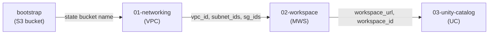

# Ch 30 — Practical Databricks AWS Deployment with Terraform

A misconfigured IAM trust policy can silently accept the workspace request, return a workspace ID, and then fail hours later when the first cluster tries to start. The only way to catch this before it costs you is to run the Terraform code yourself — against a real AWS account — and watch each resource state transition. This chapter walks through deploying the codebase from [databricks-aws-terraform](../../databricks-aws-terraform) end to end.

---

## What you'll have after this chapter

- An S3 bucket holding all Terraform state (no DynamoDB)
- A VPC with two private subnets and one public subnet (NAT gateway optional — off by default for serverless)
- A Databricks workspace registered in your account console
- A Unity Catalog metastore with a `main` catalog containing bronze, silver, and gold schemas

---

## Free Edition vs paid account

> **If you have a Databricks Free Edition account**, you already have one workspace provisioned by Databricks — you cannot create additional workspaces via `databricks_mws_*`. **Skip Steps 1–3** (bootstrap, networking, workspace). Go straight to [Step 4 — Unity Catalog](#step-4--unity-catalog-layer), which works against any existing workspace including Free Edition. You will still need a service principal (see below) and Terraform installed, but no AWS account is required for the UC layer alone.
>
> Steps 1–3 require a **paid Databricks account on AWS** (Trial or Enterprise) where you have permission to provision new workspaces. The standard way to get one is through the **AWS Marketplace**: search for "Databricks" at `https://us-east-1.console.aws.amazon.com/marketplace/search?text=databricks`, subscribe, and Databricks will email you a link to set up your account at `accounts.cloud.databricks.com`. Your Databricks DBU (compute) charges then flow through your AWS bill.
>
> **Cost note for learners:** provisioning the workspace, VPC, S3 bucket, and Unity Catalog metastore via Terraform incurs only standard AWS infrastructure costs — no DBU charges. DBUs only accrue when a cluster or SQL warehouse is running. The main ongoing cost is the **NAT gateway (~$0.045/hour, ~$32/month)**, which sits in your VPC to give classic cluster nodes outbound access to the Databricks control plane. If you plan to use **serverless compute only** (serverless SQL Warehouses, serverless jobs), compute runs in Databricks-managed infrastructure and never touches your VPC — the NAT gateway is idle overhead. In that case, set `enable_nat_gateway = false` in `modules/networking/main.tf` to remove it, or simply destroy the full stack after each learning session (`terraform destroy` in reverse layer order takes ~5 minutes).

---

## Prerequisites

Before running a single `terraform init`:

| Requirement | Free Edition | Paid account |
|---|---|---|
| Terraform 1.15+ | ✅ needed | ✅ needed |
| Databricks account | ✅ accounts.cloud.databricks.com | ✅ accounts.cloud.databricks.com |
| Service principal with Account Admin | ✅ needed | ✅ needed |
| AWS CLI + IAM permissions | ❌ skip Steps 1–3 | ✅ needed |

**Creating the service principal** (works on both Free and paid):

1. In the Databricks account console go to **Settings → Identity and access → Service Principals → Add service principal**
2. Give it a name, e.g. `terraform-deployer`
3. On the workspace entitlements screen, set the following and click **Add service principal**:

| Entitlement | Setting | Why |
|---|---|---|
| Consumer access | On | Default; allows read access to shared data |
| Databricks SQL access | On | Needed to manage SQL warehouses via Terraform |
| Workspace access | On | Required to authenticate into the workspace at all |
| **Admin access** | **On** | Required to manage catalogs, schemas, grants, and workspace-level config |

<ol start="4">
<li><strong>Paid account only</strong> — in the <strong>account console</strong> (<code>accounts.cloud.databricks.com</code>, a separate URL from the workspace) → <strong>User management → Service principals</strong> → click <code>terraform-deployer</code> → <strong>Roles</strong> → assign <strong>Account Admin</strong>. Required for <code>databricks_mws_*</code> (Steps 1–3). <em>Free Edition users skip this — workspace Admin access already set above is sufficient for Step 4.</em></li>
<li>In the workspace SP page (<strong>Workspace settings → Identity and access → Service principals → terraform-deployer</strong>) → <strong>Secrets</strong> tab → <strong>Generate secret</strong> — save the <strong>Application Id</strong> as <code>client_id</code> and the generated value as <code>client_secret</code></li>
</ol>

---

## Repository layout

```
databricks-aws-terraform/
├── bootstrap/           S3 state bucket — run once
├── modules/
│   ├── networking/      VPC, subnets, NAT, security group
│   ├── workspace/       IAM cross-account role, root S3, MWS workspace
│   └── unity-catalog/   Metastore, UC IAM, catalog, schemas, grants
└── environments/
    ├── dev/
    │   ├── 01-networking/
    │   ├── 02-workspace/
    │   └── 03-unity-catalog/
    └── prod/            (same structure, prod CIDRs)
```

Each `environments/*/0N-*/` directory is a thin root module that calls the corresponding reusable module and stores its state independently. The numbered prefixes enforce deploy order at a glance.



---

## Step 1 — Bootstrap the state bucket

The bootstrap layer is the only one without a remote backend — it uses local state. Run it once; the bucket it creates holds all other state files.

```powershell
cd C:\opt\learn\databricks\databricks-aws-terraform\bootstrap

cp terraform.tfvars.example terraform.tfvars
# Edit terraform.tfvars: set region and prefix (bucket name is auto-generated)

terraform init
terraform validate
terraform plan
terraform apply
```

Expected output on success:

```
Apply complete! Resources: 5 added, 0 changed, 0 destroyed.

Outputs:
state_bucket_name = "myorg-databricks-tf-state-a1b2c3d4"
state_bucket_region = "eu-central-1"
```

The bucket name is `<prefix>-databricks-tf-state-<random8hex>` — globally unique without any manual naming.

**What gets created:** one S3 bucket with versioning, AES256 encryption, and public access blocked. `force_destroy = false` protects the bucket from accidental deletion.

**Why no DynamoDB?** Terraform 1.10 introduced S3 native locking via `use_lockfile = true`. The backend writes a `.tflock` object to S3 before any write operation. No DynamoDB table, no provisioned capacity, no cost at rest.

Verify the bucket in the AWS console under S3 — it should show the bucket name and zero objects.

---

## Step 2 — Networking layer

```powershell
# Get the generated bucket name from bootstrap output
terraform -chdir=C:\opt\learn\databricks\databricks-aws-terraform\bootstrap output -raw state_bucket_name

cd environments/dev/01-networking

cp backend.tfvars.example backend.tfvars
# Edit: bucket = "<value from above>", region = "eu-central-1"

cp terraform.tfvars.example terraform.tfvars
# Edit if needed: change AZs for your region

terraform init -backend-config="backend.tfvars"   # quotes required on PowerShell (dot in filename)
terraform validate
terraform plan
terraform apply
```

**What gets created:**

| Resource | Value |
|---|---|
| VPC | 10.0.0.0/16 |
| Private subnets | 10.0.1.0/24, 10.0.2.0/24 (us-east-1a, us-east-1b) |
| Public subnet | 10.0.0.0/24 (for NAT egress if enabled) |
| NAT gateway | None by default (`enable_nat_gateway = false`); set `true` only for classic clusters |
| Security group | self-referential ingress + all egress |

The default security group is configured for Databricks: cluster nodes communicate with each other on all ports (self-referential rule), and all outbound traffic is allowed so nodes can reach the Databricks control plane.

Verify with:

```powershell
aws ec2 describe-vpcs --filters "Name=tag:Name,Values=dbx-dev-vpc" --query "Vpcs[].VpcId"
```

---

## Step 3 — Workspace layer

This layer creates the most sensitive resources: the cross-account IAM role that Databricks uses to manage EC2 instances in your VPC.

```powershell
cd environments/dev/02-workspace

cp backend.tfvars.example backend.tfvars
# Edit: bucket and region

cp terraform.tfvars.example terraform.tfvars
# Edit: databricks_account_id, databricks_client_id, state_bucket, workspace_name = "dev"

terraform init -backend-config="backend.tfvars"   # quotes required on PowerShell (dot in filename)
terraform validate
terraform plan
terraform apply
```

**Resource creation sequence:**

1. `aws_iam_role.cross_account` — the role Databricks assumes
2. `aws_iam_role_policy.cross_account` — the policy granting EC2/networking permissions
3. **`time_sleep` 20 seconds** — waits for IAM to propagate globally. Without this, `databricks_mws_credentials` validates the role immediately and fails with "unable to assume role" even though the role exists.
4. `aws_s3_bucket.root_storage` — DBFS root (workspace home directory, cluster logs, init scripts)
5. `databricks_mws_credentials` — registers the IAM role with Databricks account
6. `databricks_mws_storage_configurations` — registers the S3 bucket with Databricks account
7. `databricks_mws_networks` — registers the VPC + subnets + security group with Databricks account
8. `databricks_mws_workspaces` — combines the above three into a workspace (takes 2–5 minutes to provision)

Expected apply time: 4–8 minutes (the workspace provisioning waits for Databricks to complete the VPC peering and cluster setup).

```powershell
terraform output workspace_url   # e.g. https://1234567890123456.7.azuredatabricks.net
terraform output workspace_id    # e.g. 1234567890123456
```

Open the workspace URL in your browser. It should show the Databricks UI. Verify it also appears in the **Accounts console → Workspaces** list.

> **Finding workspace ID and URL in the UI:** in the account console (`accounts.cloud.databricks.com`) click the workspace row — the workspace ID is the number in the browser URL bar: `https://accounts.cloud.databricks.com/workspaces/<workspace_id>`. The workspace URL is shown on the configuration page as the **Per-workspace URL**.

---

## Step 4 — Unity Catalog layer

> **Free Edition users start here.** Set `workspace_url` and `workspace_id` from your existing workspace: in the Databricks UI go to the top-right user menu → **User Settings** — or copy the URL from your browser (e.g. `https://1234567890.cloud.databricks.com`). The workspace ID is the number in the URL. You do not need to fill in `state_bucket` — use a local backend instead (remove the `backend.tf` file and run `terraform init` without `-backend-config`).

```powershell
cd environments/dev/03-unity-catalog

cp backend.tfvars.example backend.tfvars
cp terraform.tfvars.example terraform.tfvars
# Edit: paste workspace_url and workspace_id from step 3 outputs
# Also set: admin_user = "your.email@example.com"

terraform init -backend-config="backend.tfvars"   # quotes required on PowerShell (dot in filename)
terraform validate
terraform plan
terraform apply
```

**Resource creation sequence:**

1. `aws_s3_bucket.metastore` — storage root for the Unity Catalog metastore
2. `aws_iam_role.uc_storage` (placeholder trust policy using `databricks_account_id` as `ExternalId`)
3. `aws_iam_role_policy.uc_storage` — grants S3 access + STS assume-role
4. `databricks_metastore` — creates the metastore at account level; one per region
5. `databricks_metastore_data_access` — provides the IAM role to UC; this is where the real `external_id` is generated
6. **`time_sleep` 20 seconds** — waits for UC to provision the IAM session
7. `aws_iam_role.uc_storage_patched` — patches the trust policy with the real `external_id`
8. `databricks_metastore_assignment` — assigns metastore to workspace
9. `databricks_catalog`, `databricks_schema` ×3, `databricks_grants` ×4

**The circular-dependency pattern:** Unity Catalog needs the IAM role ARN to create the data-access credential, but the real `external_id` for the trust policy only exists after the credential is created. The solution is a two-pass IAM role update: create with placeholder `ExternalId`, create the Databricks credential, then patch the trust policy. Terraform resolves this as a linear dependency chain in a single `apply`.

Verify in the workspace:

```sql
SHOW CATALOGS;                    -- should include "main"
SHOW SCHEMAS IN main;             -- should show bronze, silver, gold
SHOW GRANTS ON CATALOG main;      -- should show your admin_user
```

---

## Common errors

| Error | Cause | Fix |
|---|---|---|
| `unable to assume role` during `databricks_mws_credentials` | IAM propagation not complete | `time_sleep` 20s handles this; if it still fails, increase to 30s |
| `BucketAlreadyOwnedByYou` | S3 bucket name not globally unique | Change the prefix in tfvars |
| `metastore already exists in region us-east-1` | One metastore per region per account | Import existing: `terraform import databricks_metastore.this <id>` |
| Backend init fails with `NoSuchBucket` | Bootstrap not applied yet | Run `terraform apply` in `bootstrap/` first |
| `workspace_url` or `workspace_id` empty in UC tfvars | Forgot to fill in from step 3 outputs | `terraform -chdir=../02-workspace output workspace_url` |
| Windows Defender blocks provider binary | Antivirus scanning new `.exe` | Add `.terraform/providers/` to Defender exclusions; `terraform validate` retries automatically |

---

## Destroy (reverse order)

Always destroy in reverse layer order. Destroying workspace first while the metastore still references it leaves orphaned state.

```powershell
# From 03-unity-catalog/
terraform destroy

# From 02-workspace/
terraform destroy

# From 01-networking/
terraform destroy

# Only destroy bootstrap if you want to delete the state bucket too
# (terraform destroy in bootstrap/ will fail by default since force_destroy = false)
```

To delete the state bucket itself, change `force_destroy = false` to `true` in `bootstrap/main.tf`, run `terraform apply`, then `terraform destroy`.

---

## What comes next

This deployment gives you a working, standard workspace. To harden it toward production:

- **Private Link** — add VPC endpoints for the Databricks REST API and SCC relay so traffic never leaves the AWS backbone. See Ch 29 §Security Reference Architecture.
- **Customer-Managed Keys** — add two KMS keys (workspace storage + managed services) as shown in the SRA `cmk.tf`.
- **Terragrunt** — eliminate the DRY violation between dev and prod by extracting common configuration into a root `terragrunt.hcl`. See Ch 29 §Terragrunt.
- **CI/CD** — add a GitHub Actions workflow that runs `terraform plan` on PRs and `terraform apply` on merge to main. See Ch 29 §CI/CD.

---

## Summary

- The state bucket is bootstrapped once; all other layers use S3 native locking (`use_lockfile = true`)
- Three layers deploy in strict order: networking → workspace → unity-catalog
- Each layer reads upstream outputs via `terraform_remote_state` (networking) or explicit variable (workspace URL for UC)
- The `time_sleep` 20s resources absorb IAM propagation delay at two points: after cross-account policy attachment, and after UC metastore data-access creation
- The UC IAM circular dependency is broken by a two-pass trust policy update in the same `apply` run
- Dev and prod share the same modules; only tfvars and state keys differ
