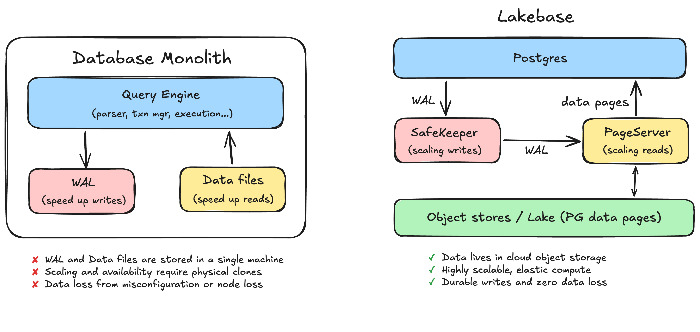
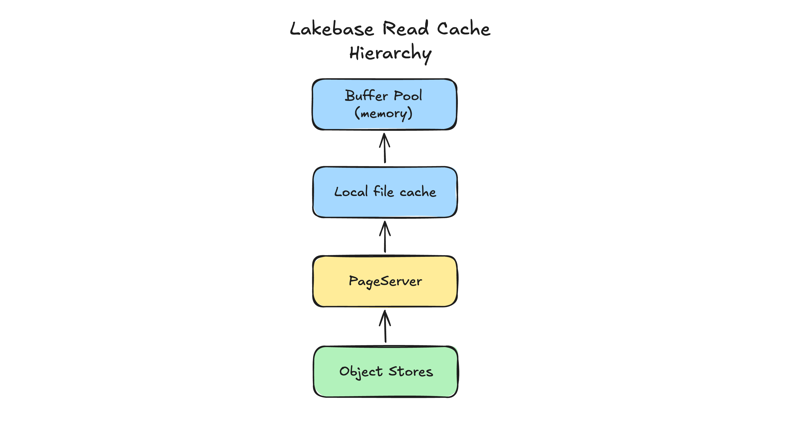
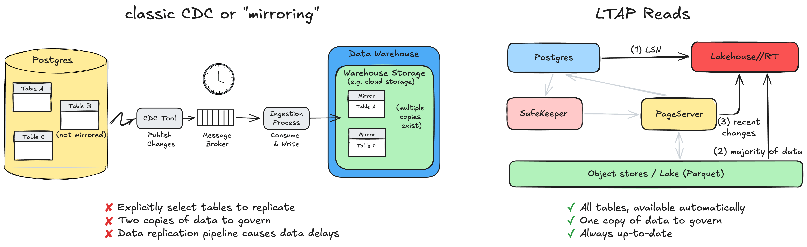

# From Monolith to Lakebase to LTAP: Rethinking the Database from Storage Up

> **Source:** [databricks.com/blog — From monolith to Lakebase to LTAP](https://www.databricks.com/blog/lakebase-ltap-rethinking-database-storage)
> **Added:** 2026-07-01
> **Source updated:** 2026-06-30
> **Tags:** lakebase, ltap, postgres, safekeeper, pageserver, oltp, olap, htap, architecture, E8
> **Type:** blog
> **Author:** Reynold Xin

Deep architecture dive into Lakebase's storage internals and how they enable LTAP. Extends [[streaming-lakebase]] (which covers the streaming-sink *usage* pattern) with the *why/how* underneath: why monolithic Postgres storage causes durability/HA/scaling pain, how Lakebase's SafeKeeper + PageServer split fixes it, and how that same split lets LTAP serve fresh analytics with zero CDC.

## Summary

Traditional databases keep the write-ahead log (WAL) and data files on one machine's disk — root cause of data-loss risk, expensive read replicas/HA clones, and analytics queries that drag down transactions.

Lakebase makes Postgres compute stateless by externalizing the log and data files into independent cloud services (**SafeKeeper** and **PageServer**), unlocking unlimited storage, elastic compute, durable writes, simpler HA, and instant branching — with no meaningful added latency.

LTAP goes further: it stores operational data once, in open columnar formats that both Postgres and Lakehouse engines read, so analytics runs on the same fresh data transactions just wrote — no CDC pipeline, no second copy, no slowdown to the transactional workload. Unlike HTAP (one engine for both workloads), LTAP unifies at the **storage layer** and keeps the best engine for each job.

## The database as a monolith

Most databases (MySQL, Postgres, classic Oracle) run as a monolith: one machine runs both the engine and the storage. Two things on disk matter most:

- **WAL (write-ahead log)** — a commit first appends to this sequential log; the log makes writes fast (single sequential append) and safe (durable the moment the entry is flushed).
- **Data files** — updated later, asynchronously; they make reads fast (read current state directly instead of replaying history).

> For the full mechanics, the post points to the 69-page ARIES paper — "one of the most complex papers in computer science."

**Problems this monolithic design creates:**

- **Data loss from misconfiguration** — a commit is only as durable as the disk flush behind it. If WAL writes are acknowledged before actually flushed, a commit can vanish on power loss/kernel panic. Failure is often silent — "the operating system might even decide to lie to you about flushing."
- **Data loss from node loss** — WAL and data files live on one machine. NAS or RAID-1/RAID-10 improve durability but don't fundamentally solve it; if the storage mount dies, so does data access.
- **Scaling reads requires a physical clone** — a read replica is a full physical copy of the entire database, streaming and replaying the WAL. Provisioning one means copying the whole dataset then catching up on the log — slow, can even bring down the database for large datasets.
- **HA also requires a physical clone** — surviving primary loss means running ≥1 standby, itself a complete physical copy kept in sync via the WAL. Pay for ≥2x infrastructure, long standby bring-up, synchronous replication to avoid data loss at failover. (Many recommend 3+ nodes in practice.)
- **Analytics contend with transactional traffic** — a heavy analytical query runs on the same hardware as the latency-sensitive OLTP workload; one large reporting query or GDPR cleanup can degrade main OLTP queries. Running analytics on a separate replica still doesn't give optimal performance, because OLTP's row-oriented storage isn't suited to analytics (which needs column-oriented storage).

Root cause common to all of these: **WAL + data files stored on a single machine.** Durability is tied to that machine's disk; scaling/availability require physically cloning it; workloads interfere because they share it.

## Lakebase architecture

*The monolith: WAL and data files co-located on one disk — the shared root cause of the problems above.*

Redesigning an OLTP database today means starting from cheap, highly durable cloud object storage paired with elastic compute — the path the Neon team took, and the foundation of Lakebase.

**Core move:** make the Postgres compute instances stateless by externalizing the WAL and data files (previously on local disk) into purpose-built, independently scalable services. Compute becomes a stateless Postgres engine that can be started, stopped, and replicated freely, because it no longer owns the data.

### Scaling writes: WAL becomes SafeKeeper

In Lakebase, the WAL is externalized to a distributed storage service called the **SafeKeeper**. A commit is made durable by replicating the log record across a quorum of SafeKeeper nodes using **Paxos-based network replication** — not by a single local disk claiming to have flushed it. No single disk failure loses data; no misconfigured flush quietly undermines durability.

> Does moving the WAL to SafeKeeper add write latency from the extra network hop? **No.** Any serious Postgres deployment that cares about durability/availability already requires synchronous replication (that same network hop), so externalizing to SafeKeeper adds no additional overhead. The combination of SafeKeeper + PageServer can lead to **5x higher write throughput and 2x lower read latency**.

### Scaling reads: data files become PageServer

Data files move to another distributed storage service, the **PageServer**. The WAL streams from SafeKeeper into PageServer, which asynchronously applies those changes, materializing pages into low-cost cloud object storage (the lake) — think of PageServer as a write-through cache for that object storage.

When a page is requested and PageServer doesn't have the latest version, it reconstructs the latest state by applying logs from SafeKeeper (changes always reach SafeKeeper before PageServer).

> Does moving data files to PageServer add read latency? **No, for practical purposes.** Reads are isolated from the network hop via multi-layered caching: Postgres checks its buffer pool (local memory) first, then a local disk cache, and only falls through to PageServer on a cache miss. A compute node configured with the same local memory/disk capacity as a monolith keeps the same cache-hit rate — read latency is indistinguishable from a monolith, while storage becomes decoupled and virtually infinite.

### What this unlocks

Already widely available as part of the Lakebase product on both Databricks and Neon:

- **Still Postgres** — real Postgres: wire protocol, SQL, drivers, extensions all work as-is.
- **Unlimited storage** — data lives in cloud object storage, not a provisioned disk; no capacity ceiling.
- **Serverless, elastic compute** — stateless compute scales up instantly under load and down to zero when idle.
- **Durable writes, zero data loss** — a commit is durable once replicated across SafeKeeper nodes via Paxos; losing any one node doesn't lose committed data.
- **Simpler HA** — no second full physical clone to maintain; the durable state already lives in a replicated storage layer independent of any single compute instance.
- **Instant branching, cloning, and recovery** — the author's favorite. Because data lives in an externalized, versioned storage layer, a branch/clone is a **metadata operation**, not a physical copy — branch a production database in seconds, run an experiment or risky migration, throw it away. Point-in-time recovery works the same way.

> Separating compute from storage isn't itself new (see "generation 2" cloud databases in the referenced prior post). Lakebase's distinguishing move is storing operational data on commodity object storage **in an open format** — which is what opens the door to other engines reading it directly, leading to LTAP.

## LTAP: one copy for transactions and analytics

*Where PageServer materialization sits in the storage hierarchy — the point where LTAP's columnar transcoding happens.*

Even with Lakebase, PageServer's materialized object-storage data was still in Postgres's native row-by-row page format — great for transactions, poor for analytics. Any analytical engine reading it either paid a conversion cost per read, or (more commonly) relied on a separate synced copy — a pipeline that can be brittle, with two copies of data becoming "a governance nightmare with diverged permissions."

**LTAP (Lake Transactional/Analytical Processing)** removes the two-copies problem by unifying at the **storage layer**, not the engine layer: Postgres keeps full ACID semantics for transactions; Lakehouse engines handle analytics. What changes is the data underneath — instead of two copies in two formats, there's **one durable copy**, in open columnar formats (Delta and Iceberg, stored as Parquet), that both sides read.

### Materializing in columnar form

> This section assumes more Postgres internals than the rest of the post.

As PageServer materializes pages into object storage, it **transcodes** Postgres row data into Parquet's columnar layout — preserving the exact Postgres representation of every value, down to the bits, so any Postgres-compatible engine can reinterpret it without information loss. Unlike CDC (which ships logical change events into a foreign schema, leaving physical/transactional semantics behind), LTAP keeps those semantics. The transcoding runs on spare PageServer CPU, adding no burden to the Postgres compute serving transactions. PageServer still materializes row-based pages in a local cache for transactional reads, but that's strictly a performance cache — the durable store is the unified lake copy, accessible by both sides.

Preserving Postgres semantics in columnar form comes down to two things:

- **Type system** — most Postgres types map directly onto native Parquet types. Values with no lossless columnar counterpart (NaN, ±Infinity, NUMERICs beyond decimal range, exotic/extension types) aren't dropped or coerced — they're carried in a structured overflow field alongside the original columns, holding canonical Postgres text. That field is directly queryable and sufficient to reconstruct the original Postgres bytes exactly.
- **Multi-versioning** — Postgres retains every row version a transaction could observe (this is what makes snapshot isolation and PITR possible), whereas open table formats expose only consistent snapshots without intermediate row versions. LTAP separates *durability* from *visibility*: every materialized row carries its physical heap address (block + offset), so heap pages stay fully reconstructable as an accelerating cache tier; Postgres indexes are served/rebuilt from that cache, not transcoded into columns. Intermediate row versions are retained for MVCC/PITR but are invisible to Iceberg/Delta readers and are eventually garbage-collected. Net effect: analytical engines see clean, snapshot-consistent tables; Postgres underneath still sees a full, time-travelable version history.

Side benefit: columnar data compresses far better than row data (often >10x), cutting network volume between the caching layer and object store to near-negligible. During LTAP's transitional rollout, Databricks **dual-writes both row and columnar formats** for data verification, "since we want to be extremely careful with storage changes."

### Reading the latest data without affecting Postgres

The freshness question — how does analytics see a commit from a moment ago that hasn't been materialized to object storage yet — is "the question that sinks most 'just point analytics at the lake' designs." LTAP's answer:

1. An analytical query (e.g. from Lakehouse//RT) asks Postgres for the current **LSN** (log sequence number) — a cheap metadata lookup marking the exact WAL position to read as of.
2. With that LSN, the engine reads the overwhelming majority of data — everything already materialized up to that point — directly from object storage.
3. The small set of very recent, not-yet-materialized changes is fetched from PageServer and merged on top.

Result: a consistent, fully up-to-date read as of that LSN — almost all work lands on cheap, scalable object storage, and **Postgres itself serves none of the analytical read traffic other than returning a single LSN**. A large analytical query does not slow the transactional workload.

> **Small-table optimization:** tables holding a handful of rows are not converted to columnar form or given Iceberg metadata — the bookkeeping would cost more than it saves, and such a tiny table has no measurable analytical-performance effect regardless of layout. They remain present and queryable as part of the single copy.

### Every table, automatically

Classic CDC/"mirroring"/"zero ETL" approaches cost something per table, so you must explicitly select which tables to replicate, and replication comes with a delay.

**LTAP has nothing to opt into.** A table that exists is, by construction, already in the lake and already queryable — no replicated/mirrored-table list, because there's no replication. One governed copy of the data in open formats, no ETL pipeline to build/monitor/unbreak. Transactional and analytical engines scale independently, each sized to its own workload, and because there's no data movement/second copy, the two views can never drift — analytics always reads the same data the application just wrote.

> The post links a Data + AI Summit demo of LTAP in action (video, not transcribed here).

## What about HTAP?

*CDC/mirroring (two copies, a pipeline, and drift risk) vs. LTAP (one copy, no pipeline).*

LTAP is a deliberate play on **HTAP** (hybrid transactional/analytical processing) — the long-standing "holy grail" goal of one engine doing both workloads. No HTAP system has seen wide adoption, for reasons the post attributes to unifying at the *engine* layer:

- **Incomplete feature set** — building one new proprietary engine to do two jobs compounds the multi-year investment needed to match a mature single-purpose engine (SQL breadth like foreign keys, optimizer maturity, etc.).
- **No ecosystem** — Postgres and Spark each anchor a vast ecosystem (drivers, extensions, tools, decades of operational knowledge); a brand-new engine starts outside all of it.
- **No performance isolation** — many HTAP systems run both workloads on the same hardware, reproducing the exact monolith failure mode (analytics starving transactions).

Lakebase/LTAP avoids all three by unifying at the **storage layer** while keeping different compute engines per workload — full feature sets, full ecosystem support, full performance isolation.

## Closing thought

Lakebase's unlimited storage, elastic compute, durable writes, simpler HA, and instant branching followed "almost mechanically" once the WAL lived in SafeKeeper and data files lived in PageServer — validated by what the Neon platform had already shown. LTAP came later, once the Neon and Databricks teams combined to solve fresh-data analytics without CDC/mirroring delay and cost. As LTAP rolls out over "the coming months," all Lakebase tables become available for analytics at Lakehouse-level performance. The author flags more optimization opportunities ahead: separating other heavyweight maintenance operations from the core transactional workload, beyond just analytics.

---
Related: [[streaming-lakebase]] — the streaming-sink usage pattern this architecture underlies; [[multi-statement-transactions]] — covers Unity Catalog transaction/isolation semantics for Delta/Iceberg tables, a useful contrast to the Postgres MVCC mechanics described here.
