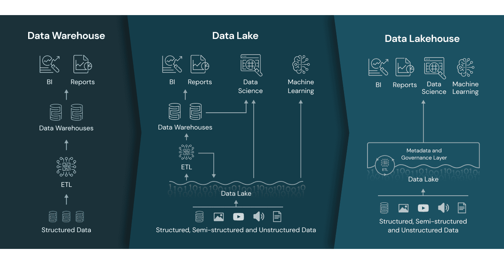

# What Is a Lakehouse?

> **Source:** [databricks.com/blog — What Is a Lakehouse?](https://www.databricks.com/blog/2020/01/30/what-is-a-data-lakehouse.html)
> **Added:** 2026-06-20
> **Source updated:** 2020-01-30
> **Tags:** lakehouse, architecture, data-lake, data-warehouse, delta-lake, foundations, B1
> **Type:** blog
> **Authors:** Ben Lorica, Michael Armbrust, Reynold Xin, Matei Zaharia, Ali Ghodsi

## Summary
The foundational Databricks post (Jan 2020) naming the **lakehouse**: an open architecture that implements data-warehouse data-management features (ACID, schema, governance, BI) directly on low-cost cloud object storage in open formats. It frames the lakehouse as "what you would get if you had to redesign data warehouses in the modern world," now that cheap, reliable object stores exist — collapsing the lake + warehouse(s) + specialized-systems sprawl into one system holding one copy of the data.

## Key points
- **Lakehouse = DW management features on data-lake storage**, in open formats (Parquet) on cheap object storage.
- **Why now:** warehouses (since late-1980s, MPP) handle structured data but aren't suited — or cost-efficient — for unstructured/semi-structured high-variety/velocity/volume data that modern AI needs.
- **Data lakes alone fall short:** no transactions, no data-quality enforcement, no consistency/isolation → can't safely mix appends+reads or batch+streaming. Many lake promises never materialized; in many cases lost the benefits of warehouses.
- **Multi-system sprawl is the real cost:** moving/copying data between lake, warehouses, and specialized engines (streaming, time-series, graph, image) adds complexity and delay.
- **8 defining features** (below) + enterprise needs (security/access control, governance: audit/retention/lineage, discovery: catalogs/usage metrics) — implemented once, for a single system.
- **AI angle:** use a lakehouse over a bare data lake for AI because it adds **versioning, governance, security, and ACID even for unstructured data**.
- **2020 caveat:** lakehouses cut cost but performance can still lag specialized systems; UX and tool connectors need work. Authors bet the gaps close over time.

## Notes

*The post's diagram: storage architecture evolving warehouse → lake → lakehouse.*

### The problem it solves
- **Data warehouses** — long history in decision support/BI; MPP let them scale. Great for **structured** data, but not suited (and not cost-efficient) for unstructured/semi-structured data with high variety, velocity, volume.
- **Data lakes** (~a decade ago) — raw-data repositories in many formats. Suitable for *storing*, but lack transactions, data-quality enforcement, and consistency/isolation → mixing appends+reads or batch+streaming is "almost impossible." Result: many lake promises unrealized, often losing warehouse benefits.
- **Multi-system approach** — lake + several warehouses + specialized systems (streaming, time-series, graph, image DBs). Complexity, and delay because data must be moved/copied between systems.

### Definition
> A lakehouse is "a new, open architecture that combines the best elements of data lakes and data warehouses… implementing similar data structures and data management features to those in a data warehouse directly on top of low cost cloud storage in open formats."

Framed as: what you'd get redesigning the data warehouse now that cheap, highly reliable object stores exist.

### The 8 features that define a lakehouse

1. **Transaction support** — pipelines read/write concurrently; ACID keeps multiple parties consistent, typically via SQL.
2. **Schema enforcement and governance** — enforcement + evolution; supports DW schema designs (star/snowflake); reason about data integrity; robust governance + auditing.
3. **BI support** — BI tools run directly on source data → less staleness, better recency, lower latency, no second operational copy.
4. **Storage decoupled from compute** — separate clusters → scale to more concurrent users and larger data. *(Note: some modern data warehouses also have this property — it's not unique to lakehouses.)*
5. **Openness** — open standardized formats (Parquet) + an API so many tools/engines, including ML and Python/R libraries, read data directly.
6. **Diverse data types** — unstructured → structured: images, video, audio, semi-structured, text. Store, refine, analyze, access.
7. **Diverse workloads** — data science, ML, SQL/analytics. Multiple tools, but all on the same repository.
8. **End-to-end streaming** — built-in streaming removes the need for separate real-time serving systems.

### Enterprise-grade additions
Beyond the eight: security and access control (basic requirement); governance — auditing, retention, lineage (essential under privacy regulations); discovery — data catalogs and usage metrics. Key payoff: with a lakehouse these only need to be implemented, tested, and administered **once, for a single system**. (On Databricks today → **Unity Catalog**.)

### Early examples (2020)
- **Databricks Lakehouse Platform** — has the architectural features.
- **Azure Synapse Analytics** — integrates with Azure Databricks; enables a similar pattern.
- **BigQuery / Redshift Spectrum** — have *some* lakehouse features but focus primarily on BI/SQL.
- **Build-your-own** — open-source table formats: **Delta Lake, Apache Iceberg, Apache Hudi**.

Caveat on parity: materialized views and stored procedures exist, but aren't equivalent to traditional DWs — matters for **"lift and shift"** scenarios needing near-identical legacy-DW semantics.

### Non-BI workloads
Standard tools (Spark, Python, R, ML libraries) for data science/ML. Data exploration and refinement are standard; **Delta Lake is designed to let users incrementally improve data quality** until it's ready for consumption.

### Technical building blocks
Distributed file systems *can* serve as storage, but **object stores are more common** — low cost, highly available, excel at massively parallel reads (an essential requirement for modern warehouses).

### From BI to AI
Lakehouse radically simplifies enterprise data infra and accelerates innovation as ML spreads. Historically products/decisions ran on structured operational data; today many products embed AI (computer vision, speech, text mining). **Why a lakehouse over a plain data lake for AI? It gives data versioning, governance, security, and ACID — needed even for unstructured data.**

## Quotes worth keeping
> "A lakehouse is a new, open architecture that combines the best elements of data lakes and data warehouses." (What is a lakehouse?)

> "They are what you would get if you had to redesign data warehouses in the modern world, now that cheap and highly reliable storage (in the form of object stores) are available." (What is a lakehouse?)

> "Current lakehouses reduce cost but their performance can still lag specialized systems (such as data warehouses) that have years of investments and real-world deployments behind them… Over time lakehouses will close these gaps while retaining the core properties of being simpler, more cost efficient, and more capable of serving diverse data applications." (From BI to AI)

## Version note
> 📌 Point-in-time (2020). "Databricks Lakehouse Platform" branding has since shifted to the **Data Intelligence Platform**. The eight features now map to concrete products: Delta Lake (transactions/schema), Unity Catalog (governance/discovery/lineage), Photon + serverless SQL (BI), Structured Streaming (streaming). Open-format interop has since grown (Delta UniForm, OpenSharing). The architectural argument is unchanged.

## Open questions
- The post lists materialized views/stored procedures as not-yet-equivalent to DWs — how far has parity closed since 2020 (e.g. Databricks materialized views, SQL stored procedures)?
- "Performance can still lag specialized systems" — Photon/Predictive I/O were the answer; worth tracing the benchmark story.

## Related sources
- [[ch01-getting-started-with-databricks]] — DCDE-SG Ch 1 frames the same lakehouse/platform architecture from the certification angle; this post is the primary-source origin of that framing.
- [[ch02-managing-data-with-delta-lake]] — Delta Lake is the table format delivering features 1–2 (transactions, schema) and the "incrementally improve data quality" idea named here.
