# Adaptive Query Execution (AQE)

> **Source:** [docs.databricks.com/aws/en/optimizations/aqe](https://docs.databricks.com/aws/en/optimizations/aqe)
> **Added:** 2026-06-18
> **Source updated:** 2023-10-12
> **Tags:** spark, aqe, performance, optimization, broadcast, skew, shuffle, partitioning, B2, B8, B16
> **Type:** documentation

AQE is query re-optimization that runs *during* execution: it collects runtime statistics after shuffle and broadcast exchanges and uses them to dynamically improve join strategies, partition sizes, and skew handling — with no manual tuning. It's enabled by default (`spark.databricks.optimizer.adaptive.enabled = true`) and applies only to non-streaming queries with at least one exchange (join, aggregate, window) or sub-query. Not all eligible queries are re-optimized — that only happens when runtime stats suggest a better plan.

## Four capabilities

**1. Dynamic broadcast join conversion** — at runtime, after a shuffle exchange, if one side of a sort-merge join turns out to be ≤ 30 MB, AQE converts it to a broadcast hash join. Caveats: broadcast isn't supported for all join types (e.g. the **left relation of a LEFT OUTER JOIN cannot be broadcast**), and AQE skips the conversion if the non-empty-partition ratio is below `spark.sql.adaptive.nonEmptyPartitionRatioForBroadcastJoin`.

**2. Partition coalescing** — after shuffle, AQE merges small partitions into target-size partitions ("very small tasks have worse I/O throughput and tend to suffer more from scheduling overhead").

| Config | Default | Meaning |
|---|---|---|
| `spark.sql.adaptive.coalescePartitions.enabled` | `true` | Enable coalescing |
| `spark.sql.adaptive.advisoryPartitionSizeInBytes` | `64MB` | Target size (upper bound) |
| `spark.sql.adaptive.coalescePartitions.minPartitionSize` | `1MB` | Floor — won't shrink below this |
| `spark.sql.adaptive.coalescePartitions.minPartitionNum` | 2× cores | Minimum count; **not recommended to set explicitly** |

[](assets/aqe/07-custom-shuffle-reader.png)
[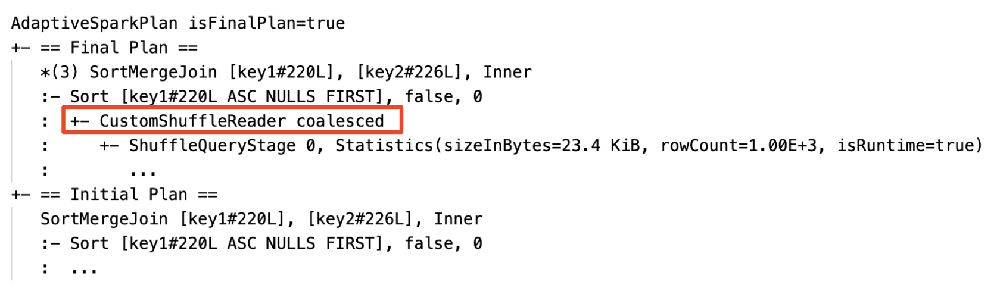](assets/aqe/08-custom-shuffle-reader-string.png)

**3. Skew join handling** — AQE splits (and replicates if needed) skewed partitions in sort-merge and shuffle hash joins. A partition is skewed when **both** hold:

```
partition size > skewedPartitionFactor × median partition size
partition size > skewedPartitionThresholdInBytes
```

| Config | Default | Meaning |
|---|---|---|
| `spark.sql.adaptive.skewJoin.enabled` | `true` | Enable skew handling |
| `spark.sql.adaptive.skewJoin.skewedPartitionFactor` | `5` | Multiplier against median |
| `spark.sql.adaptive.skewJoin.skewedPartitionThresholdInBytes` | `256MB` | Absolute floor |

In `LEFT OUTER JOIN`, only skew on the **left side** can be optimized.

[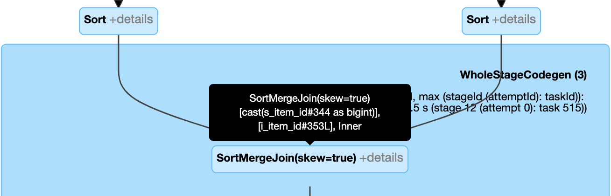](assets/aqe/09-skew-join-plan.png)
[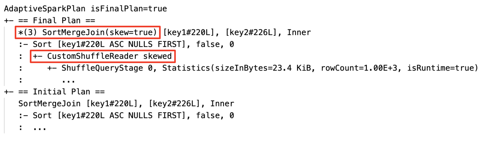](assets/aqe/10-skew-join-string.png)

**4. Empty relation propagation** — if a relation turns out empty at runtime, AQE short-circuits joins/aggregations that depend on it, replacing the subtree with `LocalTableScan`. Config: `spark.databricks.adaptive.emptyRelationPropagation.enabled` (default `true`).

[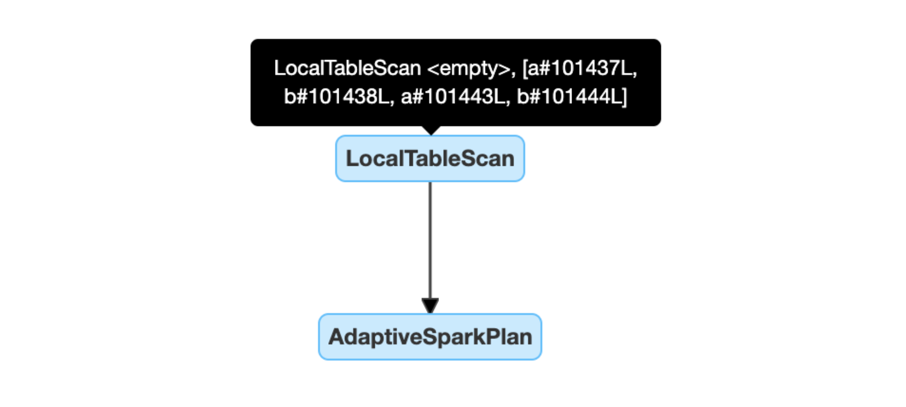](assets/aqe/11-local-table-scan.png)
[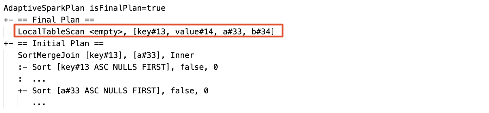](assets/aqe/12-local-table-scan-string.png)

## Configuration reference

| Config | Default | Notes |
|---|---|---|
| `spark.databricks.optimizer.adaptive.enabled` | `true` | Master switch |
| `spark.sql.shuffle.partitions` | `200` | Set to `auto` for auto-optimized shuffle (recommended on Databricks) |
| `spark.databricks.adaptive.autoBroadcastJoinThreshold` | `30MB` | AQE-specific runtime broadcast threshold (separate from static `autoBroadcastJoinThreshold`, 10 MB) |

> "For Structured Streaming, this configuration cannot be changed between query restarts from the same checkpoint location."

## Reading the AQE query plan

AQE-applied queries contain `AdaptiveSparkPlan` nodes (usually the root); the `isFinalPlan` flag is `false` while running, `true` after completion.

- **Spark UI** — the plan diagram evolves as stages complete; completed nodes are frozen, future nodes can still change.

[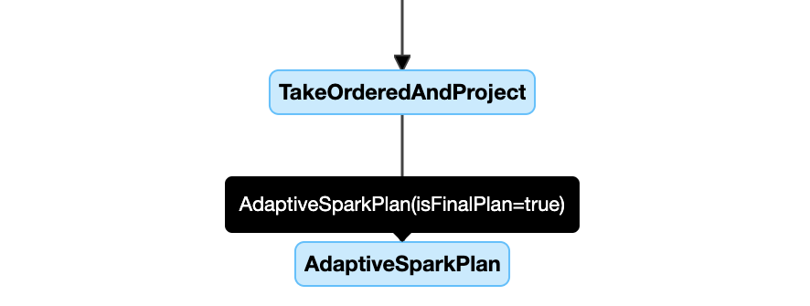](assets/aqe/01-query-plan-diagram.png)

- **`DataFrame.explain()`** — shows both initial and current/final plan; each shuffle/broadcast stage carries stats with an `isRuntime` flag (`isRuntime=false` = compile-time estimate, `true` = actual).

[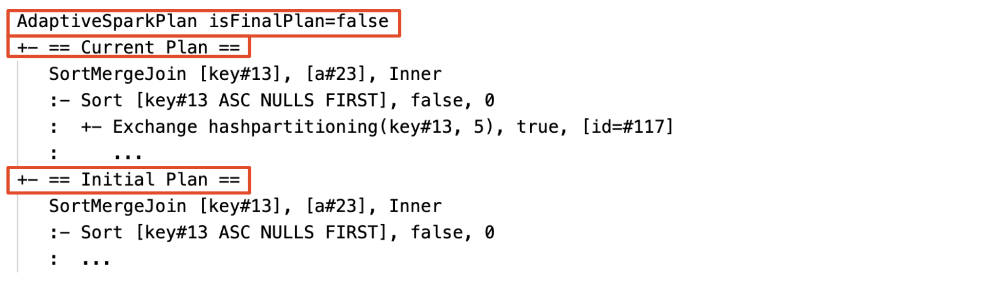](assets/aqe/02-before-execution.png)
[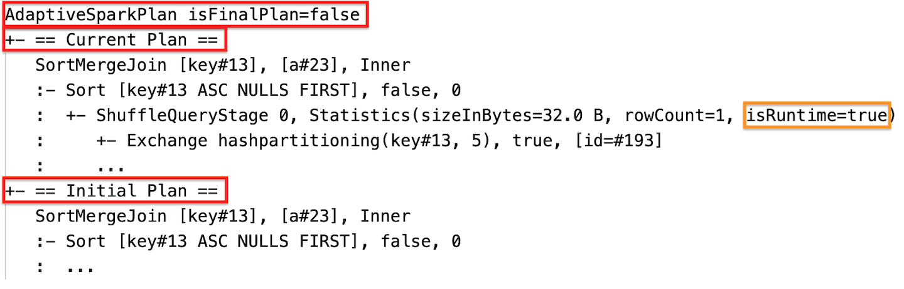](assets/aqe/03-during-execution.png)
[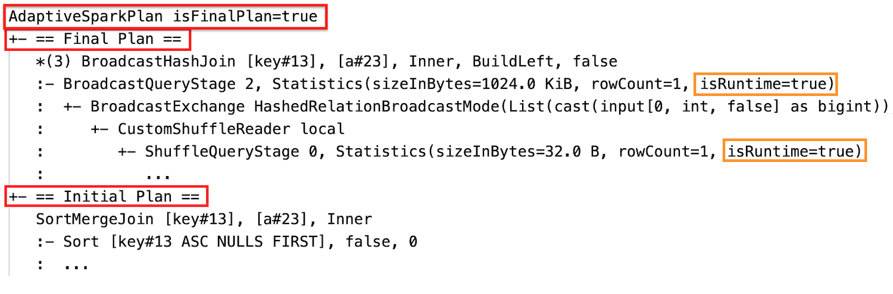](assets/aqe/04-after-execution.png)

- **`SQL EXPLAIN`** — does not execute the query; always the initial plan (no AQE transformations).

[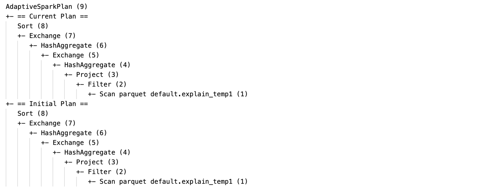](assets/aqe/05-sql-explain.png)

Recognizing transformations in the plan:

| AQE feature | Signal |
|---|---|
| Sort-merge → broadcast hash join | Different physical join node vs initial plan |
| Partition coalescing | `CustomShuffleReader` with `Coalesced` property |
| Skew join | `SortMergeJoin` with `isSkew=true` |
| Empty relation propagation | `LocalTableScan` with empty relation field |

[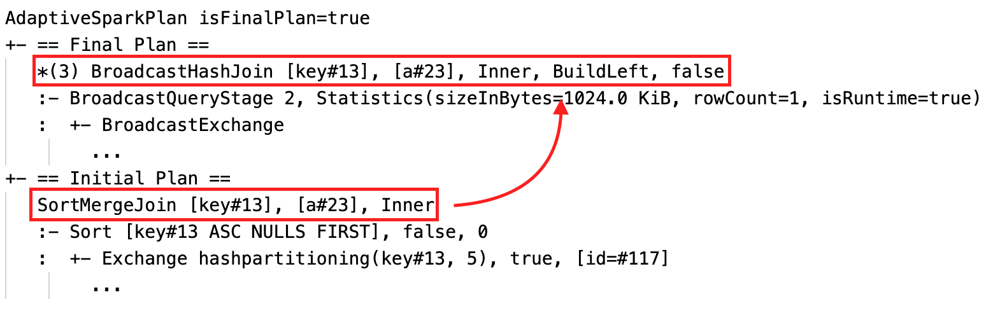](assets/aqe/06-join-strategy-string.png)

## FAQ

- **Why didn't AQE broadcast a small table?** Either the join type doesn't support it (e.g. left relation of LEFT OUTER JOIN), or too many empty partitions made sort-merge finish fast / dropped below the non-empty ratio.
- **Should I still use BROADCAST hints with AQE?** Yes. "A statically planned broadcast join is usually more performant than a dynamically planned one by AQE as AQE might not switch to broadcast join until after performing shuffle for both sides of the join." AQE respects hints and still applies dynamic optimizations.
- **AQE skew handling vs SKEW hint?** "It is recommended to rely on AQE skew join handling rather than use the skew join hint, because AQE skew join is completely automatic and in general performs better."
- **Why didn't AQE reorder my joins?** "Dynamic join reordering is not part of AQE."
- **Why didn't AQE detect my skew?** Both size conditions must hold simultaneously; for moderate skew (e.g. 3× median) lower `skewedPartitionFactor`. LEFT OUTER JOIN only handles left-side skew.

The pre-Spark-3.0 "Adaptive Execution" only did partition coalescing; AQE in Spark 3.0+ is a full framework for runtime-stats-driven replanning.

Related: [[sql-join-hints]], [[optimize-data-workloads-guide]], [[spark-memory-issues]], [[long-spark-stage-page]].
