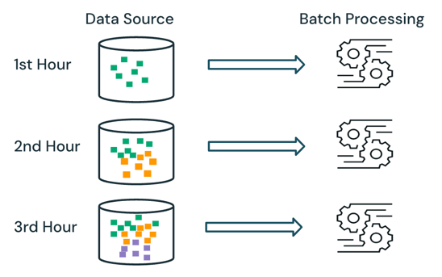
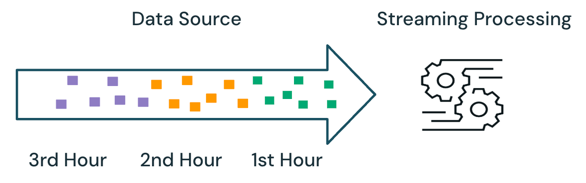

# Batch vs. streaming data processing

> **Source:** [docs.databricks.com/aws/en/data-engineering/batch-vs-streaming](https://docs.databricks.com/aws/en/data-engineering/batch-vs-streaming)
> **Added:** 2026-06-26
> **Source updated:** 2026-06-15
> **Tags:** data-engineering, concepts, batch, streaming, structured-streaming, incremental, medallion, lakeflow, materialized-views, streaming-tables, I1, I2, B7
> **Type:** documentation

Batch and streaming are the two processing **semantics** used across data-engineering workloads (ingestion, transformation, real-time). The distinguishing question is whether the engine **tracks what it has already processed** in the source. Streaming is often associated with low-latency Kafka pipelines, but on Databricks it's broader: because Lakeflow Spark Declarative Pipelines runs on a unified Spark + Structured Streaming engine, sources like cloud object storage and Delta Lake can be read **as streams** for efficient incremental processing, run either **triggered** or **continuously** (trading cost against latency).

## Batch semantics

The engine keeps **no cursor** — all data currently available in the source is processed at run time. In practice the source is partitioned (by day, region, etc.) to bound how much gets reprocessed. Example: averaging hourly item sales price for an e-commerce sale, scheduled hourly — each run reprocesses prior hours and **overwrites** the previous results with the latest.

*Batch: reprocess all available source data; overwrite prior results.*

## Streaming semantics

The engine **tracks what's been processed** and handles only **new** data on each run. Same example scheduled as streaming: only data added since the last run is processed, and the new results are **appended** to the previous ones.

*Streaming: process only new data; append to prior results.*

## Batch vs. streaming

Streaming wins by not reprocessing — but **out-of-order and late-arriving data** make it harder. If first-hour sales don't arrive until the second hour:

- **Batch** reprocesses the late data alongside the rest and **corrects** the overwritten results automatically.
- **Streaming** sees the late data without the other first-hour data, so the logic must **keep state** (e.g. running sum + count) to update prior results correctly.

The complexity shows up with **stateful** processing — joins, aggregations, deduplications (watermarks). **Stateless** streaming (e.g. appending rows) handles late data simply.

| Semantic | Pros | Cons | Databricks products |
|---|---|---|---|
| **Batch** | Simple logic; results always accurate (reflect all source data). | Less efficient (reprocesses a partition); latency hours→minutes, not seconds/ms. | SDP materialized view + materialized-view flow; Databricks Runtime / Apache Spark (`spark.read.load()`, `spark.write.save()`). |
| **Streaming** | Efficient (only new data); latency down to seconds/ms. | Logic can be complex when stateful; not always accurate with late/out-of-order data. | Lakeflow Connect; SDP append/apply-change flows, streaming table, sink; Spark Structured Streaming (`spark.readStream.load()`, `spark.writeStream.start()`). |

## Recommendations

By Medallion layer:

| Layer | Workload | Recommendation |
|---|---|---|
| **Bronze** | Ingestion; no/stateless append; larger data. | **Streaming** — streaming's efficiency without stateful complexity. |
| **Silver** | Transformation; stateless (filter) + stateful (joins/aggs/dedupe). | **Batch** (materialized-view incremental refresh); streaming only where latency/efficiency beats accuracy. |
| **Gold** | Last-mile aggregation; stateful; smaller data. | **Batch** (materialized-view incremental refresh). |

> 💡 The platform default leans **streaming at Bronze, batch (incremental-refresh MVs) at Silver/Gold** — not "stream everything." This is the *why* behind Auto Loader/streaming tables at Bronze (**I1**), triggers/watermarks/state at Silver (**I2**), and the Medallion layering itself (**B7**).

---

Related: [[procedural-vs-declarative]] (sibling Concepts page — the *how* paradigm vs this *processing semantic*), [[data-engineering-hub]], [[materialized-views]], [[serverless-pipelines]].
