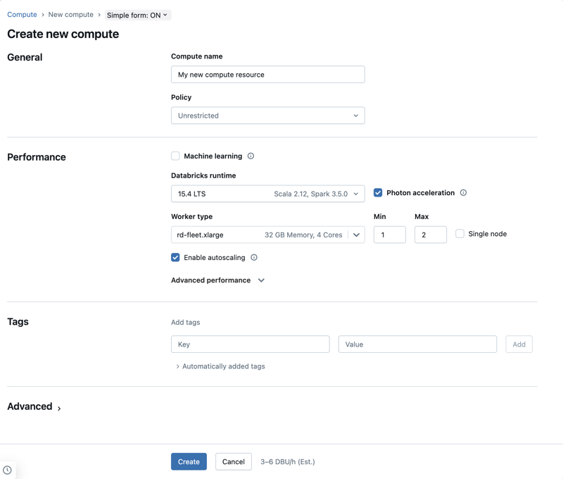
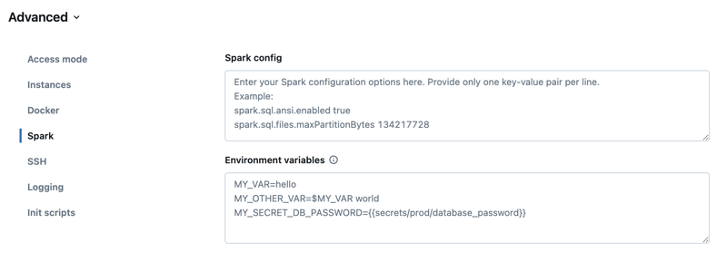
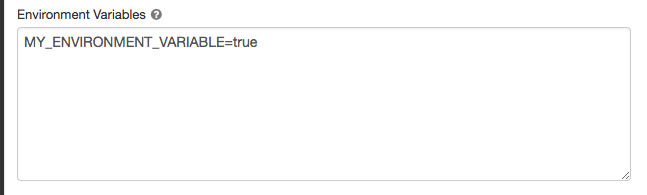

# Classic compute configuration reference

> **Source (AWS):** [docs.databricks.com/aws/en/compute/configure](https://docs.databricks.com/aws/en/compute/configure)
> **Source (GCP):** [docs.databricks.com/gcp/en/compute/configure](https://docs.databricks.com/gcp/en/compute/configure)
> **Source (Azure):** [learn.microsoft.com/en-us/azure/databricks/compute/configure](https://learn.microsoft.com/en-us/azure/databricks/compute/configure)
> **Added:** 2026-06-16
> **Source updated:** 2026-06-11
> **Tags:** compute, classic-compute, configuration, autoscaling, EBS, spark-config, instance-types, gcp, azure, B1
> **Type:** documentation

The full configuration reference for classic compute (all-purpose and job clusters) across AWS, GCP, and Azure — every setting in the creation UI: runtime version, instance types, autoscaling, advanced instance options (GPU, Graviton/Fleet on AWS; local SSDs on GCP; confidential VMs on Azure), tags, access modes, storage, logging, and Spark config. Cloud-specific sections are labelled. [[classic-compute-overview]] covers *what* classic compute is and the permission levels; this page covers *how* to configure it.

[](assets/classic-compute-configure/01.png)
*The compute creation form.*

## Compute policy

Policies constrain which configuration options appear when a user creates compute. Users without the "Unrestricted cluster creation" entitlement can *only* create compute via assigned policies. The **Personal Compute** policy (single-machine resources) is available to all users by default.

## Runtime version

- All-purpose compute → most current runtime; job compute (production) → LTS version; data science / ML → Databricks Runtime ML version.
- All runtimes include Apache Spark. **Photon** is enabled by default on DBR 9.1 LTS+ (toggle on the form).

## Worker and driver node types

A compute resource has one **driver node** and zero or more **worker nodes**; the driver defaults to the same type as workers but can be set independently. The driver maintains notebook state, the SparkContext, and the Spark master — upsize it if you `collect()` large results. To run a Spark job you need at least one worker.

> ⚠️ AWS: "Do not use a pool with spot instances as your driver type. Select an on-demand driver type to prevent your driver from being reclaimed." GCP: don't use a pool with preemptible VMs as the driver.

- **Flexible node types** — fall back to alternative compatible instance types when the primary is unavailable, improving launch reliability.
- **Worker IP addresses** — each worker gets two private IPs (Databricks internal + Spark container), isolating traffic between compute resources.
- **GPU instance types** — for deep learning / demanding tasks (AWS EC2 P2 deprecated).

**Azure confidential computing VMs** *(Azure only)* — DC and EC series prevent unauthorized access to data in use, even from the cloud operator; for regulated industries.

**AWS Graviton instance types** — Arm64, best price/performance on EC2. Min runtimes: non-Photon DBR 9.1 LTS+, Photon DBR 10.2+, ML DBR 15.4 LTS ML+. Limitations: Python UDFs unsupported below DBR 15.2, no Databricks Container Services, no Databricks SQL, no AWS GovCloud, no workspace-files/Git access from web terminals, can't mix Graviton/non-Graviton in one cluster. (Floating-point basics unchanged; single triangle functions differ from Intel by ≤1.11e-16.)

**AWS Fleet instance types** — resolve to the best available instance of the same size class via the Spot Placement Score API; memory/core count guaranteed. No GPU support; spot-bid-percentage settings have no effect; unavailable on some older workspaces.

**GCP instance types with local SSDs** — some types include locally attached SSDs (encrypted, automatic disk caching) for shuffle/cache; `-lssd` suffix = fixed count, others configurable under **Advanced > Instances > Local SSD**.

> 💡 Unlike AWS (shuffle storage via EBS), GCP shuffle/cache storage comes from local SSDs provisioned with the instance type.

GCP default worker node storage: boot disk 30 GB; container root 150 GB; local SSDs 375 GB each; remote SSD 80 GB (0 if local SSD present), autoscaling.

## Single-node compute

For small datasets / non-distributed workloads. Runs Spark locally (driver is both master and worker), one executor thread per logical core minus one for the driver, all logs to the driver log. **Cannot convert to multi-node**, no GPU scheduling, can't scale workers. Parquet files with UDT columns fail ("The Spark driver has stopped unexpectedly…") — workaround `spark.conf.set("spark.databricks.io.parquet.nativeReader.enabled", False)`.

## Autoscaling

Dynamically reallocates workers; when the cloud terminates instances below the minimum, Databricks retries to maintain it. **Not available for `spark-submit` jobs**, and has limited scale-*down* for Structured Streaming (use Lakeflow SDP enhanced autoscaling instead).

> ⚠️ Never enable `spark.dynamicAllocation.enabled` alongside Databricks autoscaling → executor churn, `NODES_LOST` errors, stuck tasks.

- **Optimised autoscaling (Premium)** — scales up min→max in ≤2 events; can scale down even on non-idle compute via shuffle-file state; scale-down window 40 s (job) / 150 s (all-purpose), tunable via `spark.databricks.aggressiveWindowDownS` (max 600 s).
- **Standard autoscaling (Standard plan)** — adds 8 nodes, then exponential; scales down when 90% of nodes idle for 10 min and compute idle ≥30 s.
- **With pools** — pool idle count must be ≥ min compute size (else benefit lost), and max compute size must be ≤ pool max capacity (else creation fails).

## Advanced performance — spot/preemptible & auto-termination

- **Spot (AWS/Azure)** — driver always on-demand; workers spot. **Azure failback**: evicted spot → try new spot, then on-demand (only for fully-running instances; setup failures not replaced).
- **Preemptible (GCP)** — much cheaper, but "Google Cloud might stop (preempt) these instances"; defaults to on-demand when unavailable.
- **Automatic termination** — after a configurable inactivity period.

## Tags

Key-value pairs applied to cloud resources and usage logs for cost monitoring.

> ⚠️ For pool-launched compute, custom tags appear only in DBU usage reports — they do **not** propagate to cloud resources.

## Access modes

Default is **Auto**: Standard unless an ML runtime or DBR < 14.3 is selected (then Dedicated). "Databricks recommends that you use standard access mode unless your required functionality is not supported." Init scripts/libraries supported by all access modes on DBR 13.3 LTS+ (support levels vary). See [[classic-compute-overview]].

## Cloud identity for storage access

- **AWS — Instance profiles** — Databricks recommends UC external locations instead. ⚠️ "Once a compute resource launches with an instance profile, anyone who has attach permissions… can access the underlying resources controlled by this role."
- **GCP — Google service account** — set under **Advanced > Google service account**; must be in the same project; used for GCS/BigQuery.
- **Azure — Managed Identities** — handled via UC or workspace-level Azure identity config (not on this page).

## Availability zones

Default **Auto**: Databricks picks the AZ by available subnet IPs, retrying others on capacity errors (applies at startup only). Set a specific AZ for reserved instances. **GCP HA zone** — `HA` spreads instances across zones (may increase inter-zone egress cost).

## AWS Capacity Blocks *(AWS only)*

Reserve capacity for a specific time + AZ (no GCP equivalent): purchase in the AWS portal, tag the compute `X-Databricks-AwsCapacityBlockId = <id>`, disable spot, select the assigned AZ. The block must be *active* before launching.

## Autoscaling local storage

Databricks monitors free disk and expands storage when low; **5 TB total per instance** on all clouds, never detached mid-run.

- **AWS** — auto-attaches **EBS GP3** volumes (default account cap 50 TiB).
- **GCP** — auto-**resizes** the existing **Zonal SSD PD**.
- **Azure** — auto-attaches **Managed Disks**; always-on (no toggle).

## AWS EBS volumes (fixed)

When autoscaling local storage is *disabled* on AWS, configure fixed EBS volumes. Defaults per worker: encrypted root 30 GB; container root 150 GB; worker log 75 GB *(HIPAA only)*. **EBS shuffle volumes** (gp2/gp3; gp3 recommended) add shuffle storage for instance types without local disk; encrypted for on-demand + spot.

## Local disk encryption (Public Preview)

Encrypts shuffle/ephemeral data on local disks (per-node key, in memory during use, destroyed with the node). Enabled only via the Clusters API (`enable_local_disk_encryption: true`).

> ⚠️ "Your workloads may run more slowly because of the performance impact of reading and writing encrypted data to and from local volumes."

## Spark configuration

Set properties in **Advanced > Spark tab** (one `key value` per line) or via `spark_conf` in the API; admins can enforce via policies. Never store passwords in plaintext — use secret references:

```
spark.password {{secrets/acme-app/password}}
```

[](assets/classic-compute-configure/02.png)
*The Spark config field.*

## Compute log delivery

Driver/worker/event logs delivered every 5 minutes, archived hourly, until termination. Destinations: **Volumes** (recommended; UC volume path; needs Standard mode or Dedicated-to-user, plus `READ/WRITE VOLUME`), **S3** *(AWS only; instance profile with `PutObject`/`PutObjectAcl`)*, **DBFS** (legacy). Logs land in a subfolder named after the cluster ID.

## SSH access *(Azure only)*

SSH port is **closed by default**; can be enabled only if the workspace is deployed in the customer's own Azure VNet (VNet injection).

## Environment variables

Set custom environment variables (accessible from init scripts) via **Advanced > Spark tab > Environment variables**, or `spark_env_vars` in the API. Databricks-predefined variables can't be overridden.

[](assets/classic-compute-configure/03.png)
*The Environment Variables field.*

Related: [[classic-compute-overview]], [[compute-pools]], [[photon]], [[serverless-limitations]], [[serverless-notebooks]].
