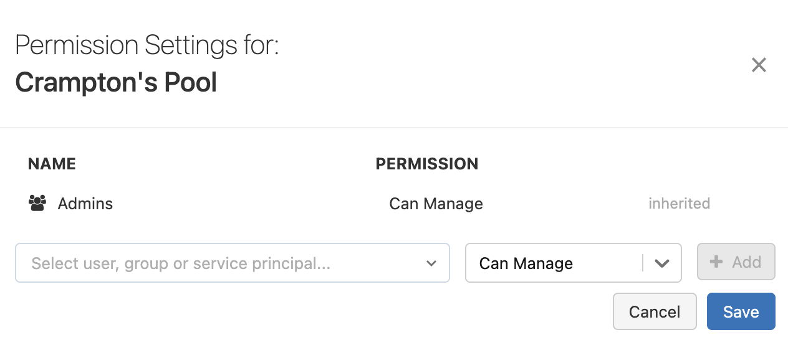

# Compute pools (instance pools)

> **Source:** [docs.databricks.com/aws/en/compute/pool-index](https://docs.databricks.com/aws/en/compute/pool-index)
> **Added:** 2026-06-16
> **Source updated:** 2024-10-29
> **Tags:** compute, classic-compute, pools, autoscaling, cost, B1
> **Type:** documentation

> "Databricks pools are a set of idle, ready-to-use instances. When cluster nodes are created using the idle instances, cluster start and auto-scaling times are reduced."

Pre-warmed VMs sit in the pool until a cluster needs them, cutting startup to the time to install the Databricks runtime on an idle VM rather than provisioning a fresh instance. Databricks does **not** charge DBUs for idle pool instances — but the cloud provider still bills the VMs.

## Billing

> "Databricks does not charge DBUs while instances are idle in the pool. Instance provider billing does apply."

Idle pool VMs accrue cloud compute costs (EC2, GCE, Azure VM) regardless of use; the DBU charge starts only when an instance leaves the pool and joins a running cluster.

## Creating a pool

Requires the **"Allow pool creation"** entitlement (workspace admins by default). "Non-admin users with the Allow pool creation entitlement can only create pools using the CLI or API. The **Create Pool** button in the UI is available only to workspace admins." UI path: **Compute** → **Pools** → **Create Pool**.

## Attaching a cluster to a pool

- **UI:** select the pool from the **Driver Type** or **Worker Type** dropdown when configuring the cluster.
- **API:** set `driver_instance_pool_id` for the driver and `instance_pool_id` for workers.

> ⚠️ Never attach a spot-instance pool as the driver type — the driver node must always be on-demand.

Autoscaling constraints (from [[classic-compute-configure]]): the pool's idle instance count must be ≥ the compute's minimum workers (or startup reverts to non-pool speed), and the max compute size must be ≤ the pool's max capacity (or compute creation fails).

## Pool permissions

To configure permissions on a pool you must have CAN MANAGE on it (via workspace UI, Permissions API, or Terraform).

| Permission | What it grants |
|---|---|
| **CAN MANAGE** | Configure pool settings and permissions |
| **CAN ATTACH TO** | Attach clusters to the pool |
| **NO PERMISSIONS** | No access |

*Setting permissions on a pool.*

## Deleting a pool

Deletion terminates all idle instances and removes the configuration — **it cannot be undone**. Running clusters continue but **can't allocate pool instances** during resize/autoscale-up; terminated clusters that reference the pool **will fail to start**.

Related: [[classic-compute-configure]], [[classic-compute-overview]].
