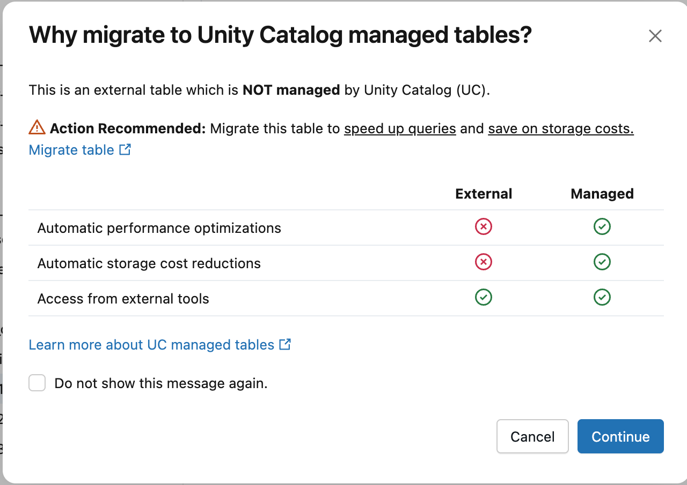
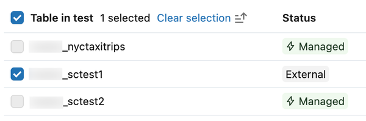
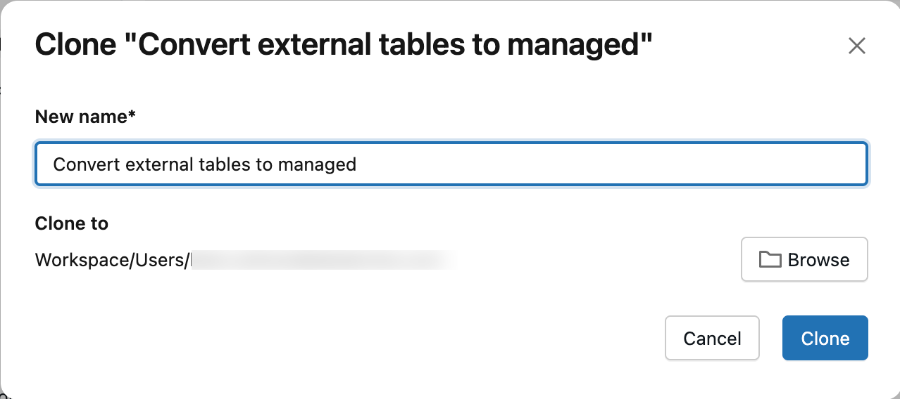

# Convert an external Delta table to a managed UC table

> **Source:** [docs.databricks.com/aws/en/tables/convert-external-managed](https://docs.databricks.com/aws/en/tables/convert-external-managed?language=SQL)
> **Added:** 2026-06-23
> **Source updated:** 2026-06-17
> **Tags:** tables, unity-catalog, managed, external, set-managed, unset-managed, migration, uniform, path-based-redirect, streaming, B4
> **Type:** documentation

## Summary

How to migrate an **external Delta table → UC managed table** in place via `ALTER TABLE ... SET MANAGED` (or Catalog Explorer, Beta). Preferred over CTAS / DEEP CLONE because it minimizes downtime, handles concurrent writes, **retains history/permissions/views**, and is **reversible within 14 days** (`UNSET MANAGED`). This is the operation [[managed-tables]] links to with "Convert an external Delta Lake table to a managed Unity Catalog table."

## Key points

- Command: `ALTER TABLE catalog.schema.tbl SET MANAGED;` — add `TRUNCATE UNIFORM HISTORY` if the table has Iceberg reads (UniForm) enabled.
- **Why SET MANAGED over CTAS/DEEP CLONE**: min downtime, handles concurrent writes, retains history, keeps name/settings/permissions/views, **rollback supported**, and **redirects path-based reads/writes** so legacy code keeps working.
- **Prereqs**: DBR **17.3 LTS+** or Serverless (for SET/UNSET MANAGED, TRUNCATE UNIFORM HISTORY); table must be **Delta**; readers/writers on DBR **15.4 LTS+** (14.3 and below = degraded, see below).
- **Two-phase copy**: (1) copy data + log, no downtime; (2) switch metadata to managed location — brief **writer** downtime; readers DBR 16.4 LTS+ no downtime.
- **Reversible 14 days** via `UNSET MANAGED`; after rollback, managed-location data deleted after 7 days.
- After conversion: **restart all streaming jobs**; **predictive optimization auto-enabled** (unless previously off); old external-location data deleted after **14 days** (PO on) or manual `VACUUM`.
- Cancel/pause OPTIMIZE jobs (liquid clustering, compaction, ZORDER) before converting; don't run concurrent `SET MANAGED` on the same table → inconsistent state.

## Notes

### SET MANAGED command

```sql
-- External table WITHOUT Iceberg reads (UniForm)
ALTER TABLE catalog.schema.my_external_table SET MANAGED;

-- External table WITH Iceberg reads (UniForm) already enabled
ALTER TABLE catalog.schema.my_external_table SET MANAGED TRUNCATE UNIFORM HISTORY;
```

- `TRUNCATE UNIFORM HISTORY` truncates **UniForm Iceberg history only** (not Delta history); causes a short Iceberg read+write downtime after truncation. Keeps performance + compatibility.
- Without UniForm, you can enable Iceberg reads on the managed table afterward, no compatibility concern.
- **Resumable**: if interrupted while copying, just rerun — resumes from where it left off.
- ⚠️ A table with `minReaderVersion=2`, `minWriterVersion=7`, `tableFeatures={..., columnMapping}` fails with `DELTA_TRUNCATED_TRANSACTION_LOG`. Check via `DESCRIBE DETAIL`.

> **IMPORTANT** — cancel existing `OPTIMIZE` jobs (liquid clustering, compaction, ZORDER) and don't schedule jobs during conversion, to avoid conflicts. Avoid concurrent `SET MANAGED` on the same table.

### Catalog Explorer path (Beta)

Name-based access is used automatically; can convert multiple external tables in a schema at once.

[](assets/convert-external-managed/01-why-migrate-dialog.png)
*Table/schema detail → About this table → "Explore optimizations" → this dialog → Continue.*

[](assets/convert-external-managed/02-table-selection.png)
*Select external tables to convert; managed tables are not selectable.*

[](assets/convert-external-managed/03-create-notebook.png)
*"Create conversion notebook" → review prereqs in the generated notebook → run the SET MANAGED Queries cell. Type then shows MANAGED.*

### After conversion

- **Streams fail**: existing read/write streams stop. Restart with same config → auto path-based redirect.
- **Predictive optimization auto-enabled** unless manually off.
- **Old external data cleanup**: with PO on, Databricks deletes the external-location data after **14 days**. With PO off, run `VACUUM my_converted_table` after 14 days (needs DBR 17.3 LTS+ / Serverless). Even with PO on, small/infrequently-used tables may not get cleaned — run `VACUUM` manually. Only the **data** in the external location is deleted; the Delta log + UC table reference are kept.

### Verify

```sql
DESCRIBE EXTENDED catalog_name.schema_name.table_name   -- Type = MANAGED
```

### Readers/writers on DBR 14.3 LTS or below

Recommended: upgrade all readers/writers to DBR 15.4 LTS+. If you don't:

- After conversion, time travel to historical commits is **by version only, not by timestamp**.
- Roll back within 14 days → pre-conversion timestamp time travel is re-enabled.
- Timestamp time travel never works for commits made **between conversion and rollback**.
- Writing post-conversion on DBR 15.4 LTS or below requires dropping a feature:

```sql
ALTER TABLE <table_name> DROP FEATURE inCommitTimestamp;
```

### Path-based redirect (Public Preview, opt-in form)

DBR **18.1+**: after conversion, path-based reads/writes to the old external location **auto-redirect** to the managed location — legacy path-based code keeps working without refactor.

- Adds **several hundred ms** overhead per path-based op; requires old Delta logs stay active in the external location. Migrate to **name-based** access for low latency (no overhead).
- Backward-compat only — does **not** enable *new* path-based access to managed tables.

**Streaming with redirect**: reads supported DBR 18.1+, writes DBR 18.2+. Must restart streams post-conversion.

- Read error on old path: `DELTA_STREAMING_INTERRUPTED_BY_MANAGED_TABLE_CONVERSION: The table at <path> has been converted to a Unity Catalog managed table. The stream has been stopped to ensure data consistency. Restart the stream and it will automatically resume from the last committed offset using the converted table.`
- Write error (first micro-batch): `Operation not allowed: STREAMING WRITE cannot be performed on a table with redirect feature. The no redirect rules are not satisfied [].`
- Fix both: restart streams with same config.

### Roll back to external (within 14 days)

```sql
ALTER TABLE catalog.schema.my_managed_table UNSET MANAGED;   -- needs DBR 17.3 LTS+ / Serverless
```

- Metadata points back to original external location; **writes made to the managed location after conversion are preserved**.
- Commits between conversion and rollback → version time travel only, not timestamp.
- **7 days after rollback**, managed-location data auto-deleted.
- Restart streaming jobs after rollback too. Rerun if interrupted. Verify: `DESCRIBE EXTENDED` → Type = EXTERNAL.

### Downtime & data-copy estimates

Two-step: (1) initial copy = **no downtime**; (2) switch = brief **writer** downtime (readers DBR 16.4 LTS+ none; DBR 15.4 may see downtime). Throughput ~0.5–2 GB/CPU-core/min.

| Table size | Recommended cluster | Data copy | Reader+writer downtime |
|---|---|---|---|
| ≤ 100 GB | 32-core / X-Large SQL warehouse | ~6 min or less | ~1–2 min or less |
| 1 TB | 64-core / 2X-Large SQL warehouse | ~30 min | ~1–2 min |
| 10 TB | 256-core / 4X-Large SQL warehouse | ~1.5 hrs | ~1–5 min |

### Troubleshooting

- **Runtime version consistency** — don't retry the same conversion on a *different* DBR version → `VERSIONED_CLONE_INTERNAL_ERROR.EXISTING_FILE_VALIDATION_FAILED`. Always retry with the same DBR.
- **Cluster shutdown mid-conversion** → `DELTA_ALTER_TABLE_SET_MANAGED_INTERNAL_ERROR`; retry to resume.
- **Corrupted source table** → `DELTA_TRUNCATED_TRANSACTION_LOG` / `DELTA_TXN_LOG_FAILED_INTEGRITY` / `DELTA_STATE_RECOVER_ERRORS`. Verify `DESCRIBE DETAIL` works first.
- **File validation failure** → `DELTA_ALTER_TABLE_SET_MANAGED_FAILED.FILE_VALIDATION_FAILED` (some snapshot files not copied). Check driver logs for missing files, verify they exist + are accessible at source, retry. Persists → contact support.

### Limitations

- Must restart streaming jobs after conversion.
- Post-conversion-pre-rollback commits: version time travel only, not timestamp.
- **OpenSharing not fully compatible**: Open OpenSharing works; **Databricks-to-Databricks** sharing does *not* auto-update the recipient's managed location — recipient reads old location until resharing:

```sql
ALTER SHARE <share_name> REMOVE TABLE <table_name>;
ALTER SHARE <share_name> ADD TABLE <table_name> AS <table_share_name> WITH HISTORY;
```

- **Cross-region cost**: if the UC metastore/catalog/schema default managed location is in a different cloud region from the external storage, expect cross-region data-transfer charges. Verify locations:

```sql
DESC SCHEMA EXTENDED <catalog_name>.<schema_name>;
DESC CATALOG EXTENDED <catalog_name>;
SELECT * FROM system.information_schema.metastores;
```

## Quotes worth keeping

> "Path-based redirect only has backward compatibility for the migration process and does not enable new path-based access to Unity Catalog managed tables." (Limitations)

## Open questions

- Path-based redirect requires the old Delta logs to "remain active" in the external location — unclear how this interacts with the 14-day external-data deletion. Logs are kept (only data is deleted) per the conversion section, so presumably fine, but the page doesn't reconcile the two explicitly.

## Related sources

- [[managed-tables]] — the managed-table feature set you gain after converting; this is the migration path it references.
- [[tables-concepts]] — defines external vs managed; this note is the external→managed transition.

## References

- [Convert an external Delta Lake table to a managed Unity Catalog table](https://docs.databricks.com/aws/en/tables/convert-external-managed?language=SQL) — this page
- Learning path: **B4 — Spark SQL & Relational Entities**
