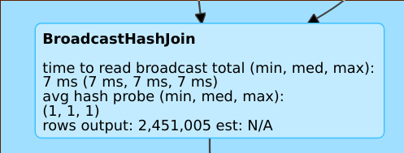
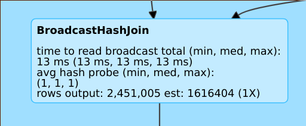
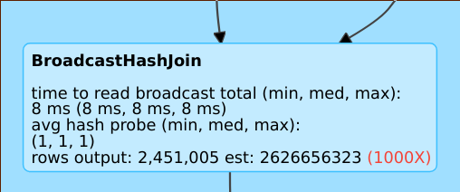

# Cost-based optimizer (CBO)

> **Source:** [docs.databricks.com/aws/en/optimizations/cbo](https://docs.databricks.com/aws/en/optimizations/cbo)
> **Added:** 2026-06-24
> **Source updated:** 2025-02-04
> **Tags:** optimization, performance, cbo, cost-based-optimizer, statistics, analyze-table, joins, explain, predictive-optimization, A1
> **Type:** documentation

## Summary
Spark SQL's cost-based optimizer (CBO) improves query plans — especially join order/strategy — using **table and column statistics**. Default-on (`spark.sql.cbo.enabled = true`). Critically dependent on fresh stats: collect with `ANALYZE TABLE … COMPUTE STATISTICS`, refresh after writes. On UC managed tables, **predictive optimization runs `ANALYZE` automatically**, so stats stay fresh without manual work.

## Key points

- Especially valuable for queries with **multiple joins** — `rowCount` drives join planning.
- Needs **both** column stats and table stats; missing stats → suboptimal plans.
- Default-on; disable via `spark.sql.cbo.enabled = false`.
- Predictive optimization auto-runs `ANALYZE` on UC managed tables.
- DBR 16.0+: `EXPLAIN` prints a per-table `missing / partial / full` stats summary + corrective command.

## Notes

### Collect statistics

```sql
ANALYZE TABLE <table-name> COMPUTE STATISTICS FOR ALL COLUMNS
```

Run `ANALYZE TABLE` after writing to a table to keep stats current. On managed tables, predictive optimization handles this (see [[predictive-optimization]]).

### Verify query plans — `EXPLAIN`

`EXPLAIN` shows whether the plan uses stats. Each operator carries `Statistics(sizeInBytes=…, rowCount=…)`. **Missing `rowCount`** means insufficient column stats — bad for multi-join queries.

[](assets/cost-based-optimizer/01-missing-estimate.png)
*Missing estimate: operator has no stats available.*

[](assets/cost-based-optimizer/02-good-estimate.png)
*Good estimate: estimated rows ≈ actual, error factor ~1.*

[](assets/cost-based-optimizer/03-bad-estimate.png)
*Bad estimate: estimate off by ~1000× — stale/missing stats.*

DBR 16.0+ `EXPLAIN` adds a stats-state summary:

```text
== Optimizer Statistics (table names per statistics state) ==
  missing = date_dim, store
  partial =
  full    = store_sales
Corrective actions: consider running the following command on all tables with missing or partial statistics
  ANALYZE TABLE <table-name> COMPUTE STATISTICS FOR ALL COLUMNS
```

### Spark SQL UI

The Spark SQL UI shows estimate accuracy per operator:

- `rows output: 2,451,005 est: N/A` → ~2M rows produced, **no stats**.
- `rows output: 2,451,005 est: 1616404 (1X)` → estimate ~1.6M, error factor 1 (good).
- `rows output: 2,451,005 est: 2626656323` → estimate ~2.6B, error factor ~1000 (bad).

### Disable

```scala
spark.conf.set("spark.sql.cbo.enabled", false)
```

## Quotes worth keeping

> "For this to work it is critical to collect table and column statistics and keep them up to date." (intro)

> "The rowCount statistic is especially important for queries with multiple joins. If rowCount is missing, it means there is not enough information to calculate it…" (EXPLAIN)

## Related sources

- [[predictive-optimization]] — auto-runs `ANALYZE` on managed tables, keeping CBO stats fresh.
- [[aqe]] — AQE re-optimizes at runtime using actual stats; CBO plans ahead from collected stats. Complementary.
- [[optimization-recommendations]] — parent hub (lists CBO under recommendations).
