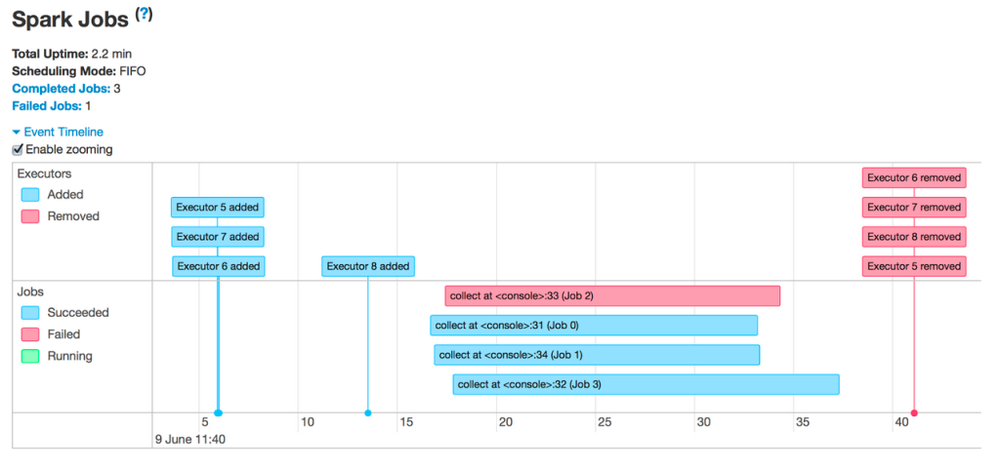
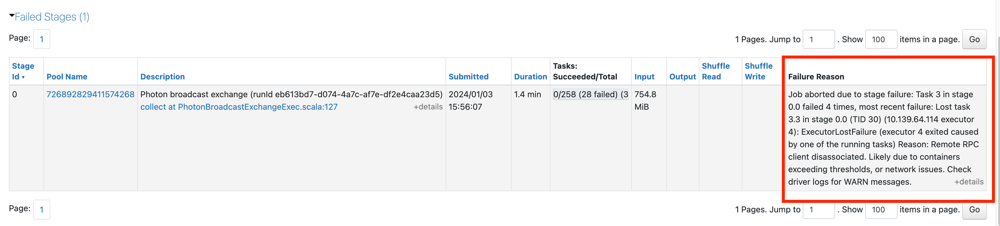
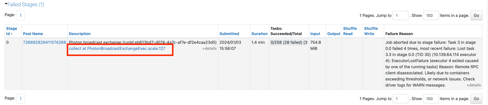
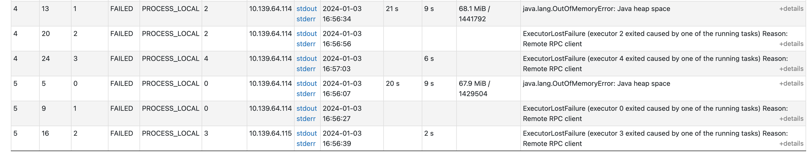
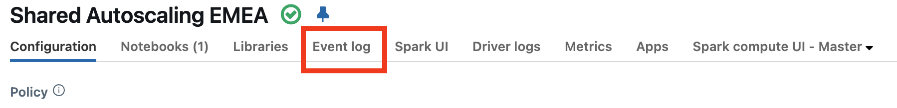
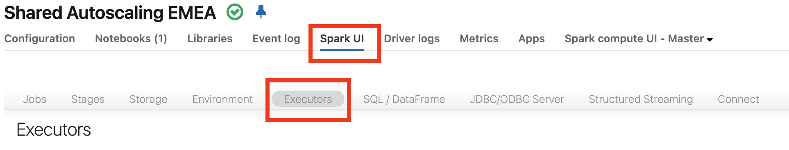
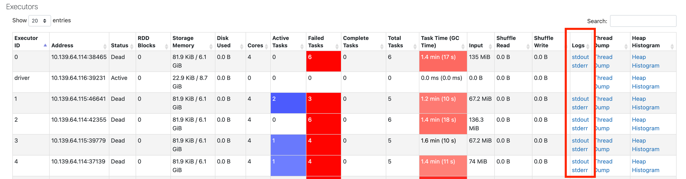

# Failing Jobs or Executors Removed

> **Source:** [docs.databricks.com/aws/en/optimizations/spark-ui-guide/failing-spark-jobs](https://docs.databricks.com/aws/en/optimizations/spark-ui-guide/failing-spark-jobs)
> **Added:** 2026-06-17
> **Source updated:** (not shown on page)
> **Tags:** spark, spark-ui, debugging, executors, memory, spot-instances, autoscaling, B2, B16
> **Type:** documentation

## Summary

Sub-page of the Spark UI Guide series. Covers the three causes of executor removal and provides step-by-step navigation for diagnosing failing jobs and failing executors. Final escalation path: if none of the other causes apply, assume a memory issue.

## Key points

- Three causes of executor removal: autoscaling (expected), spot instance reclaim (cloud), OOM.
- Failing job: drill from job → failed stage → stage description → individual task failures.
- Failing executor: check cluster Event log first; if no answer, check Spark UI Executors tab for executor logs.
- Terminal diagnosis: if you can't find another cause, the issue is almost certainly memory.

## Notes

### Three causes of executor removal

| Cause | Is it an error? | Next step |
|---|---|---|
| **Autoscaling** | No — expected | Nothing needed |
| **Spot instance reclaim** | No — cloud provider taking VMs back | See losing-spot-instances guide |
| **OOM (out of memory)** | Yes | See spark-memory-issues guide |

### Diagnosing failing jobs

*Jobs list with red/failed entries — click the failed job to start diagnosis.*

1. Click the failing job → job detail page.
2. Scroll down to the failed stage — read the **failure reason**.

*Failure reason shown below the stage timeline.*

3. Click the **link in the stage description** for more detail (if reason is generic).

*Stage description link expands additional error context.*

4. Scroll further to see **why each task failed**.

*Per-task failure reasons — most specific level of diagnosis.*

### Diagnosing failing executors

1. Check the compute's **Event log** first.

*Cluster Event log shows resizing events and spot instance losses — check here before going to Spark UI.*

2. If spot reclaim visible → see losing-spot-instances guide.
3. If autoscaling resize → expected, nothing to fix.
4. If no explanation: go to **Spark UI → Executors tab**.

*The Executors tab in Spark UI.*

5. Get logs from the failed executors.

*Failed executors shown with log links — executor stderr/stdout often has the root cause.*

### Escalation

> "If you've gotten this far, the likeliest explanation is a memory issue."

→ See `spark-memory-issues` (not yet captured).

## Open questions

- `losing-spot-instances` page — not yet captured (`/aws/en/optimizations/spark-ui-guide/losing-spot-instances`)
- `spark-memory-issues` page — not yet captured (`/aws/en/optimizations/spark-ui-guide/spark-memory-issues`)

## Related sources

- [[spark-ui-guide]] — parent guide; this page is part of the Jobs Timeline diagnostic branch
- [[optimize-data-workloads-guide]] — broader optimization context (memory, spill, cluster config)
