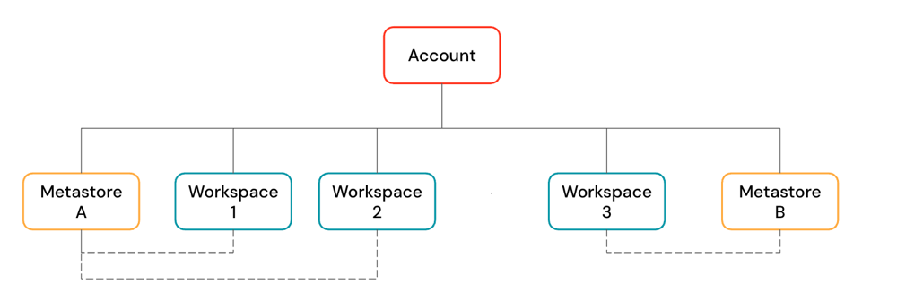
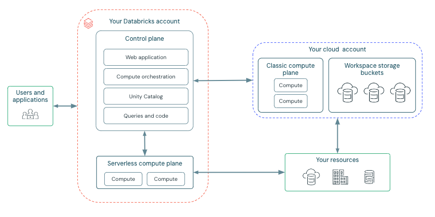
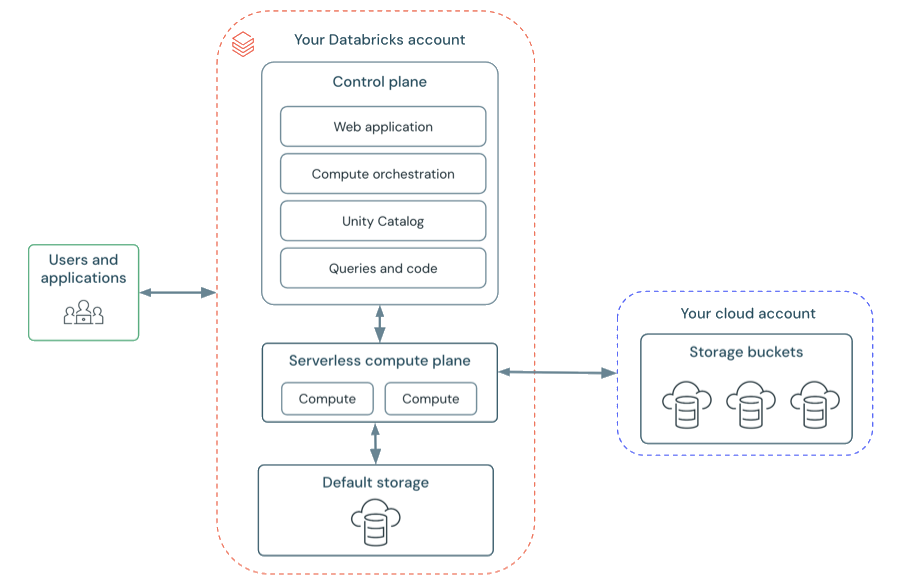

# High-level architecture

> **Source:** [docs.databricks.com/gcp/en/getting-started/high-level-architecture](https://docs.databricks.com/gcp/en/getting-started/high-level-architecture)
> **Added:** 2026-06-20
> **Source updated:** 2026-03-16
> **Tags:** architecture, control-plane, compute-plane, account, workspace, unity-catalog, serverless, classic, workspace-storage, gcp, B1
> **Type:** documentation

## Summary

Databricks runs as a **control plane** (Databricks-managed backend services and the web app, in the Databricks account) plus a **compute plane** (where data is processed). The compute plane is either serverless (in the Databricks account) or classic (in your own cloud account). Above workspaces sits the **account** — the top-level construct for identity, workspace, and Unity Catalog metastore management. Each workspace also keeps its own **workspace storage** (file-system data + system data), separate from your actual data objects. This is the GCP edition of the page; the split is the same on every cloud, only the storage/bucket terminology is cloud-specific.

## Key points

- **Three-tier object model**: account → workspace(s) → data governed by Unity Catalog metastore. One account holds many workspaces and metastores.
- **Unity Catalog three-level namespace**: `<catalog>.<schema>.<object>`. A metastore can attach to multiple workspaces **in the same region**, giving them the same data view + shared access controls.
- **Control plane** = Databricks-managed backend + web app, lives in the **Databricks account**, not your cloud account.
- **Compute plane** = where data is processed. Two kinds:
    - **Serverless** compute plane — runs in the **Databricks account** (same GCP region as the workspace's classic plane).
    - **Classic** compute plane — runs in **your GCP account**, inside each workspace's virtual network; natural isolation because it's your own account.
- **Workspace storage ≠ your data.** It holds workspace file-system data (notebooks, queries, dashboards, alerts, repos, libraries) and workspace system data (query/job results, notebook revisions, query plans, cluster logs).
- **Classic workspace = 3 GCS buckets** in your GCP account: system data, DBFS root (legacy/deprecated), and (if auto-enabled for UC) the default workspace catalog.
- **Serverless workspace = default storage** (fully managed); can also connect to your own cloud storage for catalogs/tables.
- ⚠️ **Never delete or modify classic workspace storage** — a workspace depends on both its control-plane databases and workspace storage; deleting storage makes the workspace unrecoverable.

## Notes

### Databricks objects — the account hierarchy

*Account is the top-level construct; it contains workspaces and Unity Catalog metastores.*

A **Databricks account** is the top-level construct for managing Databricks org-wide. At the account level you manage:

- **Identity and access**: users, groups, service principals, SCIM provisioning, SSO.
- **Workspace management**: create/update/delete workspaces across multiple regions.
- **Unity Catalog metastore management**: create metastores and attach them to workspaces.
- **Usage management**: billing, compliance, policies.

An account can contain **multiple workspaces and multiple Unity Catalog metastores**.

**Workspaces** are the collaboration environment where users run compute workloads — ingestion, interactive exploration, scheduled jobs, ML training.

**Unity Catalog metastores** are the central governance system for data assets (tables, ML models). Data is organized under the three-level namespace `<catalog-name>.<schema-name>.<object-name>`. A single metastore can link to multiple workspaces in the same region, giving each the same data view with access controls managed across all linked workspaces. (See [[unity-catalog-overview]] when captured.)

### Workspace architecture — control plane vs compute plane

Databricks operates out of a **control plane** and a **compute plane**:

- **Control plane** — the backend services Databricks manages in your Databricks account. Located in the **Databricks account, not your cloud account**. The web application lives here.
- **Compute plane** — where your data is processed. Two types depending on the compute used:
    - **Serverless compute** → resources run in a **serverless compute plane in your Databricks account**.
    - **Classic Databricks compute** → resources run in **your Google Cloud resources** (the classic compute plane) — refers to the network in your GCP resources and its resources.

This is the platform-level distinction behind [[classic-compute-overview]] (runs in your cloud account) vs [[serverless-notebooks]] / [[serverless-limitations]] (runs in Databricks-managed infrastructure).

### Classic workspace architecture

*General architecture for classic workspaces on GCP — compute runs in the customer's GCP project.*

Classic Databricks workspaces have **three associated storage buckets** (the workspace storage buckets), located in your Google Cloud account.

### Serverless workspace architecture

*General architecture for serverless workspaces — workspace storage lives in default storage.*

Workspace storage in serverless workspaces is in the workspace's **default storage**. You can also connect to your own cloud storage account to access your data.

### Serverless compute plane

Databricks compute resources run in a compute layer **within your Databricks account**. Databricks creates the serverless compute plane in the **same GCP region** as the workspace's classic compute plane (the region you select when creating the workspace).

To protect customer data, serverless compute runs within a **network boundary for the workspace**, with multiple security layers isolating different customer workspaces, plus additional network controls between clusters of the same customer.

### Classic compute plane

Compute resources run in **your Google Cloud account**. New resources are created within each workspace's **virtual network** in the customer's GCP account. A classic compute plane has **natural isolation** because it runs in each customer's own GCP account.

### Workspace storage

Workspace storage is handled differently per workspace type. It contains **two categories of data**, both separate from your own data objects (Unity Catalog tables and volumes):

**Workspace file system data** — assets users create/manage through the Databricks UI:

- Notebooks
- SQL queries and dashboards
- Alerts
- Repos (folders attached to Git repositories)
- Libraries (`.whl`, `.jar`)
- Python files, YAML configuration files, and other small files

**Workspace system data** — data generated internally by Databricks features; too large for memory/databases, or must persist beyond a single compute resource's lifetime:

- SQL query results and cached query results
- Job run results
- Notebook revisions
- SQL query plans used for observability
- Cluster logs

#### Serverless workspaces

Use **default storage** — a fully managed location for internal workspace system data **and** Unity Catalog data assets. Can also connect to your own cloud storage locations for your catalogs, tables, and other data assets.

#### Classic workspaces

> ⚠️ **IMPORTANT:** Do not delete or modify the workspace storage in your cloud account. A workspace depends on both its control-plane databases and its workspace storage. **If workspace storage is deleted, the workspace cannot be recovered.**

Workspace system data is **distinct from DBFS**. Although both may reside in the same GCS buckets, they serve different purposes: DBFS root is a user-accessible file system; workspace system data is used internally by Databricks features.

When you create a classic workspace, Databricks creates **three buckets** in your GCP account:

1. **System data bucket** — internal data generated by Databricks features.
2. **DBFS root bucket** — your workspace's root storage for DBFS (legacy, may be disabled). DBFS root and DBFS mounts are both in the `dbfs:/` namespace. **Storing/accessing data via DBFS root or mounts is a deprecated pattern, not recommended.**
3. **Default UC workspace catalog bucket** — present only if the workspace was auto-enabled for Unity Catalog. Holds the default workspace catalog; all users can create assets in its default schema.

## Quotes worth keeping

> "The control plane is located in the Databricks account, not your cloud account. The web application is in the control plane." (Workspace architecture)

> "If workspace storage is deleted, the workspace cannot be recovered." (Classic workspaces — IMPORTANT callout)

## Open questions

- How does the serverless compute plane's "network boundary for the workspace" map to NCC / Private Service Connect on GCP specifically? (Page links to "Serverless compute plane networking" — not yet captured.)
- Exact relationship between "default storage" and a UC-managed catalog's storage location for serverless workspaces.

## Related sources

- [[classic-compute-overview]] — drills into the classic compute that runs in *your* cloud account (this page's classic compute plane).
- [[serverless-limitations]] — what the serverless compute plane (in the Databricks account) can't do.
- [[dedicated-compute-overview]] / [[standard-compute-overview]] — access modes for compute inside the classic plane.
- [[lakehouse-what-is]] — the lakehouse concept that this account/workspace/UC architecture implements.
