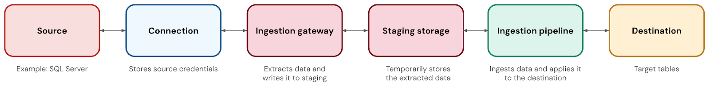

# Managed database connectors (CDC) — Lakeflow Connect

> **Source:** [docs.databricks.com/aws/en/ingestion/lakeflow-connect/cdc-overview](https://docs.databricks.com/aws/en/ingestion/lakeflow-connect/cdc-overview)
> **Added:** 2026-06-30
> **Source updated:** 2026-06-18
> **Tags:** lakeflow-connect, database-connectors, cdc, ingestion-gateway, staging-storage, A3
> **Type:** documentation

Fully-managed connectors for relational databases using change data capture (CDC). Each connector tracks changes in the source and applies them incrementally to Delta tables.

## Supported connectors

| Connector | Mode |
|---|---|
| MySQL | CDC |
| PostgreSQL | CDC |
| Microsoft SQL Server | CDC **or** full snapshot |

SQL Server is the only database connector offering a non-CDC (full snapshot) mode.

## Connector components

*Five components of a database connector pipeline.*

| Component | Description | Key operational notes |
|---|---|---|
| **Connection** | UC securable object storing database authentication details | — |
| **Ingestion gateway** | Pipeline that extracts snapshots, change logs, and metadata from the source | Runs on **classic compute**; runs **continuously** to capture changes before source change logs can be truncated |
| **Staging storage** | UC volume that temporarily holds extracted data before the ingestion pipeline applies it | Auto-purged after **30 days**; decouples gateway (continuous) from pipeline (scheduled); aids failure recovery |
| **Ingestion pipeline** | Moves data from staging into destination tables | Runs on **serverless compute**; you pay for gateway classic compute **even when the pipeline is idle** |
| **Destination tables** | Target streaming tables | Delta tables with extra incremental processing support |

**Sizing gotcha:** the initial snapshot can **fail on undersized gateway compute**. Size for your workload; see connector-specific sizing recommendations.

## Why the gateway runs continuously

Source databases have finite change log (binlog/WAL) retention windows. The gateway must read and stage change events before the source truncates them — it can't catch up from a stopped state. This is why the gateway is a continuous running cost even if you ingest on a slow schedule.

## Network connectivity

Gateway runs in your Databricks workspace VPC / VNet. Any network path that allows the gateway to reach the source is supported:

- VPN
- AWS Direct Connect / Azure ExpressRoute
- VPC or VNet peering
- Public endpoints

**Cross-cloud supported:** e.g., an Azure Databricks workspace can ingest from an AWS Aurora PostgreSQL database if network connectivity exists between the environments.

[[lakeflow-connect-managed]] · [[lakeflow-connect-pipeline-maintenance]] · [[lakeflow-connect-faq]] · [[lakeflow-connect-gateway-event-logs]]
