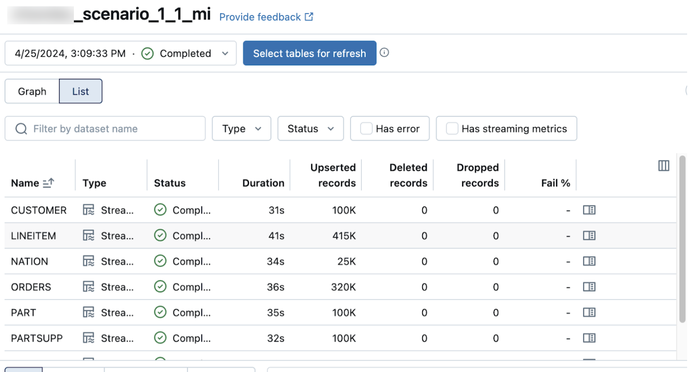

# Common pipeline maintenance tasks (Lakeflow Connect)

> **Source:** [docs.databricks.com/aws/en/ingestion/lakeflow-connect/pipeline-maintenance](https://docs.databricks.com/aws/en/ingestion/lakeflow-connect/pipeline-maintenance)
> **Added:** 2026-06-30
> **Source updated:** 2026-06-25
> **Tags:** lakeflow-connect, managed-connectors, pipeline-maintenance, operations, staging-files, A3
> **Type:** documentation

**Applies to:** SaaS connectors · Database connectors · Query-based connectors (per task)

Operations reference for ongoing managed ingestion pipeline management.

## Restart the ingestion pipeline

**Applies to:** SaaS · Database · Query-based

Use when a pipeline run fails unexpectedly or hangs (transient network issues, source database timeouts, corrected config errors).

| Interface | Command |
|---|---|
| Lakehouse UI | Manually trigger a pipeline update |
| Pipelines API | `POST /api/2.0/pipelines/{pipeline_id}/updates` |
| Databricks CLI | `databricks pipelines start-update` |

## Restart the ingestion gateway

**Applies to:** SaaS · Database connectors only

DB connector table discovery runs periodically — new tables can take **up to 6 hours** to appear. Restart the gateway to force immediate discovery.

Same interfaces as pipeline restart: `POST /api/2.0/pipelines/{pipeline_id}/updates` / `databricks pipelines start-update`.

## Run a full refresh

**Applies to:** SaaS · Database · Query-based

Clears existing data and reingests all records. Use when data is inconsistent, incomplete, or needs reprocessing. See [[lakeflow-connect-full-refresh]] for full behavior details.

Same interfaces: `POST /api/2.0/pipelines/{pipeline_id}/updates` / `databricks pipelines start-update`.

## Update the pipeline schedule

**Applies to:** SaaS · Database · Query-based

> **Gotcha:** schedule updates use the **Jobs API**, not the Pipelines API.

| Interface | Command |
|---|---|
| Lakehouse UI | Schedule a pipeline with the pipeline UI |
| Jobs API | `POST /api/2.2/jobs/update` |
| Databricks CLI | `databricks jobs update` |

## Set up alerts and notifications

**Applies to:** SaaS · Database · Query-based

Lakeflow Connect **automatically** sets up notifications for ingestion pipelines and scheduling jobs. Customize if needed.

| Interface | Command |
|---|---|
| Lakehouse UI | Add email notifications for pipeline events |
| Pipelines API | `PUT /api/2.0/pipelines/{pipeline_id}` |
| Databricks CLI | `databricks pipelines update` |

## Remove unused staging files

**Applies to:** SaaS · Database connectors only

**Pipelines created after January 6, 2025:** auto-cleanup is on by default.

- Staging data scheduled for deletion: **25 days** after last successful pipeline run
- Physically removed: **30 days**
- Auto-cleaned: CDC data files, snapshot files, staging table data

**Gap risk:** if the pipeline has not completed successfully for 25+ days, staging files may be gone → **data gaps in destination tables**. Trigger a full refresh to recover.

**Pipelines created before January 6, 2025:** contact Databricks Support to request manual enablement of automatic retention management.

## Specify tables to ingest

**Applies to:** SaaS · Database · Query-based

Two methods in the `ingestion_definition.objects` field (API/CLI only):

- **Table specification** — ingest a single named table to a specific destination
- **Schema specification** — ingest all tables from a source schema; check per-connector table-count limits

| Interface | Command |
|---|---|
| Pipelines API | `PUT /api/2.0/pipelines/{pipeline_id}` |
| Databricks CLI | `databricks pipelines update` |

## Verify successful data ingestion

**Applies to:** SaaS · Database connectors only

Pipeline details page list view shows records processed, auto-refreshing. **Upserted records** and **Deleted records** columns are hidden by default — enable via the columns configuration button.

*Pipeline details list view with upserted and deleted record counts.*

[[lakeflow-connect-common-patterns]] · [[lakeflow-connect-full-refresh]] · [[lakeflow-connect-monitor-costs]] · [[lakeflow-connect-gateway-event-logs]]
