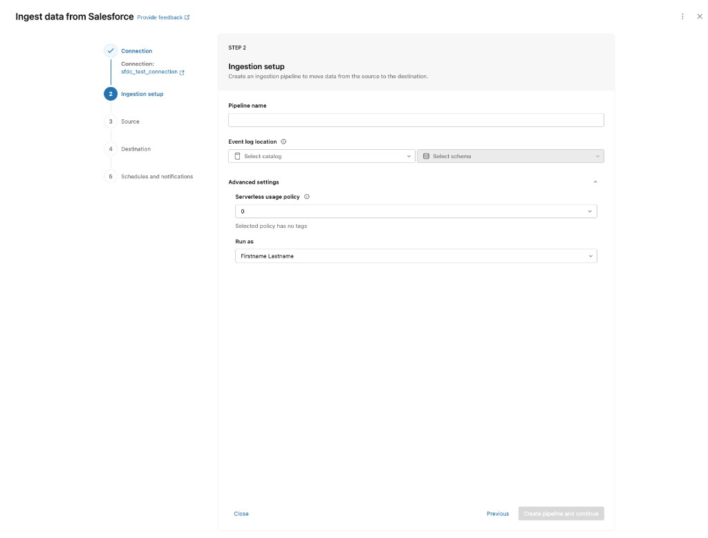
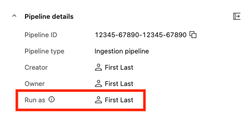

# Configure the Run as identity for a pipeline (Lakeflow Connect)

> **Source:** [docs.databricks.com/aws/en/ingestion/lakeflow-connect/run-as](https://docs.databricks.com/aws/en/ingestion/lakeflow-connect/run-as)
> **Added:** 2026-06-30
> **Source updated:** 2026-05-06
> **Tags:** lakeflow-connect, managed-connectors, run-as, service-principal, identity, A3
> **Type:** documentation

**Applies to:** SaaS connectors · Database connectors · Query-based connectors

**Run as** determines which identity's permissions the pipeline uses at runtime. Default: pipeline **owner** (a user).

**Databricks recommendation:** set Run as to a **service principal** so pipelines continue to run if the owner leaves the organization or loses workspace access. User accounts change; service principals don't.

UI-only configuration (no API/CLI options documented on this page).

## Configure Run as during pipeline creation

1. In the **Ingestion setup** step, expand **Advanced settings**
2. In the **Run as** dropdown, select a service principal (leave default to run as owner)
3. Complete remaining steps and save

*Run as dropdown in Advanced settings during pipeline creation.*

## View the Run as setting

On the pipeline monitoring page → **Pipeline details** panel → **Run as** field.

*Pipeline details panel with current Run as identity.*

## Change Run as for an existing pipeline

1. Open the pipeline monitoring page
2. Click **Edit pipeline**
3. In **Advanced settings**, update the **Run as** dropdown
4. Save

[[lakeflow-connect-common-patterns]] · [[lakeflow-connect-pipeline-maintenance]] · [[lakeflow-connect-managed]]
