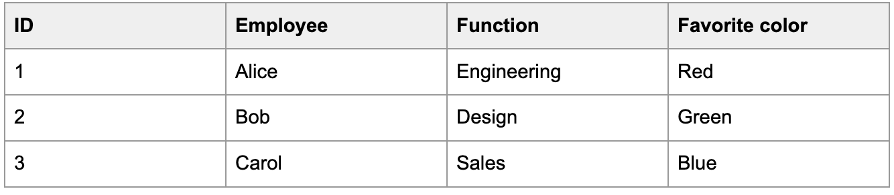
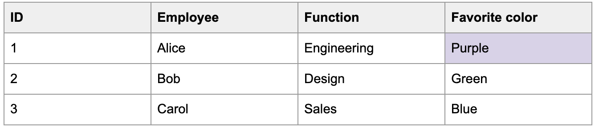
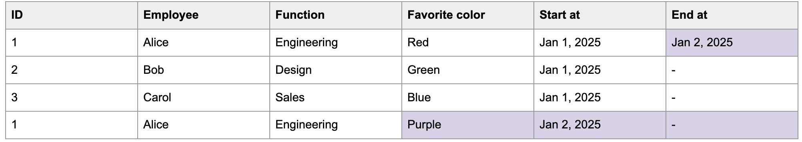
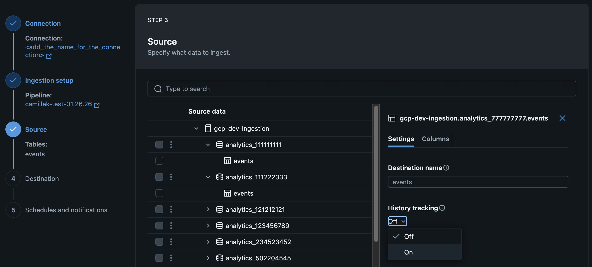

# Enable history tracking / SCD Type 2 (Lakeflow Connect)

> **Source:** [docs.databricks.com/aws/en/ingestion/lakeflow-connect/scd](https://docs.databricks.com/aws/en/ingestion/lakeflow-connect/scd)
> **Added:** 2026-06-30
> **Source updated:** 2026-05-06
> **Tags:** lakeflow-connect, managed-connectors, ingestion, scd, scd-type-2, history-tracking, sequence-by, A3
> **Type:** documentation

**Applies to:** SaaS connectors · Database connectors · Query-based connectors

The `scd_type` parameter in `table_configuration` controls how changes are handled over time.

- **`SCD_TYPE_1`** (default) — overwrite outdated records as they're updated/deleted in source
- **`SCD_TYPE_2`** — keep a history of changes; old rows are marked inactive; new rows added for each change

> **Note:** Deleting a table or column in source does **not** delete that data from the destination — even with SCD Type 1 selected.

Not all connectors support SCD Type 2. Check the Feature availability section on your connector's overview page.

## History tracking behavior

**Source table:**

[](assets/lakeflow-connect-scd/01-source-table.png)
*Example source table before a change*

**SCD Type 1** — after Alice's favorite color changes to purple, the row is overwritten:

[](assets/lakeflow-connect-scd/02-scd1-result.png)
*SCD Type 1: row overwritten in destination*

**SCD Type 2** — old row kept (marked inactive) + new row added:

[](assets/lakeflow-connect-scd/03-scd2-result.png)
*SCD Type 2: history preserved with __START_AT / __END_AT columns*

## Enable in the UI

On the Source page of the data ingestion wizard, set the **History tracking** drop-down to **On** (SCD Type 2):

[](assets/lakeflow-connect-scd/04-ui-history-tracking.png)
*History tracking setting in the Databricks UI*

## Enable via API — `scd_type` in `table_configuration`

Set `scd_type: SCD_TYPE_2` inside `table_configuration` on each `table` or `report` object.

### Google Analytics

SCD Type 2 supported for `users` and `pseudonymous_users` tables only (cursor: `last_updated_date`). Not supported for event-level tables (append-only).

**DABs (YAML)**

```yaml
resources:
  pipelines:
    pipeline_ga4:
      name: <pipeline-name>
      catalog: <destination-catalog>
      schema: <destination-schema>
      ingestion_definition:
        connection_name: <connection-name>
        objects:
          - table:
              source_url: <project-id>
              source_schema: <property-name>
              destination_catalog: <destination-catalog>
              destination_schema: <destination-schema>
              table_configuration:
                scd_type: SCD_TYPE_2
```

**Databricks notebook (Python)**

```python
pipeline_spec = """
{
  "name": "<pipeline-name>",
  "ingestion_definition": {
    "connection_name": "<connection-name>",
    "objects": [
      {
        "table": {
          "source_url": "<project-id>",
          "source_schema": "<property-name>",
          "destination_catalog": "<destination-catalog>",
          "destination_schema": "<destination-schema>",
          "table_configuration": {
            "scd_type": "SCD_TYPE_2"
          }
        }
      }
    ]
  }
}
"""
```

**Databricks CLI (JSON)**

```json
{
  "resources": {
    "pipelines": {
      "pipeline_ga4": {
        "name": "<pipeline-name>",
        "catalog": "<destination-catalog>",
        "schema": "<destination-schema>",
        "ingestion_definition": {
          "connection_name": "<connection-name>",
          "objects": [
            {
              "table": {
                "source_url": "<project-id>",
                "source_schema": "<property-name>",
                "destination_catalog": "<destination-catalog>",
                "destination_schema": "<destination-schema>",
                "table_configuration": {
                  "scd_type": "SCD_TYPE_2"
                }
              }
            }
          ]
        }
      }
    }
  }
}
```

### Salesforce

Same pattern as GA — `scd_type: SCD_TYPE_2` in `table_configuration`; uses `source_schema` + `source_table` instead of `source_url`/`source_schema`.

**DABs (YAML)**

```yaml
              table_configuration:
                scd_type: SCD_TYPE_2
```

### SQL Server (database connector)

Requires an additional `sequence_by` column. The sequence column determines the time span (`__START_AT` / `__END_AT`) for each row version in the target.

**Supported `sequence_by` column types:** Timestamp · Date · Integer · Long · String

**DABs (YAML)**

```yaml
resources:
  pipelines:
    pipeline_sqlserver:
      name: <pipeline-name>
      catalog: <destination-catalog>
      schema: <destination-schema>
      ingestion_definition:
        connection_name: <connection-name>
        objects:
          - table:
              source_catalog: <source-catalog>
              source_schema: <source-schema>
              source_table: <source-table>
              destination_catalog: <destination-catalog>
              destination_schema: <destination-schema>
              table_configuration:
                scd_type: SCD_TYPE_2
                sequence_by: <sequence-column>
```

**Databricks notebook (Python)**

```python
pipeline_spec = """
{
  "name": "<pipeline-name>",
  "ingestion_definition": {
    "connection_name": "<connection-name>",
    "objects": [
      {
        "table": {
          "source_catalog": "<source-catalog>",
          "source_schema": "<source-schema>",
          "source_table": "<source-table>",
          "destination_catalog": "<destination-catalog>",
          "destination_schema": "<destination-schema>",
          "table_configuration": {
            "scd_type": "SCD_TYPE_2",
            "sequence_by": "<version-number>"
          }
        }
      }
    ]
  }
}
"""
```

**Databricks CLI (JSON)**

```json
{
  "resources": {
    "pipelines": {
      "pipeline_sqlserver": {
        "ingestion_definition": {
          "objects": [
            {
              "table": {
                "table_configuration": {
                  "scd_type": "SCD_TYPE_2",
                  "sequence_by": "<version-number>"
                }
              }
            }
          ]
        }
      }
    }
  }
}
```

### Workday (report-based)

Uses `report` + `source_url` (no `sequence_by` needed):

**DABs (YAML)**

```yaml
              objects:
                - report:
                    source_url: <report-url>
                    destination_catalog: <destination-catalog>
                    destination_schema: <destination-schema>
                    table_configuration:
                      scd_type: SCD_TYPE_2
```

## Limitations

Full refresh replaces the **entire table**. All previous row versions are removed. New history is tracked starting from the refresh point.

## Contrast with SDP SCD Type 2

This is the Lakeflow **Connect** (managed ingestion) SCD setting — a simple `scd_type` flag in `table_configuration`. It differs from Lakeflow **Spark Declarative Pipelines** SCD, which uses the `APPLY CHANGES INTO` / `AUTO CDC` API with an explicit `SEQUENCE BY` column and CDC event stream. See [[what-is-cdc]] for the SDP approach.

[[lakeflow-connect-common-patterns]] · [[lakeflow-connect-managed]] · [[what-is-cdc]]
