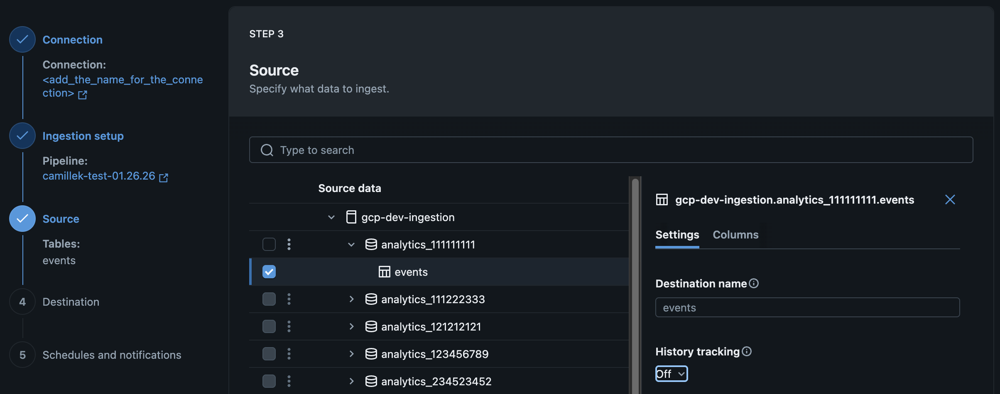

# Name a destination table (Lakeflow Connect)

> **Source:** [docs.databricks.com/aws/en/ingestion/lakeflow-connect/table-rename](https://docs.databricks.com/aws/en/ingestion/lakeflow-connect/table-rename)
> **Added:** 2026-06-30
> **Source updated:** 2026-05-06
> **Tags:** lakeflow-connect, managed-connectors, destination-table, table-rename, A3
> **Type:** documentation

**Applies to:** SaaS connectors · Database connectors · Query-based connectors

By default, destination table name = source table name. Optionally override with `destination_table`.

Required when ingesting the same object into two tables in the same destination schema — duplicate table names in the same schema are not supported. See [[lakeflow-connect-multi-destination]] for the full fan-out pattern.

## Name in the UI

On the **Source** page of the data ingestion wizard, enter a name in the **Destination table** field.

[](assets/lakeflow-connect-table-rename/01-ui-destination-table.png)
*Optional destination table name setting in the Databricks UI.*

## Name via API

Set `destination_table` in the `table` (or `report` for Workday) object inside `ingestion_definition.objects`.

### Google Analytics (DABs YAML)

```yaml
resources:
  pipelines:
    pipeline_ga4:
      name: <pipeline-name>
      catalog: <target-catalog>   # event log location
      schema: <target-schema>     # event log location
      ingestion_definition:
        connection_name: <connection-name>
        objects:
          - table:
              source_url: <project-id>
              source_schema: <property-name>
              destination_catalog: <target-catalog>
              destination_schema: <target-schema>
              destination_table: <custom-target-table-name>
```

### Salesforce (DABs YAML)

```yaml
resources:
  pipelines:
    pipeline_sfdc:
      name: <pipeline-name>
      catalog: <target-catalog>
      schema: <target-schema>
      ingestion_definition:
        connection_name: <connection-name>
        objects:
          - table:
              source_schema: <source-schema>
              source_table: <source-table>
              destination_catalog: <target-catalog>
              destination_schema: <target-schema>
              destination_table: <custom-target-table-name>
```

### Workday (DABs YAML)

Workday uses `report` + `source_url` instead of `table` + `source_schema`/`source_table`.

```yaml
resources:
  pipelines:
    pipeline_workday:
      name: <pipeline-name>
      catalog: <target-catalog>
      schema: <target-schema>
      ingestion_definition:
        connection_name: <connection-name>
        objects:
          - report:
              source_url: <report-url>
              destination_catalog: <target-catalog>
              destination_schema: <target-schema>
              destination_table: <custom-target-table-name>
```

[[lakeflow-connect-common-patterns]] · [[lakeflow-connect-multi-destination]] · [[lakeflow-connect-managed]]
