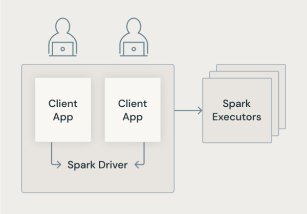
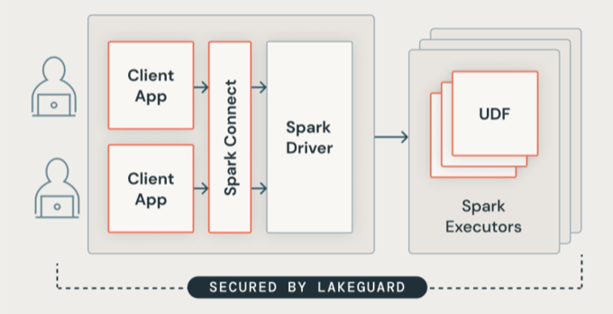

# Lakeguard

> **Source:** [docs.databricks.com/aws/en/compute/lakeguard](https://docs.databricks.com/aws/en/compute/lakeguard)
> **Added:** 2026-06-16
> **Source updated:** 2025-11-05
> **Tags:** compute, lakeguard, security, isolation, standard-compute, spark-connect, UDF, B1
> **Type:** documentation

Lakeguard is the set of technologies Databricks uses to enforce **code isolation and data filtering on multi-user shared compute** — standard classic compute, serverless compute, and SQL warehouses. It replaces the classic Spark model (shared JVM, privileged machine access) with container-sandboxed client processes connected via **Spark Connect**, sandboxes UDFs separately on executors with egress network isolation, and applies data filtering to prevent cross-user leakage through row/column security policies.

## The problem: classic Spark architecture

In traditional Spark, "user applications share a JVM with privileged access to the underlying machine." On shared compute, one user's process can potentially access another user's data or interfere with their execution.

*Traditional Spark architecture.*

## Lakeguard architecture

"Lakeguard isolates all user code using secure containers. This allows multiple workloads to run on the same compute resource while maintaining strict isolation between users." Boundaries enforced: user ↔ user, user ↔ Spark driver, user ↔ Spark executors.

*Lakeguard architecture.*

## Spark client isolation

Two components work together:

**Spark Connect** — "Lakeguard uses Spark Connect to decouple client applications from the driver. Client applications and drivers no longer share the same JVM or classpath."

> ⚠️ "Spark Connect defers analysis and name resolution to execution time, which may change the behavior of your code." Plan-time errors (e.g. referencing a nonexistent column) may not surface until the query actually runs. ([[serverless-limitations]] lists Spark Connect as the only supported API surface on serverless.)

**Container sandboxing** — "Each client application runs in its own isolated container environment." Each user's notebook/query process is walled off from others — no shared memory, no shared classpath.

## UDF isolation

UDFs run on Spark executors and could in theory exfiltrate data or cross-contaminate. Lakeguard **sandboxes** the UDF execution environment on executors, **isolates egress network traffic** from UDFs, and **replicates** the client's container environment into the UDF sandbox so UDFs see consistent libraries.

| Surface | Python UDFs | Scala/Java UDFs |
|---|---|---|
| Standard classic compute | Isolated | Isolated |
| Serverless compute | Isolated | May not be equivalent |
| SQL warehouses | Isolated | May not be equivalent |

## Data filtering

Lakeguard prevents users from "accessing data resulting from over-fetching when queries include row- or column-level filters." Without isolation, a Spark engine that fetches more rows than a filter allows could expose those rows to another user sharing the same executor; Lakeguard enforces filter boundaries at the isolation layer.

Related: [[standard-compute-overview]], [[serverless-limitations]], [[dedicated-compute-overview]], [[classic-compute-configure]].
