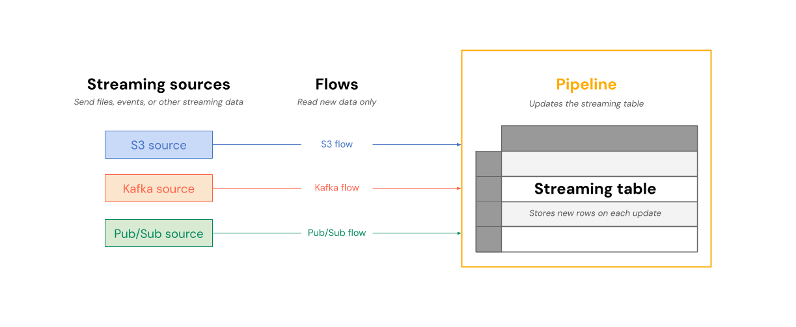
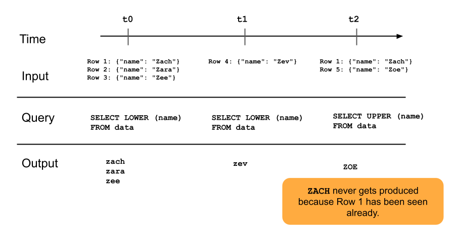

# Streaming tables (Lakeflow Spark Declarative Pipelines concepts)

> **Source:** [docs.databricks.com — Streaming tables](https://docs.databricks.com/aws/en/ldp/concepts/streaming-tables)
> **Added:** 2026-07-02
> **Source updated:** 2026-06-16
> **Tags:** lakeflow, declarative-pipelines, sdp, streaming-tables, auto-loader, real-time-mode, watermarks, I3
> **Type:** documentation

Breadcrumb: Data engineering › Lakeflow Spark Declarative Pipelines › Concepts › Streaming tables. Third page in the `ldp/concepts/` family alongside [[ldp-concepts-pipelines]] and [[ldp-concepts-flows]] — streaming tables were only name-dropped as a target type before this note.

A **streaming table** is a Delta table with added support for streaming/incremental processing. It can be targeted by one or more [[ldp-concepts-flows|flows]] in a pipeline. For when to pick a streaming table vs a materialized view or view, see the pipelines note's target-type guidance.

## Why streaming tables for ingestion

- Each input row is handled **only once** — matches most ingestion workloads (append or upsert).
- Handles large volumes of append-only data.

## Why streaming tables for low-latency transformations

They can reason over rows and time windows, handle high volumes, and give low-latency processing.

*Flows read from streaming sources and write incrementally into a streaming table within a pipeline.*

On each update, each flow associated with a streaming table reads the changed data in its streaming source and appends new information to the table.

## Ownership

Streaming tables are **owned and updated by a single pipeline** — defined explicitly in that pipeline's source code. A table defined by one pipeline can't be changed or updated by any other pipeline. Multiple flows can append to the same streaming table.

Databricks creates **internal support tables** for streaming-table processing. These show up in `system.information_schema.tables` but are **not visible in Catalog Explorer** or other workspace UI.

> 📌 **Standalone streaming tables get an auto-created pipeline.** Create a streaming table outside a pipeline definition and Databricks creates a pipeline to update it — visible under Jobs & Pipelines (add the **Pipeline type** column). Streaming tables defined inside a pipeline have type **ETL**; standalone ones have type **MV/ST**. This mirrors the standalone-vs-in-pipeline distinction already noted for materialized views in [[ldp-concepts-pipelines]] (`pipeline_type` = `DBSQL`/MV-ST for standalone MVs — standalone STs use the same `MV/ST` pipeline type).

## Streaming tables for ingestion

Append-only-source-shaped: data arrives continuously and must be captured once, without reprocessing. Supported ingestion sources: cloud object storage via **Auto Loader**, and streaming message buses — **Apache Kafka, Azure Event Hubs, Google Pub/Sub**.

> To stream source data that **changes over time** (updates/deletes at the source), use **AUTO CDC** to apply those changes instead of appending — see [[what-is-cdc]].

*Append-only streaming tables: each row is queried once, ever.*

A row already appended to a streaming table is **not re-queried** by later pipeline updates. Change the query (e.g. `SELECT LOWER(name)` → `SELECT UPPER(name)`) and existing rows keep their old value — only new rows use the new logic. A **full refresh** requeries all previous data from source to update every row under the current query.

## Streaming tables and low-latency streaming

Designed for low-latency streaming over **bounded state**, using checkpoint management. They expect streams that are naturally bounded or bounded with a watermark.

- **Naturally bounded stream** — a well-defined start and end, e.g. reading a directory of files where no new files land after the initial batch; finite file count, stream ends once all are processed.
- **Watermark-bounded stream** — a Structured Streaming mechanism that caps how long the system waits for delayed events before closing a time window. An unbounded stream with **no watermark can fail the pipeline from memory pressure**.

For the lowest possible latency on operational workloads, run the pipeline in **real-time mode** for sub-second end-to-end latency.

## Streaming table limitations

- **Limited evolution** — you can change the query without recomputing the whole dataset, but without a full refresh a streaming table only ever sees each row once, so rows processed under different query versions look different (the `UPPER()` example above). You must track all previous query versions still "live" in your dataset; full refresh is the only way to reprocess prior rows under the current query.
- **State management** — low-latency streams must be naturally bounded or watermark-bounded (see above).
- **Joins don't recompute** — a join in a streaming table does not recompute when a joined dimension changes. Good for "fast-but-wrong" scenarios; if correctness matters more than latency, use a **materialized view** instead — MVs always recompute joins when dimensions change (see stream-static join guidance).
- **No CLONE support** — streaming tables can't be the source or target of a deep or shallow clone.
- **REFRESH privilege required to view the pipeline** — a non-admin viewing the pipeline backing a streaming table needs the `REFRESH` privilege on the table, in addition to pipeline permissions.

---
Related: [[ldp-concepts-pipelines]] — the pipeline container a streaming table lives inside, and the `pipeline_type` taxonomy this note's standalone-ST callout extends; [[ldp-concepts-flows]] — the flow types that write into a streaming table (Append, Auto CDC); [[what-is-cdc]] — AUTO CDC mechanics for change-shaped (not append-only) sources; [[materialized-views]] — the correctness-over-latency alternative when joins must recompute.
