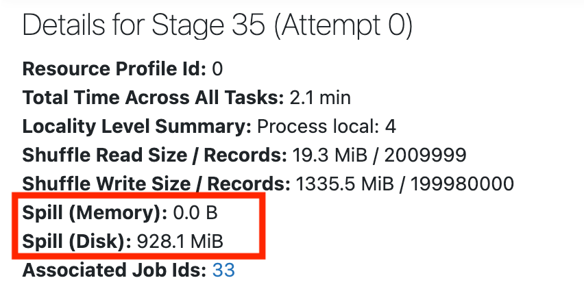
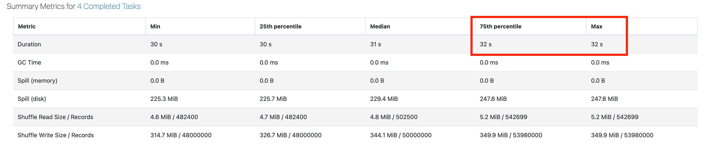
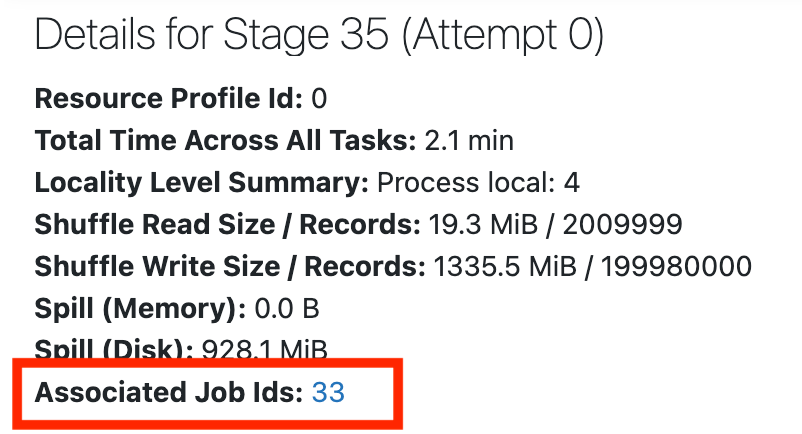

# Look for Skew or Spill

> **Source:** [docs.databricks.com/aws/en/optimizations/spark-ui-guide/long-spark-stage-page](https://docs.databricks.com/aws/en/optimizations/spark-ui-guide/long-spark-stage-page)
> **Added:** 2026-06-17
> **Source updated:** (not shown on page)
> **Tags:** spark, spark-ui, performance, debugging, skew, spill, memory, shuffle, B2, B16
> **Type:** documentation

## Summary

Step 3 of the Spark UI diagnostic series. After opening the stage detail page (from Step 2), check for two conditions in order: spill first, then skew. If neither is present, navigate back to the job via "Associated Job Ids" and proceed to the I/O-bound check (Step 4).

## Key points

- Check spill first: any spill statistics visible = spill present; no stats = no spill.
- Skew threshold: `Max duration > 1.5× 75th-percentile duration` → probable skew.
- No skew, no spill: click "Associated Job Ids" on the job page → go to Step 4 (high I/O).

## Notes

### Check 1 — Spill

Spill: Spark runs low on memory → moves data from RAM to disk. Expensive. Most common during shuffle stages.

*Spill statistics appear at the top of the stage page when spill occurred. No stats = no spill in this stage.*

**Decision:**

| Spill stats visible? | Meaning |
|---|---|
| No | No spill — move to skew check |
| Yes | Spill present → see [[optimize-data-workloads-guide]] spill section |

### Check 2 — Skew

Skew: one or a few tasks take much longer than the rest → poor cluster utilisation, slow jobs.

Navigate to **Summary Metrics** on the stage detail page. Compare Max duration vs 75th percentile.

*Summary Metrics table — compare the Max row against the 75th percentile row.*

**Threshold:** `Max duration > 1.5× 75th-percentile` → probable skew.

Equal Max and 75th percentile values → no skew.

**Decision:**

| Max > 1.5× P75? | Meaning |
|---|---|
| No | No skew — move to no-skew/spill path |
| Yes | Probable skew → see [[optimize-data-workloads-guide]] skew/salting section |

### No skew, no spill — navigate to Step 4

Go back to the job page. Scroll to top. Click **Associated Job Ids**.

*"Associated Job Ids" link navigates back to the job context for the high-I/O check.*

→ Proceed to Step 4: [[long-spark-stage-io]] (Spark stage high I/O).

## Related sources

- [[spark-ui-guide]] — parent guide; this is Step 3 of 5
- [[long-spark-stage]] — Step 2 (longest stage); leads here
- [[long-spark-stage-io]] — Step 4 (I/O bound check); follows from here
- [[optimize-data-workloads-guide]] — spill AQE configs + skew salting remediation

## Images

*Spill Stats (852×422)*

*Skew Stats (2990×643)*

*Stage to Job (802×434)*

