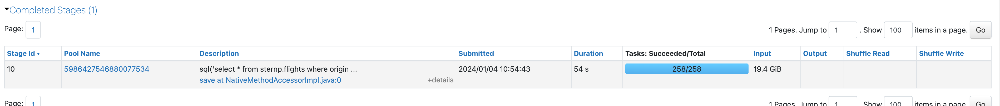

# Look at Longest Stage

> **Source:** [docs.databricks.com/aws/en/optimizations/spark-ui-guide/long-spark-stage](https://docs.databricks.com/aws/en/optimizations/spark-ui-guide/long-spark-stage)
> **Added:** 2026-06-17
> **Source updated:** 2026-03-06
> **Tags:** spark, spark-ui, performance, debugging, stages, tasks, shuffle, B2, B16
> **Type:** documentation

## Summary

Step 2 of the Spark UI diagnostic series. After identifying the longest job on the Jobs Timeline, this page guides you to find the longest stage within that job, note its I/O metrics, and branch on task count: one task is a red flag, multiple tasks get skew/spill investigation.

## Key points

- Sort stages by **Duration** — longest stage is the one to fix.
- Four I/O columns to note (Input, Output, Shuffle Read, Shuffle Write) — needed for the I/O-bound check in Step 4.
- **One task → problem.** Go to "One Spark task" guide.
- **Multiple tasks → investigate further.** Click stage description → go to skew/spill page (Step 3).

## Notes

### Finding the longest stage

Scroll to the stage list at the bottom of the job's detail page. Sort by **Duration** descending.

*Stage list sorted by duration — the longest stage is the investigation target.*

### I/O metrics — note these for Step 4

| Column | What it measures |
|---|---|
| **Input** | Data read from storage (Delta, Parquet, CSV, …) |
| **Output** | Data written to storage |
| **Shuffle Read** | Shuffle data consumed by this stage |
| **Shuffle Write** | Shuffle data produced by this stage |

> "Make note of these numbers as you'll likely need them later." (used in Step 4 I/O-bound formula)

### Task count — the branch condition

| Task count | Meaning | Next step |
|---|---|---|
| **1 task** | Sign of a problem | → `one-spark-task` guide (not yet captured) |
| **> 1 task** | Investigate further | → Click stage description → Step 3 (skew/spill) |

*Click the link in the stage's description to open stage detail — then proceed to skew/spill analysis.*

## Open questions

- `one-spark-task` sub-page not yet captured — `/aws/en/optimizations/spark-ui-guide/one-spark-task`

## Related sources

- [[spark-ui-guide]] — parent guide; this is Step 2 of 5
- [[spark-ui-guide]] Step 3: [[long-spark-stage-page]] — skew/spill (not yet a separate note)
- [[optimize-data-workloads-guide]] — shuffle data sizing formulas used in Step 4
