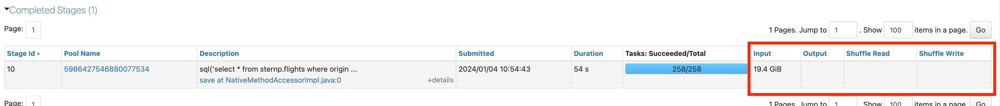
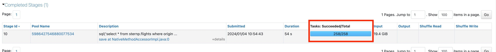
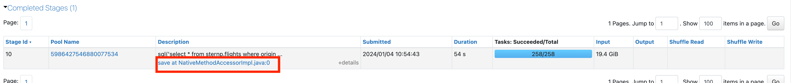

# Look at Longest Stage

> **Source:** [docs.databricks.com/aws/en/optimizations/spark-ui-guide/long-spark-stage](https://docs.databricks.com/aws/en/optimizations/spark-ui-guide/long-spark-stage)
> **Added:** 2026-06-17
> **Source updated:** 2026-03-06
> **Tags:** spark, spark-ui, performance, debugging, stages, tasks, shuffle, B2, B16
> **Type:** documentation

Step 2 of the Spark UI diagnostic series. After identifying the longest job on the Jobs Timeline, this page finds the longest stage within that job, notes its I/O metrics, and branches on task count: **one task is a red flag**; multiple tasks get skew/spill investigation.

## Finding the longest stage

Scroll to the stage list at the bottom of the job's detail page and sort by **Duration** descending — the longest stage is the investigation target.

## I/O metrics — note these for Step 4

| Column | What it measures |
|---|---|
| **Input** | Data read from storage (Delta, Parquet, CSV, …) |
| **Output** | Data written to storage |
| **Shuffle Read** | Shuffle data consumed by this stage |
| **Shuffle Write** | Shuffle data produced by this stage |

> "Make note of these numbers as you'll likely need them later." (used in the Step 4 I/O-bound formula)

## Task count — the branch condition

| Task count | Meaning | Next step |
|---|---|---|
| **1 task** | Sign of a problem | → [[one-spark-task]] |
| **> 1 task** | Investigate further | → click stage description → Step 3 ([[long-spark-stage-page]]) |

*Click the link in the stage's description to open stage detail, then proceed to skew/spill analysis.*

Related: [[spark-ui-guide]], [[long-spark-stage-page]], [[one-spark-task]], [[optimize-data-workloads-guide]].
