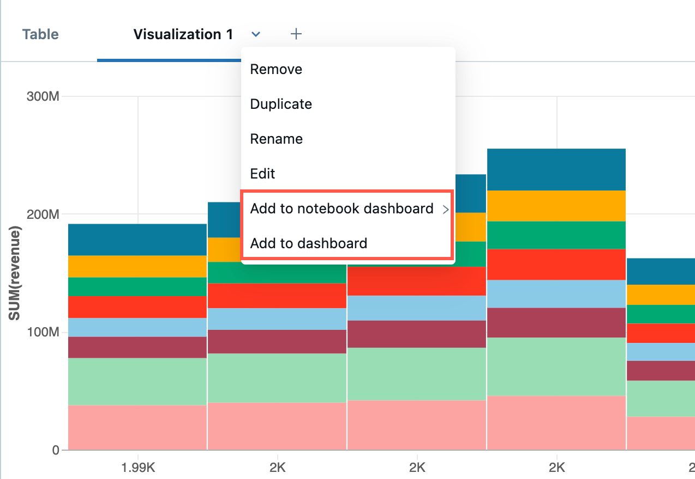
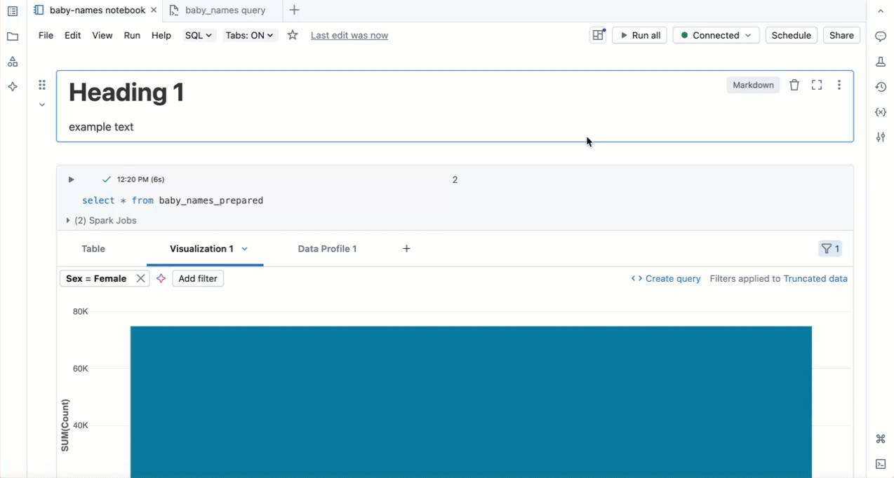

# Dashboards in Notebooks

> **Source:** [docs.databricks.com/aws/en/notebooks/dashboards](https://docs.databricks.com/aws/en/notebooks/dashboards)
> **Added:** 2026-06-17
> **Source updated:** 2026-06-16
> **Tags:** notebooks, dashboards, visualization, AI-BI, scheduling, sharing, B1
> **Type:** documentation

Databricks notebooks support two distinct dashboard types: **notebook dashboards** (bound to notebook cell outputs, any cell) and **AI/BI dashboards** (SQL-cell visualizations only, **recommended for org-wide sharing**). Both can be scheduled, shared, and presented fullscreen.

| Feature | Notebook Dashboard | AI/BI Dashboard |
|---|---|---|
| Source cells | Any cell output | SQL cells only |
| Recommended for org sharing | No | Yes |
| Create via | "Add to notebook dashboard >" | "Add to dashboard" dialog |
| Tied to cell outputs | Yes — clearing outputs clears dashboard | N/A |

## Creating a dashboard

From a cell's output menu, "Select **Add to notebook dashboard >**. If you select **Add to new notebook dashboard**, the new dashboard is automatically displayed." For AI/BI, from a **SQL** cell's output menu select **Add to dashboard**, then **Create a new dashboard** or **Add to existing dashboard** ("Only visualizations from SQL cells can be added to AI/BI dashboards").

> ⚠️ "Content in notebook dashboards are tied to the output of notebook cells. If you clear the cell output, the dashboard content is also cleared." So `Clear outputs` silently wipes all notebook dashboard content.

## Layout and sizing (notebook dashboards)

Two layout modes: **Stack** (items snap to an aligned grid) and **Float** (drag freely). Resize via the lower-right corner icon; move by click-and-drag. Add a plot title via the **Settings** icon → **Configure Dashboard Element** → **Show Title**.

## Navigation

The dashboard icon (top-right of the notebook) lists all dashboards associated with it and switches between notebook and dashboard views; hovering a plot → "new window" icon jumps to the source cell.

## Scheduling, presentation, deleting

- **Schedule** creates a Lakeflow job that re-runs the notebook on a timer to refresh plots; "View last successful run" shows the most recent state.
- **Fullscreen** presents the dashboard; **Exit** or `Esc` returns to interactive mode.
- "Delete this dashboard" removes it entirely (doesn't affect the notebook or its outputs).

Related: [[notebooks-overview]], [[lakeflow-jobs]], [[workspace-walkthrough]].
