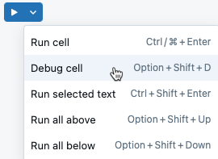
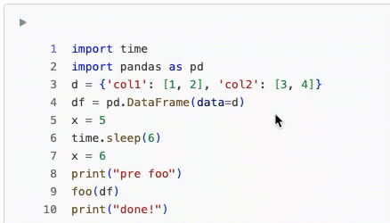
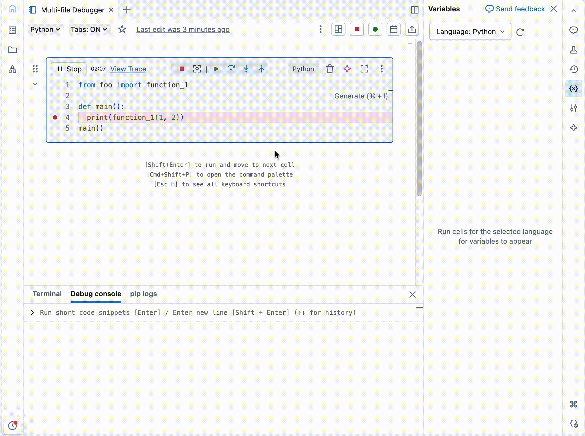
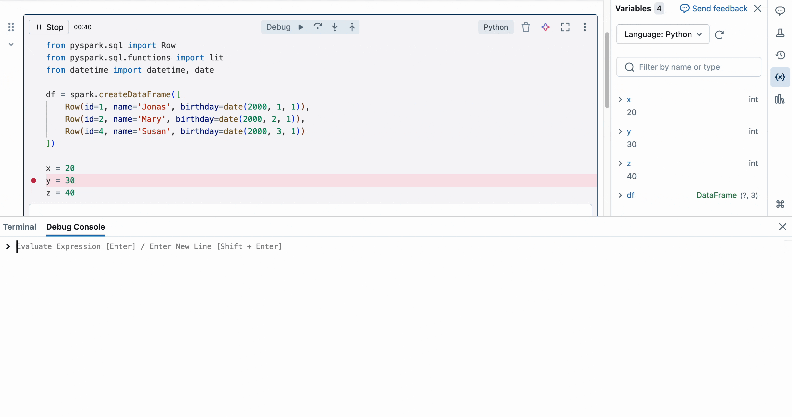
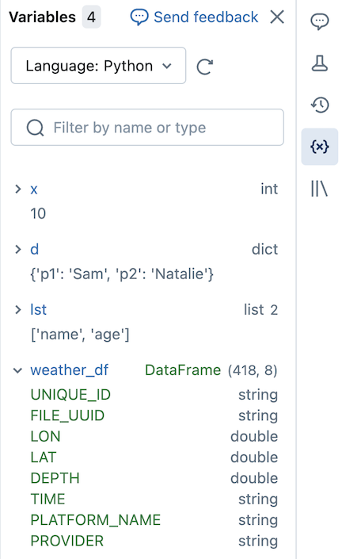

# Debug notebooks (interactive debugger)

> **Source:** [docs.databricks.com/aws/en/notebooks/debugger](https://docs.databricks.com/aws/en/notebooks/debugger)
> **Added:** 2026-06-14
> **Tags:** notebooks, debugging, variable-explorer, python, B1
> **Type:** documentation

> 📌 **Version note:** Reflects the page as of 2026-06-14. Requirements quote minimum runtimes (DBR 13.3/14.3 LTS); current runtimes are DBR 18 / 17.3 LTS, so any supported cluster qualifies. Access-mode names already use the current **Standard / Dedicated** terminology.

## Summary

Databricks has a built-in **interactive debugger** for **Python notebooks** — breakpoints, step-through execution, a variable explorer, and a debug console — instead of relying on `pdb`/`%debug`. This page is *only* about that visual debugger; it does **not** mention `pdb`, `%debug`, `%pdb`, post-mortem debugging, or `breakpoint()`.

## Key points

- **Python notebooks only.** Enabled per-user via a Developer setting.
- Breakpoints pause **before** the marked line runs; a toolbar drives step over / into / out.
- **Variable explorer** (right sidebar) and **debug console** (bottom) let you inspect and run code while paused.
- Can **step into functions defined in workspace files** — but *not* into Python libraries or other notebooks.
- Sessions auto-terminate after **30 min** idle; debug console has a **15-second** execution timeout and **no `display()`**.

## Notes

### Requirements

One of these compute configurations:

- **Serverless compute**
- **Standard access mode** — DBR **14.3 LTS** and above
- **Dedicated access mode** — DBR **13.3 LTS** and above
- **No Isolation Shared access mode** — DBR **13.3 LTS** and above

**Enable the debugger**

Username (top-right) → **Settings** → **Developer** → toggle **Python Notebook Interactive Debugger** on.

### Start debugging

Three ways to start, plus a post-error path:

- Menu: **Run > Debug cell**
- Keyboard: **Option + Shift + D** (Mac) / Alt + Shift + D (Windows)
- Cell menu: **Debug cell** (shown below)
- After an exception, click the **Debug** button in the error output to debug from the failure.

### Debugging actions

- **Breakpoints:** click the **cell gutter** to add/remove. Execution pauses *before* the breakpointed line.
- Toolbar lets you set/remove breakpoints, view variable values, **step through** code, and **step into / out of** a function.

### Step into workspace files

- Requires **"Enable tabs for notebooks and files"** to be on.
- The **step-in** icon opens the referenced workspace file in a **new tab** and continues debugging there.

> ⚠️ **Limitation:** "The debugger can only step into functions defined in files in the workspace. Stepping into Python libraries or other notebooks is not yet supported."

### Debug console

- Appears automatically at the bottom when paused; runs Python in the current frame.
- **Enter** = run single-line code; **Shift + Enter** = multi-line.
- **15-second timeout** on console execution.
- Does **not** support the `display` command.

### Variable explorer

- Right-sidebar panel listing variable values while paused.
- Click **Inspect** on a variable to run debug-console code that shows its contents.
- A **search box** filters the list as you type.

### Debug with Genie Code

- **Genie Code** (the AI assistant) offers context-aware debugging help during a session (see Databricks docs for the shortcut).

### Limitations

- **Variable update timing:** on **DBR 12.2 LTS and above**, variables update *during* cell execution; on earlier runtimes they update only *after* the cell completes.
- Step-into is limited to **workspace files** (no libraries / other notebooks — see above).

## Quotes worth keeping

> "The debugger can only step into functions defined in files in the workspace. Stepping into Python libraries or other notebooks is not yet supported." (Step into workspace files)

## Open questions

- ❓ Does the variable explorer work standalone (outside a debug session), or only while paused at a breakpoint? The page presents it only inside the debugger flow.
- ❓ For pure `pdb`/`%debug`-style debugging, is there a separate docs page? Not covered here.

## Related sources

- [[ch01-getting-started-with-databricks]] — DCDE-SG Ch 1; covers notebooks, cells, and the cluster access modes referenced in the requirements
- [[workspace-walkthrough]] — DA-FREE M1; the notebook UI this debugger lives in
