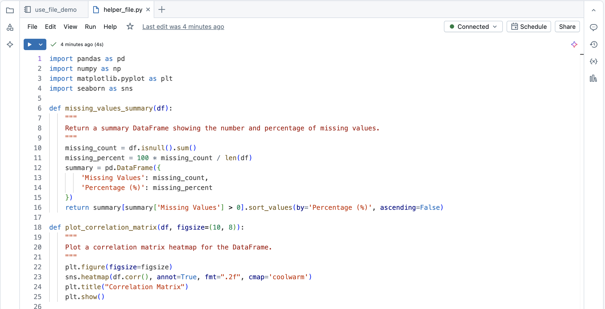
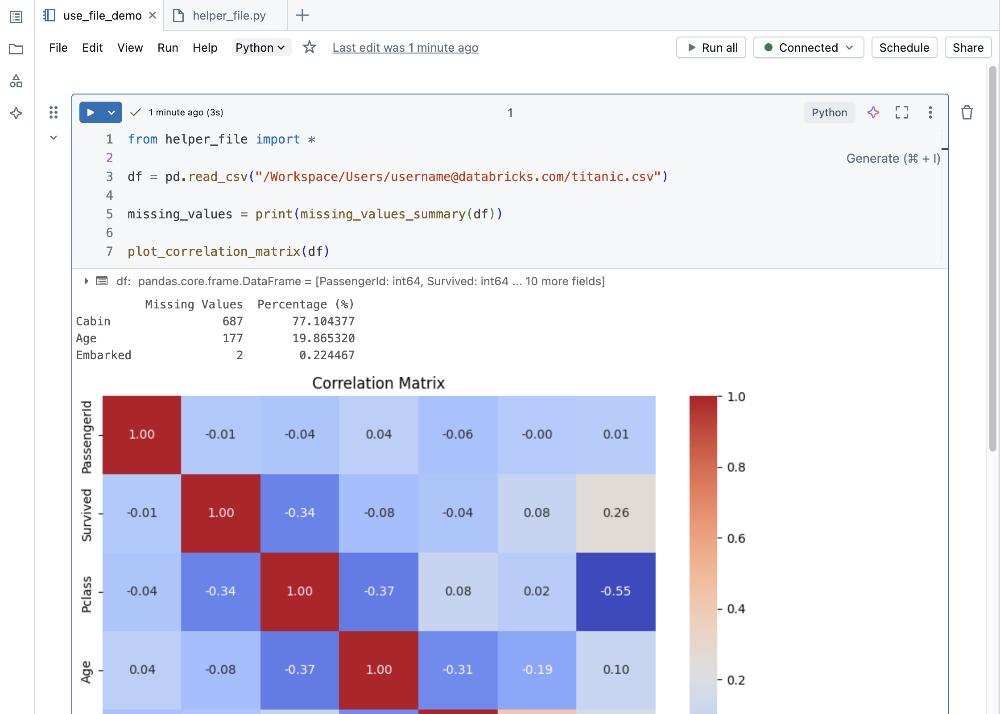
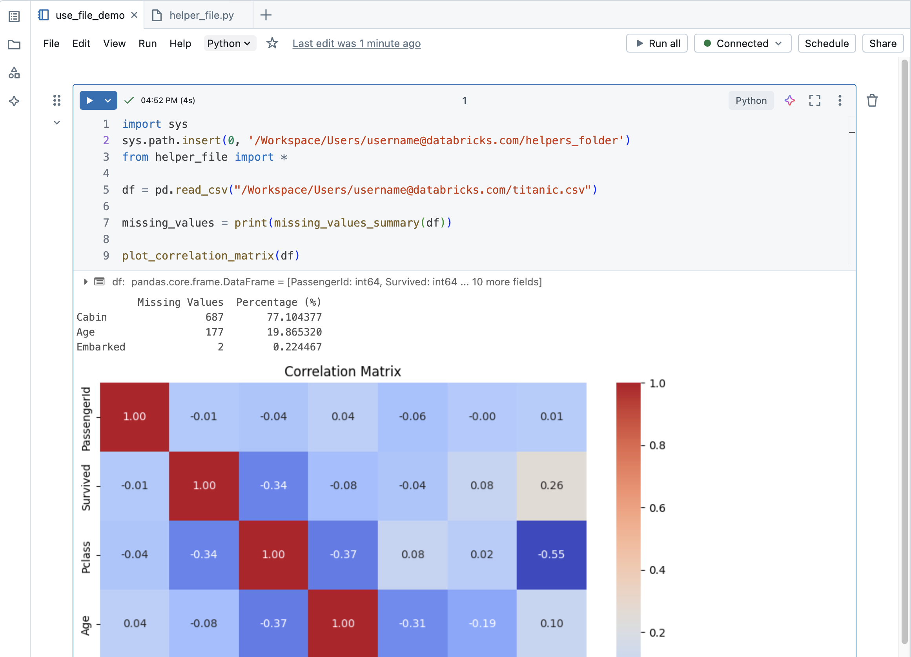

# Share Code Between Notebooks (Workspace Files)

> **Source:** [docs.databricks.com/aws/en/notebooks/share-code](https://docs.databricks.com/aws/en/notebooks/share-code)
> **Added:** 2026-06-17
> **Source updated:** 2026-06-17
> **Tags:** notebooks, workspace-files, modularization, python, git, B1
> **Type:** documentation

> ⚠️ **Capture note:** Code examples on this page are rendered as images, not text — import syntax is not extractable via WebFetch. The patterns (`import mymodule`, `from mymodule import func`) are standard Python; see [[notebook-workflows]] for the conceptual context.

## Summary

Operational how-to for creating Python workspace files and importing them into notebooks. Requires DBR 11.3 LTS+. Files live in the Databricks workspace, use standard Python `import`, support Git sync via Repos, and are the **recommended** modularization approach over `%run`. Code examples on the docs page are images.

## Key points

- Requires **DBR 11.3 LTS+** to create and manage source code files in the workspace.
- Files are `.py` files; created via Workspace > Create > File; **auto-save** on every edit.
- Import into notebooks with **standard Python `import`** commands — no special Databricks API.
- Cross-folder imports need the **full workspace path** (copy via kebab menu > Copy URL/path > Full path).
- Git sync available via **Databricks Repos**.
- Access control (per-file) requires **Premium plan or above**.
- Run a `.py` file directly: **Shift+Enter** (whole cell) / **Shift+Ctrl+Enter** (selected lines).

## Notes

### Creating a workspace file

**Workspace sidebar** → **Create** → **File** → enter name ending in `.py`.

File auto-saves on every edit — no explicit save step needed.

### Importing into a notebook

Standard Python `import` — same as any Python module. Databricks adds the workspace directory to `sys.path` so files in the same folder can be imported by name:

```python
import mymodule
from mymodule import my_function
```

*(Exact syntax from docs page rendered as an image — above is standard Python pattern.)*

### Cross-folder imports

> "If a helper file is in another folder, you must use the full file path."

Get the full path: navigate to the file in the workspace → kebab menu (⋮) → **Copy URL/path** → **Full path**.

Then either manipulate `sys.path` to add the directory, or use the full dotted module path.

### Running a file directly

| Shortcut | Action |
|---|---|
| Shift + Enter | Run entire file cell |
| Shift + Ctrl + Enter | Run selected code only |

### File management operations

| Operation | How |
|---|---|
| Delete | Workspace menu |
| Rename | Inline edit or File > Rename |
| Access control | Workspace access control (Premium plan+) |

### Git integration

> "You can also use a Databricks repo to sync your files with a Git repository."

Workspace files in a Repo folder participate in Git version control — same commit/push/pull workflow as notebooks in Repos.

### Relationship to multi-task jobs

> "Databricks also supports multi-task jobs which allow you to combine notebooks into workflows with complex dependencies."

Page positions workspace files + Lakeflow Jobs as the full modularization + orchestration stack — workspace files handle reuse within a notebook; jobs handle multi-notebook pipelines.

## Open questions

- ❓ Does editing a workspace file require restarting the kernel or calling `importlib.reload()` for the changes to take effect in an already-running notebook?
- ❓ Can workspace files import other workspace files (module-to-module imports), or only notebooks can import workspace files?
- ❓ Are `.py` files the only supported type, or can `.sql`, `.scala`, `.r` also be workspace files?

## Related sources

- [[notebook-workflows]] — covers the conceptual choice: workspace files (recommended) vs `%run` vs `dbutils.notebook.run()`; workspace files are the preferred modularization approach
- [[notebook-testing]] — unit test files (`test_myfunctions.py`) live in workspace as `.py` files — same mechanism
- [[notebook-ipywidgets]] — no relation to workspace files; separate Python-in-notebook pattern


## Images

[](assets/notebook-share-code/01.png)
*File that defines functions. (2558×1308)*

[](assets/notebook-share-code/02.png)
*Import file into notebook. (2242×1602)*

[](assets/notebook-share-code/03.png)
*Import file from another folder into a notebook. (2322×1676)*

