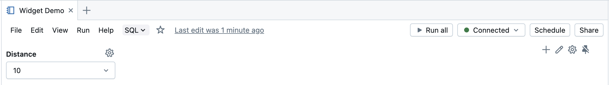
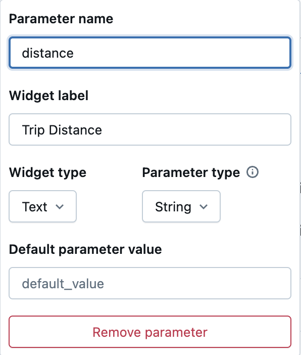
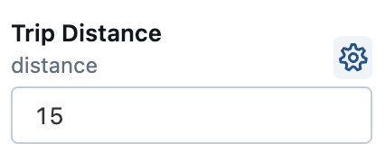
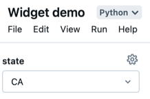
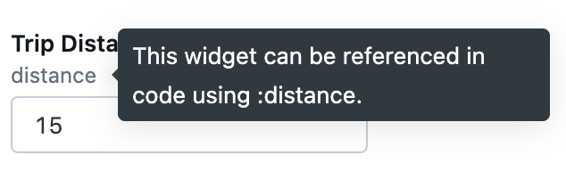
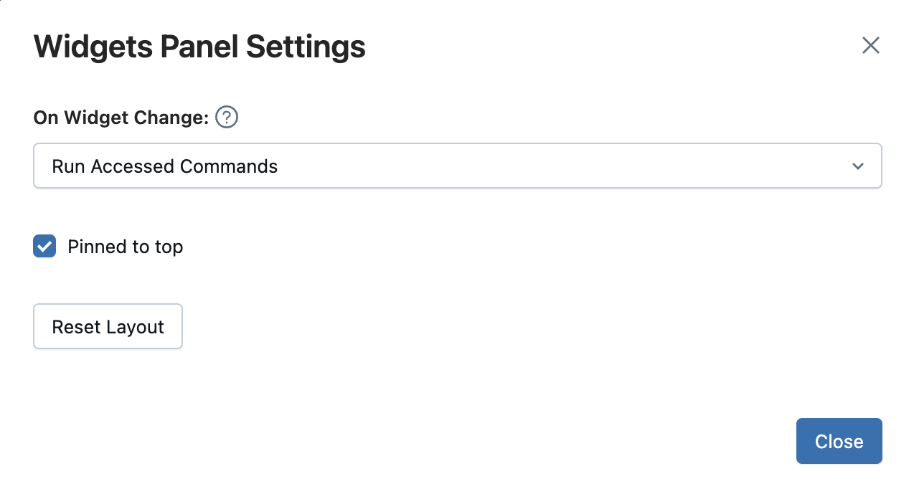
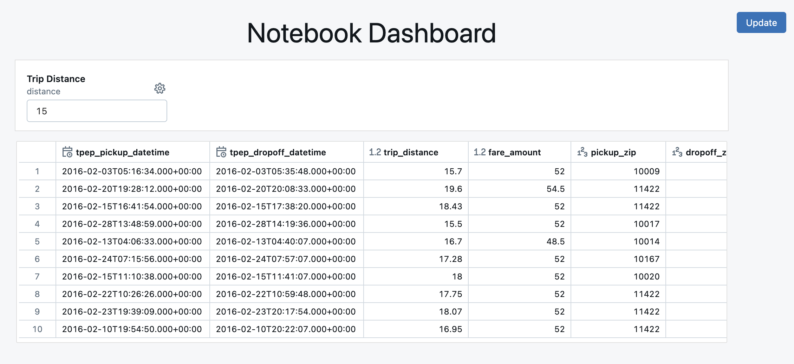

# Databricks Widgets

> **Source:** [docs.databricks.com/aws/en/notebooks/widgets](https://docs.databricks.com/aws/en/notebooks/widgets)
> **Added:** 2026-06-17
> **Source updated:** 2026-06-16
> **Tags:** notebooks, widgets, parameters, sql, python, scala, R, dashboards, B1
> **Type:** documentation

Widgets add interactive **input parameters** to notebooks and dashboards. Four types exist (text, dropdown, combobox, multiselect), created via the UI, the `dbutils.widgets` API (Python/Scala/R), or `CREATE WIDGET` DDL (SQL). **Widget values are always strings.** SQL parameter markers (`:param`, introduced in DBR 15.2) protect against injection and are the recommended way to use widget values in SQL cells.

[](assets/notebook-widgets/01.png)

| Type | Behavior |
|---|---|
| text | Free-text input box |
| dropdown | Pick one value from a fixed list |
| combobox | Pick from list OR type a custom value |
| multiselect | Pick one or more values from a list |

## Creating widgets

```python
dbutils.widgets.dropdown("state", "CA", ["CA", "IL", "MI", "NY", "OR", "VA"])             # Python
```
```scala
dbutils.widgets.dropdown("state", "CA", Seq("CA", "IL", "MI", "NY", "OR", "VA"))          // Scala
```
```r
dbutils.widgets.dropdown("state", "CA", list("CA", "IL", "MI", "NY", "OR", "VA"))         # R
```
```sql
CREATE WIDGET DROPDOWN state DEFAULT "CA" CHOICES SELECT * FROM
(VALUES ("CA"), ("IL"), ("MI"), ("NY"), ("OR"), ("VA"))
```

> "The widget API in SQL is slightly different but equivalent to the other languages."

Via UI: **Edit > Add parameter** → configure Parameter Name, Widget Label, Type, Default value, and Possible choices. Use the widget's kebab menu to edit/configure it.

[](assets/notebook-widgets/03.png)
[](assets/notebook-widgets/02.png)

## Accessing widget values

```python
dbutils.widgets.get("state")    # single widget
dbutils.widgets.getAll()        # dict of all widget values
```

```sql
SELECT :state                                              -- parameter marker
SHOW TABLES IN IDENTIFIER(:database)                       -- dynamic identifier
SELECT * FROM IDENTIFIER(:database || '.' || :table) WHERE col == :filter_value LIMIT 100
CREATE EXTERNAL TABLE my_table USING DELTA LOCATION :path  -- DDL string clause, DBR 18.0+
```

> "Parameter markers protect your code from SQL injection attacks by clearly separating provided values from the SQL statements."

| Feature | Minimum DBR |
|---|---|
| SQL parameter markers (`:param` in queries) | 15.2 |
| `:param` in DDL string clauses (`LOCATION`, etc.) | 18.0 |

For DBR 14.3–17.3 LTS, use `EXECUTE IMMEDIATE` to construct DDL dynamically instead.

[](assets/notebook-widgets/05.png)
[](assets/notebook-widgets/04.png)

## Removing widgets

```python
dbutils.widgets.remove("state"); dbutils.widgets.removeAll()   # Python/Scala/R
```
```sql
REMOVE WIDGET state
```

## On-change execution behavior

Configured per widget, three options:

- **Run Notebook** — reruns the entire notebook on every value change.
- **Run Accessed Commands** *(default)* — reruns only cells that call `dbutils.widgets.get()` for that widget. ⚠️ "SQL cells are not rerun in this configuration."
- **Do Nothing** — no automatic re-execution.

[](assets/notebook-widgets/06.png)

## Widgets in dashboards

> "When you create a dashboard from a notebook with input widgets, all the widgets display at the top. In presentation mode, every time you update the value of a widget, you can click the **Update** button to re-run the notebook and update your dashboard with new values."

[](assets/notebook-widgets/07.png)

## Passing widget values via `%run`

By default "the specified notebook is run with the widget's default values." Override with named arguments (cluster-attached notebooks only):

```python
%run /path/to/notebook $X="10" $Y="1"
```

> ⚠️ **Not available for SQL warehouses** — parameter passing via `%run` is classic-compute-only.

Related: [[notebooks-overview]], [[notebook-dashboards]], [[notebook-testing]], [[workspace-walkthrough]].
