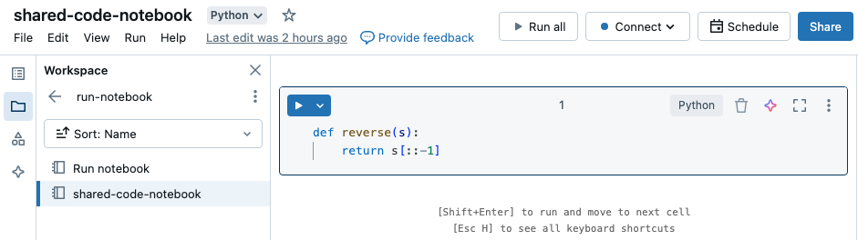
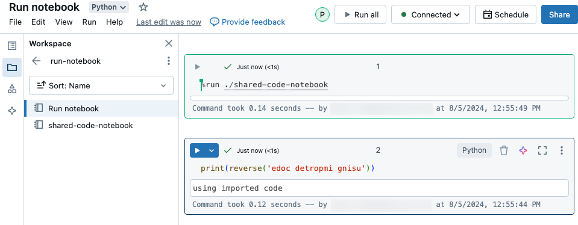

# Orchestrate Notebooks and Modularize Code

> **Source:** [docs.databricks.com/aws/en/notebooks/notebook-workflows](https://docs.databricks.com/aws/en/notebooks/notebook-workflows)
> **Added:** 2026-06-17
> **Source updated:** 2025-01-06
> **Tags:** notebooks, orchestration, workflows, dbutils, run, modularization, B1, I6
> **Type:** documentation

Four patterns for orchestrating notebooks and modularizing code. The key distinction: `%run` runs inline and exposes all variables; `dbutils.notebook.run()` starts a **separate job** with string-only params and return values.

| Method | Use case | Recommended for |
|---|---|---|
| Lakeflow Jobs | Scheduling, dependencies, triggers | Orchestration (primary choice) |
| `dbutils.notebook.run()` | Dynamic/metadata-driven ETL, programmatic control | When Jobs can't handle the use case (Python/Scala only) |
| Workspace Files | Reusable functions, classes, modules | Code modularization (primary choice) |
| `%run` | Inline notebook import, when workspace files unavailable | Modularization fallback only |

## `%run` — inline execution

> "`%run` must be in a cell by itself, because it runs the entire notebook inline."

All functions and variables from the called notebook become available in the caller's scope — no import needed.

```python
%run ./shared-code-notebook
%run /Users/username@organization.com/directory/notebook
```

Limitations: "You cannot use `%run` to run a Python file and import the entities defined in that file into a notebook" (notebook paths only); widgets run with default values unless explicitly passed.

[](assets/notebook-workflows/01.png)
[](assets/notebook-workflows/02.png)

## `dbutils.notebook.run()` — separate job

Starts a **new job** (not inline); the callee returns via `dbutils.notebook.exit()`.

```python
dbutils.notebook.run("notebook-name", 60, {"argument": "data", "argument2": "data2"})        # Python
```
```scala
dbutils.notebook.run("notebook-name", 60, Map("argument" -> "data", "argument2" -> "data2"))  // Scala
```

> ⚠️ "Like all of the dbutils APIs, these methods are available only in Python and Scala." (Not R, not SQL.)

Constraints: `arguments` accepts **only Latin/ASCII** characters; arguments and return values must be **strings**; `timeout_seconds=0` = no timeout (but "if Databricks is down for more than 10 minutes, the notebook run fails regardless"); "jobs created using the dbutils.notebook API must complete in 30 days or less."

## Returning data from called notebooks

`dbutils.notebook.exit(value)` returns a string. Three strategies for structured data:

```python
# Strategy 1 — Global temp view (return a view name; caller reads the view)
spark.range(5).toDF("value").createOrReplaceGlobalTempView("my_data"); dbutils.notebook.exit("my_data")
returned_table = dbutils.notebook.run("CALLEE", 60)
global_temp_db = spark.conf.get("spark.sql.globalTempDatabase")
display(table(global_temp_db + "." + returned_table))

# Strategy 2 — DBFS (write parquet; return the path)
spark.range(5).toDF("value").write.format("parquet").save("dbfs:/tmp/results/my_data")
dbutils.notebook.exit("dbfs:/tmp/results/my_data")

# Strategy 3 — JSON string (multiple values in one return)
import json; dbutils.notebook.exit(json.dumps({"status": "OK", "table": "my_data"}))
```

## Error handling and retries

`dbutils.notebook.run()` raises on failure — wrap in try/except:

```python
def run_with_retry(notebook, timeout, args={}, max_retries=3):
    num_retries = 0
    while True:
        try:
            return dbutils.notebook.run(notebook, timeout, args)
        except Exception as e:
            if num_retries > max_retries: raise e
            print("Retrying error", e); num_retries += 1
```

## Parallel execution

> "You can run multiple notebooks at the same time by using standard Scala and Python constructs such as Threads and Futures."

The pattern: dispatch multiple `dbutils.notebook.run()` calls via a thread pool or `concurrent.futures`, then collect results (full examples in downloadable sample notebooks).

Related: [[notebooks-overview]], [[notebook-widgets]], [[notebook-testing]], [[lakeflow-jobs]].
