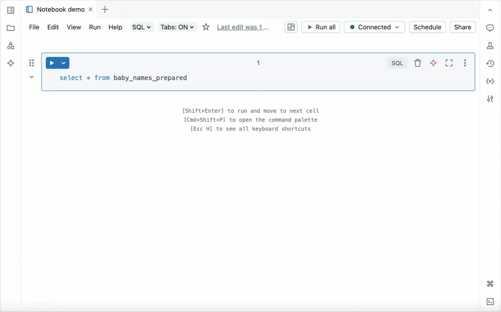

# Notebooks Overview

> **Source:** [docs.databricks.com/aws/en/notebooks/](https://docs.databricks.com/aws/en/notebooks/)
> **Added:** 2026-06-17
> **Source updated:** 2026-06-16
> **Tags:** notebooks, python, sql, scala, R, EDA, ML, collaboration, B1
> **Type:** documentation

The hub page for Databricks notebooks — "the primary tool for creating data science and machine learning workflows on Databricks." Notebooks support four languages (**Python, SQL, Scala, R**, all with syntax highlighting and IntelliSense), run on serverless / classic / SQL-warehouse compute ([[serverless-notebooks]]), embed an AI assistant (**Genie Code / Data Science Agent**) that can orchestrate multi-step workflows from a prompt, and support real-time collaboration, comments, interactive dashboards from cell results, an interactive visual debugger ([[notebook-debugger]]), and unit testing.

*A Databricks notebook in use.*

## Documentation structure

**Get started tutorials** — query and visualize data (SQL/Python/Scala/R against Unity Catalog); import and visualize CSV; EDA techniques (Python); end-to-end classic ML (loading, visualization, hyperparameter tuning, MLflow).

**Develop and run notebooks** — basic editing (cell types, shortcuts); develop code (four languages, highlighting, IntelliSense); run notebooks (flexible compute, execution controls); use the **Data Science Agent** (Genie Code Agent mode).

**Collaborate and share** — import/export (multiple formats); collaborate (sharing, comments, real-time co-editing); dashboards from notebook results.

**Debug and optimize** — code help via Genie Code; debug notebooks ([[notebook-debugger]]); unit testing ([[notebook-testing]]).

**Popular pages** — Databricks widgets ([[notebook-widgets]]); notebook outputs and results; orchestrate notebooks and modularize code ([[notebook-workflows]]); best practices ([[notebook-best-practices]]).

Related: [[notebook-debugger]], [[serverless-notebooks]], [[workspace-walkthrough]], [[ch01-getting-started-with-databricks]].
