# Comprehensive Guide to Optimize Databricks, Spark and Delta Lake Workloads

> **Source:** [databricks.com/discover/pages/optimize-data-workloads-guide](https://www.databricks.com/discover/pages/optimize-data-workloads-guide)
> **Added:** 2026-06-17
> **Source updated:** (no date on page)
> **Tags:** spark, performance, optimization, delta-lake, shuffle, skew, spill, merge, vacuum, caching, photon, B2, B5, B12, B16, B17
> **Type:** documentation

## Summary

End-to-end Databricks optimization guide covering data layout, shuffle control, spill and skew diagnosis, data skipping, caching, Delta Merge internals, and cluster configuration. Positioned as a practitioner handbook — specific thresholds and configs throughout, not just concepts.

## Key points

- Delta as default format; never partition tables under 1 TB.
- File size target: 128 MB for writes; up to 1 GB after OPTIMIZE.
- Z-order: high-cardinality columns only; max 4 columns.
- Broadcast auto-threshold: 10 MB; safely raise to 200 MB if driver has 32 GB+ RAM; hard limit 8 GB.
- Shuffle partition formula: `total_shuffled_data / 128–200 MB per task`; or 2–3× total worker cores.
- Skew signal: tasks summary shows large gap between min and max shuffle read size.
- Skew fix: partial salting — apply only to known-skewed values, not all data.
- Delta cache > Spark cache; use Storage Optimized instances to leverage it.
- Delta stats tracked on first 32 columns per Parquet file.
- Merge: two-phase (inner join to find matching files → full outer join); optimize with small file sizes (16–64 MB) and low-shuffle merge.
- VACUUM retention: ≥ 7 days; run as separate job.
- Autoscaling: never use for Spark Structured Streaming (except DLT).
- Instance selection: Memory Optimized for shuffles/spill/ML; Compute Optimized for OPTIMIZE/Z-order; Storage Optimized for Delta caching.

## Notes

### Delta Lake as the foundation

Delta Lake: open format storage layer delivering reliability, security, and performance. ACID transactions; unifies batch and streaming. All optimizations in this guide assume Delta as the table format.

> Treat cost as a **nonfunctional requirement** from project inception, not an afterthought.

### Data layout

**File sizing**

| Target | Size |
|---|---|
| Optimize Write (per partition) | 128 MB |
| Auto Compact target | 128 MB |
| Post-OPTIMIZE max | up to 1 GB (configurable) |
| Merge-heavy tables | 16–64 MB (smaller = less rewrite per merge) |
| Recommended range | 16 MB – 1 GB |

**Z-order**

- Always use high-cardinality columns (`customer_id`, not `year`)
- Never more than 4 columns
- Always run `OPTIMIZE` on a separate job cluster, not inline

**Partitioning**

- Don't partition tables under 1 TB
- Partition only if each partition will hold ≥ 1 GB of data
- Use low-cardinality columns (`year`, `date`) as partition keys

### Data shuffling

**Broadcast hash join**

Spark auto-broadcasts tables < 10 MB. Raising the threshold:

```python
# Safe up to ~200 MB if driver has 32 GB+ RAM
spark.conf.set("spark.sql.autoBroadcastJoinThreshold", 200 * 1024 * 1024)
```

Hard limits:
- Spark broadcast: 8 GB max per table
- Driver collect: 1 GB max in memory

**Shuffle hash join** (alternative to sort-merge join for medium tables)

```
spark.sql.join.preferSortMergeJoin=false
```

**Cost-based optimizer (CBO)**

```sql
-- Collect statistics (run daily or after >10% data mutation)
ANALYZE TABLE table_name COMPUTE STATISTICS
```

```
spark.sql.cbo.enabled=true
spark.sql.cbo.joinReorder.enabled=true
```

### Data spilling

**AQE auto-tuning (enable both)**

```
spark.sql.adaptive.coalescePartitions.enabled=true
spark.sql.adaptive.skewJoin.enabled=true
```

For highly compressed tables:

```
# Start at 16MB; reduce to 8MB if spill persists
spark.sql.adaptive.preshufflePartitionSizeInBytes=16777216
```

**Manual shuffle partition tuning**

```
# Formula
num_partitions = total_shuffled_bytes / (128MB to 200MB)

# Conservative baseline
num_partitions = 2× to 3× total_worker_cores
```

Target: ~128–200 MB of shuffle data processed per task.

### Data skewness

**Identification**

- Tasks summary: large gap between min and max shuffle read size → skew
- Stage view: most tasks finish but 1–2 hang indefinitely → skew

**Remediation — partial salting**

Salting is a last resort. Apply only to the known-skewed values, not all data:

1. Identify the skewed key value (e.g. `customer_id = 'xyz'`)
2. Append a random suffix `0..N` to create `xyz_0`, `xyz_1`, … (splits the large partition)
3. Join/aggregate the salted partitions, then union/re-aggregate to remove the salt

Partial salting (only on the hot key) avoids rewriting the entire dataset.

### Data explosion

**Explode function**

`explode()` converts array/map columns to rows — can multiply row count dramatically. Visible as the **Generate** node in the Spark SQL DAG.

**Join row explosion**

Spark reads ~128 MB per task, but an unconstrained join can produce GBs per task. Monitor "rows output" on `SortMergeJoin` or `ShuffleHashJoin` nodes in the SQL DAG.

Mitigations:

```python
# Reduce input partition size
spark.conf.set("spark.sql.files.maxPartitionBytes", 16 * 1024 * 1024)  # 16 MB or 32 MB

# Or repartition before the join
df.repartition(n)

# Or increase shuffle partitions for join output
spark.conf.set("spark.sql.shuffle.partitions", n)
```

### Data skipping and pruning

- Delta collects min/max stats on the **first 32 columns** of each Parquet file automatically
- Apply filters **immediately after the table read** (not downstream) for predicate pushdown
- Filter on partition columns for partition pruning
- Dynamic Partition Pruning (DPP) and Dynamic File Pruning (DFP): on by default since Spark 3.0
- Column pruning: only `SELECT` the columns actually needed

### Caching

**Delta cache** (preferred)

- Copies remote files to node-local SSD
- Transparent; no code change required
- Requires Storage Optimized instances

**Spark cache** (limited use)

- Only beneficial when the same DataFrame is used in 2+ Spark actions
- Held in memory (or spilled to disk); evicted on restart

> Databricks recommendation: **use Delta cache instead of Spark cache**.

### Delta Merge internals

Merge runs in two phases:

1. **Inner join** (source ↔ target on the `ON` clause) → produces list of target files containing matching rows → sent to driver
2. **Write phase** — two branches:
   - No matches found in phase 1 → append-only write (fast)
   - Matches found → full outer join on the matching target files + source → rewrites those files

**Challenges:**
- Loose `ON` clause → many matching files → lots of rewrite
- After many merges, Z-order degrades → run `OPTIMIZE` + Z-order periodically post-merge

**Optimizations:**

| Technique | Effect |
|---|---|
| Smaller target files (16–64 MB) | Reduces bytes rewritten per merge |
| Partition filter in `ON` clause | Limits files scanned in phase 1 |
| Z-order column filter | Further limits file candidates |
| Broadcast source (≤ 200 MB) | Avoids shuffle in phase 1 |
| Low shuffle merge | Rewrites only changed rows; keeps unmodified rows in place |

### Data purging — VACUUM

```sql
VACUUM table_name RETAIN 168 HOURS  -- 7-day minimum
```

- Default retention: 7 days
- `delta.logRetentionDuration`: default 30 days (transaction log)
- Never set retention below 7 days — concurrent readers/writers may still reference old snapshots
- Run VACUUM as a **separate job**, never inline with regular ETL

### Delta Live Tables (Lakeflow Spark Declarative Pipelines)

Managed ETL framework — declare source + transformation + destination; DLT handles clusters, autoscaling, retries, and configuration. Four benefits: pipeline building, data quality enforcement (fail/drop/alert/quarantine), streaming autoscaling, and observability (lineage + metrics).

### Cluster configuration

**Instance type by workload**

| Instance type | Use for |
|---|---|
| Memory Optimized | ML workloads; heavy shuffle and spill |
| Compute Optimized | OPTIMIZE and Z-order jobs |
| Storage Optimized | Delta caching workloads |

**Sizing baselines**

- Small workloads: 2–4 workers
- Medium/large workloads: 8–10 workers
- Never single-worker for production

**Autoscaling**

- Interactive clusters: enable, min workers = 1
- Production jobs: set min workers to the minimum compute floor
- **Never use for Spark Structured Streaming** (use DLT enhanced autoscaling for streaming instead)

**Photon**

Enable for: Delta MERGE-heavy ETL, large dataset scans, joins, and aggregations.

**Auto-termination**

Enable on all all-purpose clusters (default idle timeout: 120 minutes).

## Open questions

- "Low shuffle merge" — exact config flag not given in guide; need to look up `spark.databricks.delta.merge.enableLowShuffle`.
- Guide does not specify which version of Spark/DBR its recommendations apply to — some AQE configs may differ on older runtimes.

## Related sources

- [[spark-ui-guide]] — companion guide: how to diagnose the issues this guide fixes
- [[photon]] — confirms Photon for merge, scans, aggregations
- [[sql-warehouse-types]] — serverless as scaling alternative to cluster resizing
- [[classic-compute-configure]] — cluster config details (instance types, autoscaling)
- [[compute-pools]] — pre-warmed instances to reduce cold start


## Images

[](assets/optimize-data-workloads-guide/01.png)
*Optimize Databricks, Spark and Delta Lake Workloads (1118×648)*

[](assets/optimize-data-workloads-guide/02.png)
*Delta Lake (300×300)*

[](assets/optimize-data-workloads-guide/03.png)
*icon-graphic-8 (519×522)*

[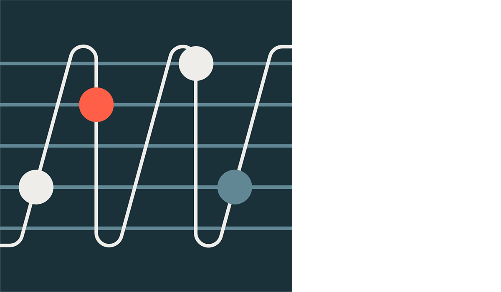](assets/optimize-data-workloads-guide/04.png)
*Data Shuffling (283×166)*

[](assets/optimize-data-workloads-guide/05.png)
*Data Spilling (283×166)*

[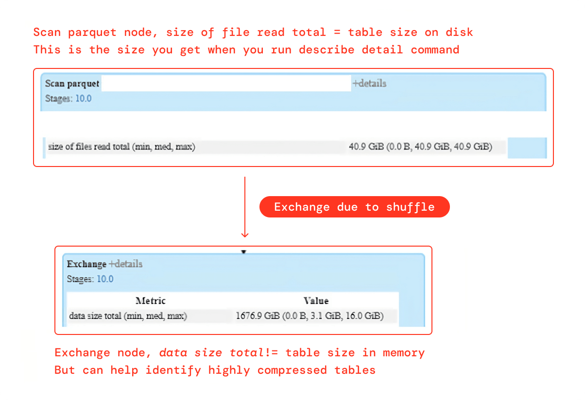](assets/optimize-data-workloads-guide/06.png)
*Data Spilling (425×291)*

[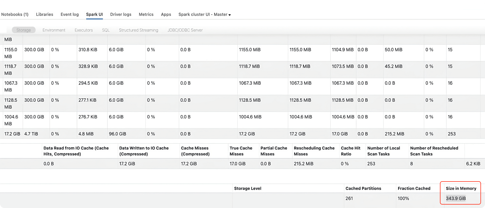](assets/optimize-data-workloads-guide/07.png)
*Data Spilling (850×365)*

[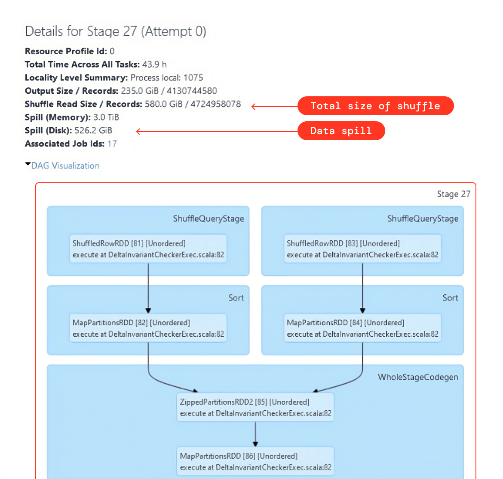](assets/optimize-data-workloads-guide/08.png)
*Data Spilling (638×607)*

[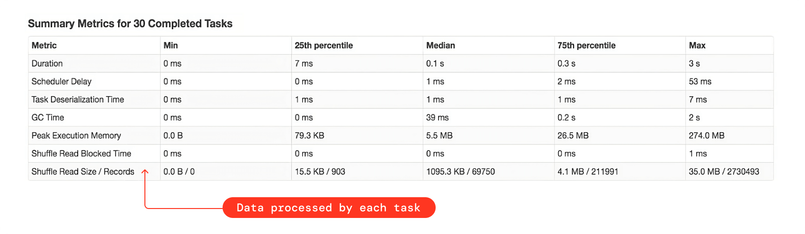](assets/optimize-data-workloads-guide/09.png)
*Data Spilling (850×248)*

[](assets/optimize-data-workloads-guide/10.png)
*Data Skewness — Identification and Remediation (283×165)*

[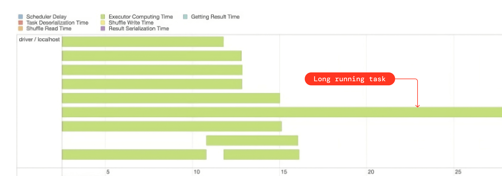](assets/optimize-data-workloads-guide/11.png)
*Data Skewness (850×299)*

[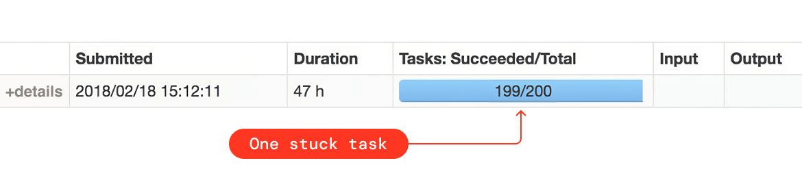](assets/optimize-data-workloads-guide/12.png)
*Data Skewness (638×142)*

[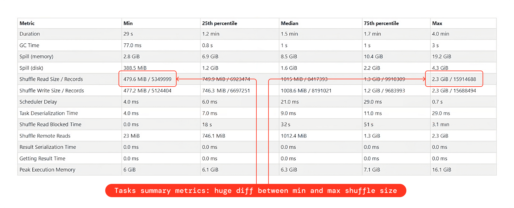](assets/optimize-data-workloads-guide/13.png)
*Data Skewness (850×345)*

[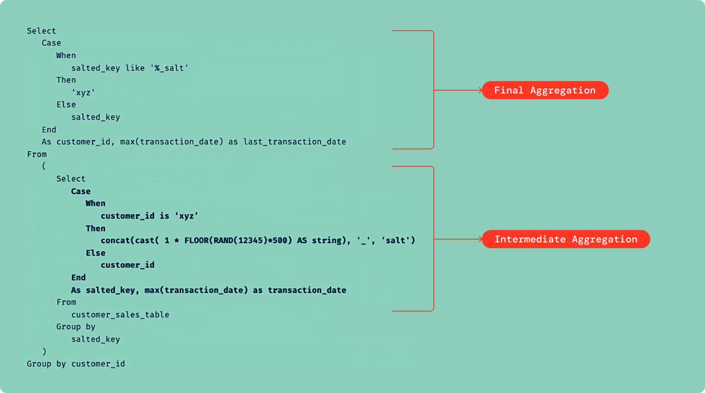](assets/optimize-data-workloads-guide/14.png)
*data-skewness (850×475)*

[](assets/optimize-data-workloads-guide/15.png)
*Data Explosion (283×165)*

[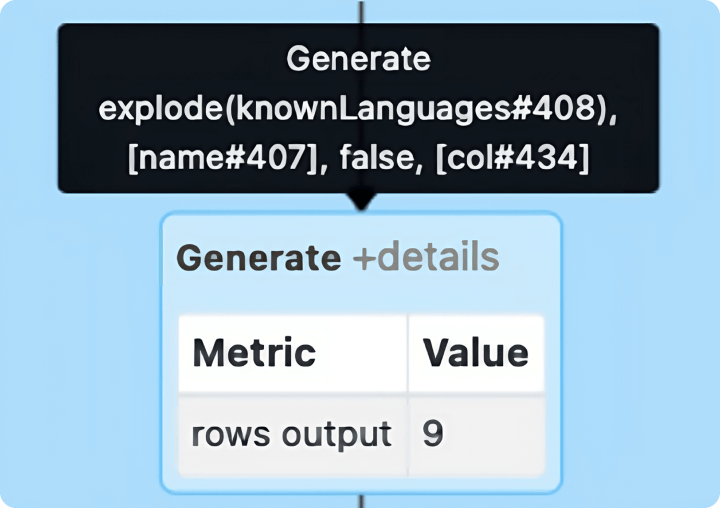](assets/optimize-data-workloads-guide/16.png)
*Data Explosion (425×300)*

[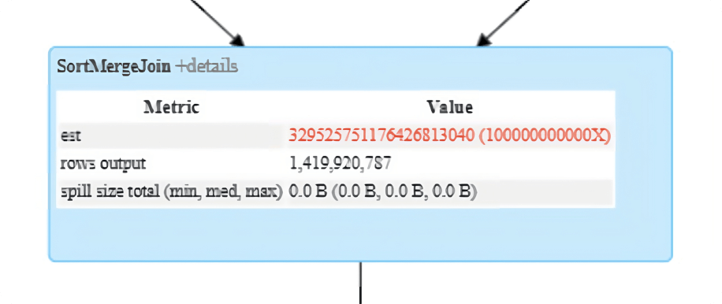](assets/optimize-data-workloads-guide/17.png)
*Data Explosion (567×239)*

[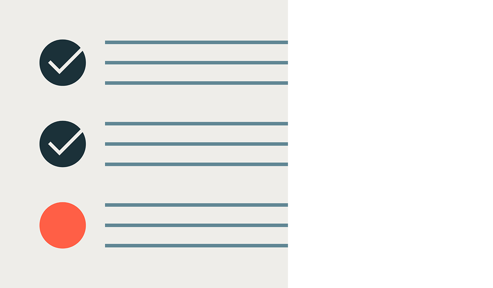](assets/optimize-data-workloads-guide/18.png)
*Data Skipping and Pruning (283×166)*

[](assets/optimize-data-workloads-guide/19.png)
*Data Caching (283×166)*

[](assets/optimize-data-workloads-guide/20.png)
*Delta Merge (283×165)*

[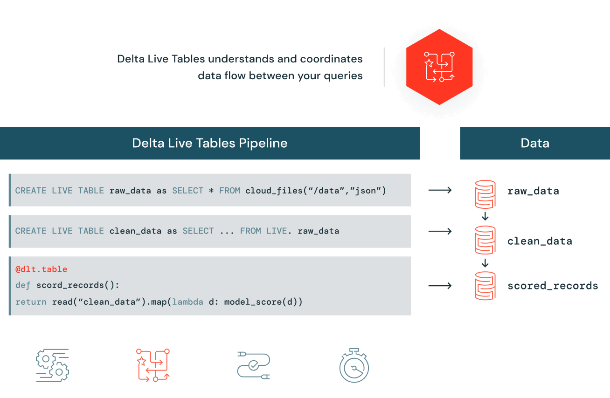](assets/optimize-data-workloads-guide/21.png)
*Delta Live Tables (638×416)*

[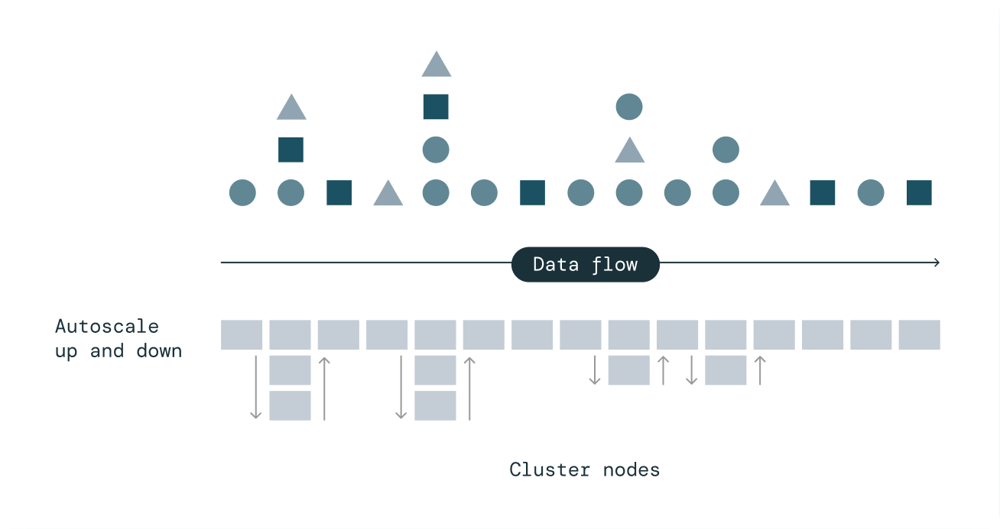](assets/optimize-data-workloads-guide/22.png)
*Delta Live Tables (638×338)*

[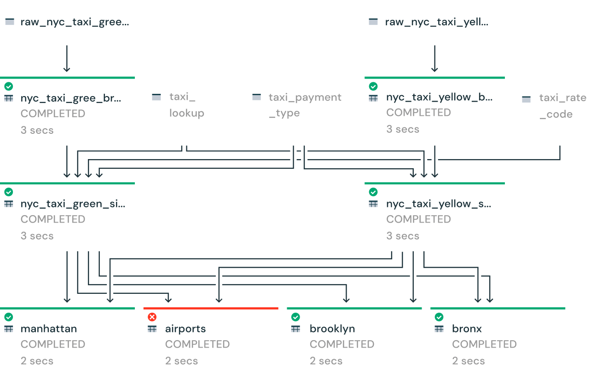](assets/optimize-data-workloads-guide/23.png)
*Delta Live Tables (638×394)*

[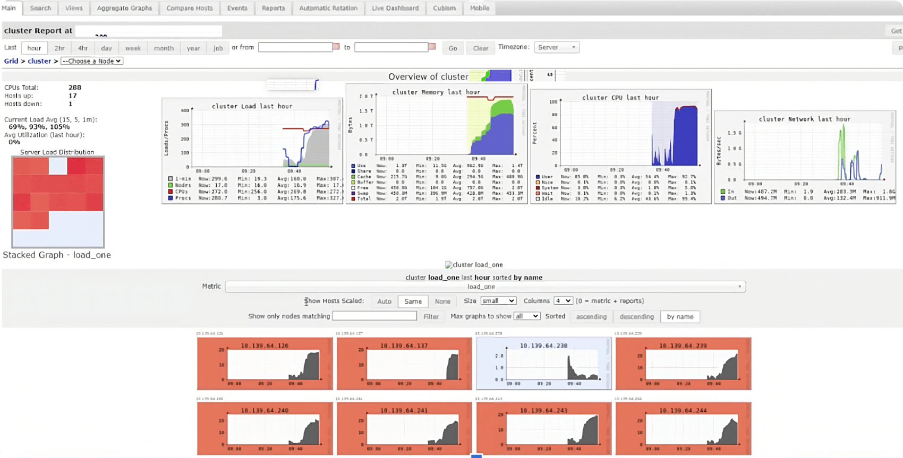](assets/optimize-data-workloads-guide/24.png)
*Databricks Cluster (850×432)*

[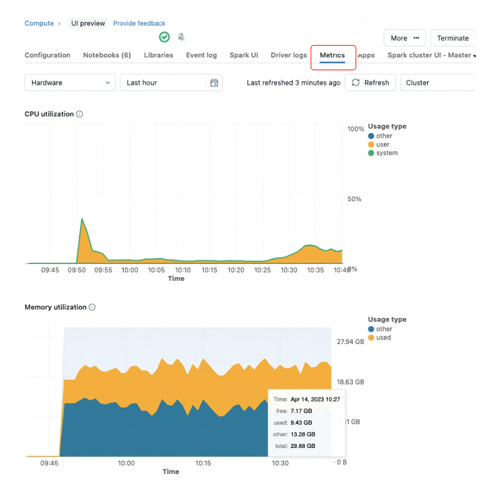](assets/optimize-data-workloads-guide/25.png)
*Databricks Cluster (567×565)*

[](assets/optimize-data-workloads-guide/26.png)
*Company Logo (1420×224)*

