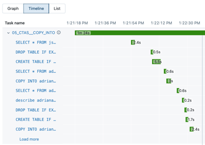
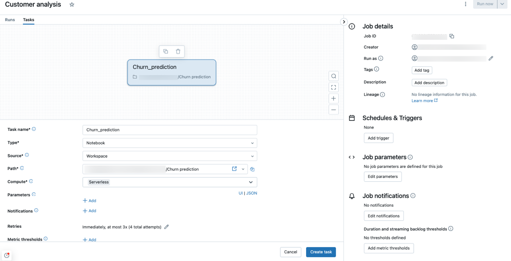
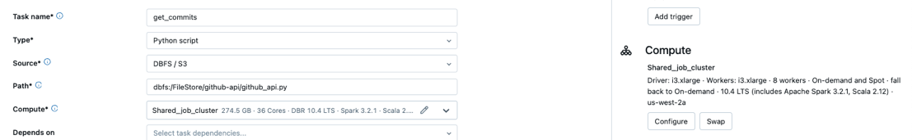

# Serverless compute for Lakeflow Jobs (workflows)

> **Source:** [docs.databricks.com/aws/en/jobs/run-serverless-jobs](https://docs.databricks.com/aws/en/jobs/run-serverless-jobs)
> **Added:** 2026-06-15
> **Source updated:** 2026-06-15
> **Tags:** serverless, jobs, lakeflow, workflows, compute, performance-modes, I6
> **Type:** documentation

## Summary

Serverless compute for workflows lets Lakeflow Jobs run without any cluster provisioning — Databricks manages infrastructure, autoscaling, and Photon automatically. This page covers requirements, supported task types, how to create or convert jobs to serverless, the two performance modes, auto-optimization, monitoring, and programmatic creation options.

## Key points

- **Prerequisite:** Unity Catalog enabled; workloads must support **Standard access mode**.
- Serverless is the **default compute** when creating jobs with supported task types.
- **Five task types supported:** notebook, Python script, dbt, Python wheel, JAR (JAR = Public Preview).
- **Two performance modes:** Standard (cost-optimised, 4–6 min startup) vs Performance Optimized (faster startup/execution). Same SKU — just different DBU consumption.
- **Auto-optimization** (on by default): Databricks automatically tunes compute and retries tasks. Turn it off for non-idempotent workloads.
- Monitor costs via the **billable usage system table**; debug runs via the **timeline view** and **query history**.
- Jobs can be created/automated with the Jobs API, **DABs**, or the Databricks SDK for Python.

## Notes

### Requirements

- Workspace must have **Unity Catalog** enabled — confirms [[serverless-notebooks]] requirement.
- Workloads must support **Standard access mode** (previously "Shared"). This is the only access-mode constraint; dedicated/single-user workloads need classic clusters.

### Supported task types

Serverless is selected as the default compute when creating jobs with any of these types:

- Notebook
- Python script
- dbt
- Python wheel
- JAR *(Public Preview)*

### Creating a new serverless job

When you create a job using a supported task type, serverless compute is selected automatically. No cluster configuration needed.

*Serverless is the default compute type in the job creation UI for supported task types.*

### Converting an existing job to serverless

Open the **Job details** panel → under **Compute** click **Swap** → select serverless. Alternatively use the **Compute dropdown** in the task editor.

*The Swap control in Job details replaces the existing cluster config with serverless in one click.*

### Schedule a notebook directly

Serverless jobs can also be created and scheduled directly from within a notebook (without going through the Jobs UI). See the [Create and manage scheduled notebook jobs](https://docs.databricks.com/aws/en/notebooks/schedule-notebook-jobs) docs page for steps.

### Configure environments and dependencies

Install libraries and configure dependencies for serverless jobs via the [serverless environment configuration](https://docs.databricks.com/aws/en/compute/serverless/dependencies) page. Not covered inline on this page.

### Performance modes

Both modes use the **same SKU** — the difference is in startup behaviour and DBU consumption:

| Mode | Startup | DBU use | Best for |
|---|---|---|---|
| **Standard** | 4–6 min | Lower | Cost-sensitive, latency-tolerant jobs |
| **Performance Optimized** | Fast | Higher | Time-sensitive, SLA-bound workloads |

- Setting only affects **serverless tasks** within the job — non-serverless tasks are unaffected.
- ⚠️ **Standard performance mode is not supported for one-time runs created using the `runs/submit` endpoint.** Use Performance Optimized or the Jobs UI / DABs for `runs/submit` one-time runs.

### Additional configuration

**High memory (Public Preview):** Notebook tasks can be configured for higher memory via the **Environment** side panel.

**Spark parameters:** Only specific Spark configuration parameters can be set at session level within notebooks running in a serverless job. Not all `spark.conf.set(...)` calls are honoured — check the docs for the supported list.

> ❓ Revisit: which Spark config keys are supported at session level in serverless jobs? The page doesn't list them inline.

### Auto-optimization

Enabled by default. Databricks automatically:

- Optimises compute resources for each run.
- Retries failed tasks automatically.

To disable (e.g. for non-idempotent workloads): **Retry Policy** dialog → uncheck **"Enable serverless auto-optimization"**.

### Usage policies & billing attribution

Custom tags can be applied to serverless usage for billing attribution (Public Preview). Users assigned to a policy can select it in the **Job details UI**.

Monitor costs by querying the **billable usage system table** — includes user and workload attributes for detailed attribution.

### Monitoring and query details

The Jobs UI **timeline view** shows individual tasks with their query statements and runtimes.

*Click a statement in the timeline to navigate to the full query profile with execution metrics.*

- Click a statement → **query profile** with execution metrics and plan.
- Task run details also link to **query history** filtered by task run ID.

> 💡 For serverless jobs, the timeline + query profile replaces what the Spark UI would give you on classic clusters — same "what ran and how" question, different UI path. Mirrors [[serverless-notebooks]] where query insights replace the Spark UI for interactive use.

### Programmatic creation

Jobs using serverless compute can be created and managed via:

- **Jobs REST API**
- **Declarative Automation Bundles (DABs)** — YAML + code, the recommended IaC path
- **Databricks SDK for Python**

> 💡 For production pipelines, DABs is the recommended path; see [[ch01-databricks-platform-workspace]] and future A5 chapter on DABs & CI/CD.

### Limitations

Serverless compute for workflows has a dedicated limitations page. See [Serverless compute limitations](https://docs.databricks.com/aws/en/compute/serverless/limitations) in the serverless compute release notes.

## Quotes worth keeping

> "Focus on implementing your data processing and analysis pipelines" — Databricks manages compute resources, with autoscaling and Photon automatically enabled. (Overview)

## Open questions

- ❓ Which Spark config keys are supported at session level inside a serverless job's notebook task?
- ❓ Is the 4–6 min startup latency in Standard mode for cold starts only, or does it apply every run?
- ❓ Can Performance Optimized mode be set per-task within a multi-task job, or only at the job level?

## Related sources

- [[serverless-notebooks]] — the interactive-notebook counterpart: same UC prerequisite, same "no Spark UI → use query insights/timeline" pattern, same Photon-auto-enabled story. Key difference: jobs has performance modes and auto-optimization; notebooks have overspend timeout.
- [[ch01-getting-started-with-databricks]] — DCDE-SG Ch 1 §8 covers job clusters as the production compute path; serverless jobs supersedes job clusters for supported task types (no cluster config, auto-managed, same cost efficiency goal).
- [[notebook-debugger]] — debugging notebook tasks in jobs: the interactive debugger works with serverless compute, making it useful when a notebook task misbehaves.

## Images

*Create serverless task (1107×566)*

*Switch task to serverless compute (1107×171)*

*A task with several query statements and their runtimes in timeline view from the jobs UI. (400×283)*

