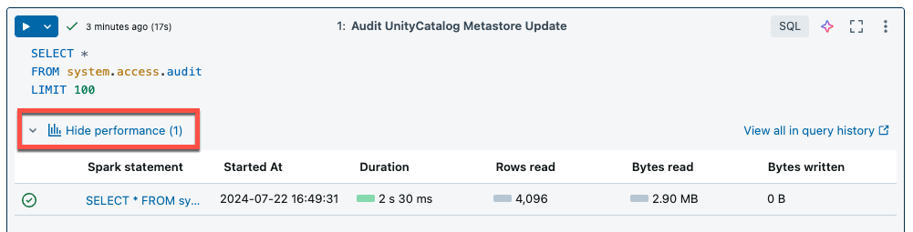

# Serverless compute for notebooks

> **Source:** [docs.databricks.com/aws/en/compute/serverless/notebooks](https://docs.databricks.com/aws/en/compute/serverless/notebooks)
> **Added:** 2026-06-15
> **Source updated:** 2026-05-26
> **Tags:** serverless, notebooks, compute, query-insights, B1
> **Type:** documentation

## Summary

Serverless compute for notebooks lets you run notebook code on Databricks-managed infrastructure with no cluster setup — attach, run, done. The page covers the one prerequisite (Unity Catalog), how to attach, how to read query insights after a run, and the overspend-protection timeout mechanism.

## Key points

- **Prerequisite:** Unity Catalog must be enabled on the workspace. No special user permission needed beyond workspace access with serverless interactive compute enabled.
- New notebooks **default to serverless** when code runs without a pre-selected compute resource.
- **Query insights** ("See performance") show SQL and Python query metrics after cell execution; the full query profile visualization is also available.
- **Spark UI is not available** on serverless notebooks — use query insights instead.
- **Default execution timeout: 2.5 hours (9,000 seconds).** Queries that exceed it are canceled (overspend protection).
- Workspace admins can change the default timeout; notebooks can override it per-session via a Spark config.

## Notes

### Requirements

- Workspace must have **Unity Catalog enabled**.
- Serverless interactive compute must be activated in the account (see [[ch01-getting-started-with-databricks]] §9 Note, which also states this requirement).

### Attaching a notebook to serverless compute

- Open the **compute dropdown** in the notebook toolbar → select the serverless option.
- On new notebooks, Databricks automatically selects serverless when code is executed with no resource pre-selected — zero friction.

### Query insights

After running notebook cells, click **"See performance"** to review how efficiently Spark executed your SQL and Python queries.

[](assets/serverless-notebooks/01-query-performance.png)
*The "See performance" link appears after a cell run; click "See query profile" for the full execution visualization.*

- Individual Spark statements can be examined for metrics.
- **"See query profile"** opens the query execution plan visualization.
- All serverless compute queries are logged in the workspace **Query History** page.

**Query insight limitations**

- Profiles only appear **after** execution completes (live metrics update during, but profile is post-run).
- Statuses covered: RUNNING, CANCELED, FAILED, FINISHED.
- Running queries **cannot be canceled from query history** — cancel from the notebook or job instead.
- No verbose metrics.
- No query profile downloads.
- No Spark UI access.
- Statement text shows only the **final executed line** (not the full cell).

> ⚠️ The absence of Spark UI is the sharpest difference from classic cluster notebooks — query insights are the replacement tool for performance debugging on serverless.

### Serverless overspend protection

Databricks imposes an **execution timeout** to prevent runaway spend from long-idle or hung serverless sessions.

- **Default:** 2.5 hours (9,000 seconds). Queries exceeding this are canceled automatically.
- **Workspace admin override:** Settings → **Compute** → **Serverless interactive** → change the default timeout. Changes propagate in ~5 minutes.
- **Per-notebook override** (takes precedence over workspace default):

    ```python
    spark.conf.set("spark.databricks.execution.timeout", <seconds>)
    ```

> 💡 Set a tighter per-notebook timeout on long-running ETL notebooks to catch hangs early rather than waiting 2.5 hours for the default to fire.

## Quotes worth keeping

> "Serverless notebooks have a default execution timeout of 2.5 hours (9,000 seconds)." (Serverless overspend protection)

## Open questions

- ❓ Is there a minimum timeout value the admin can configure, or can it be set to unlimited?
- ❓ Does the 2.5 hr timeout apply to the entire notebook session, or per cell/query?

## Related sources

- [[notebook-debugger]] — also covers notebooks; the interactive debugger mentions serverless as a supported compute option (no cluster config required); the Spark UI absence noted here means debugger + query insights are the two complementary tools for serverless notebook observability.
- [[ch01-getting-started-with-databricks]] — DCDE-SG Ch 1 §9 Note: confirms Unity Catalog + serverless account enablement as prerequisites, consistent with this page.


## Images

[](assets/serverless-notebooks/01.png)
*Show query performance (1001×255)*

