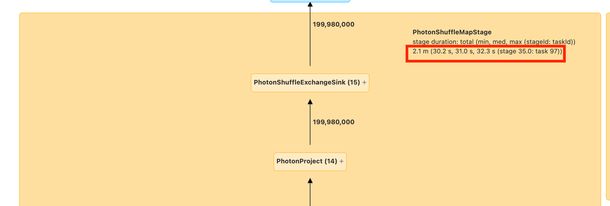
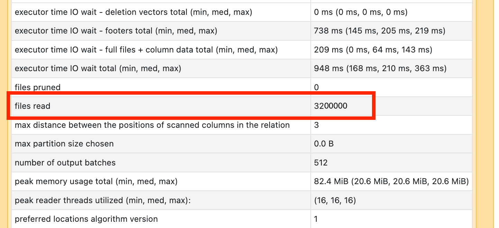
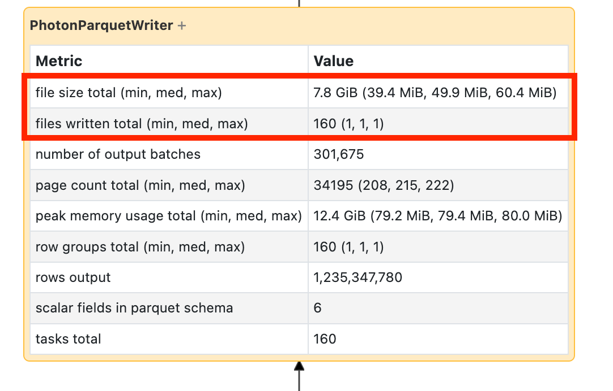
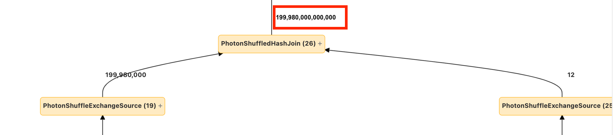
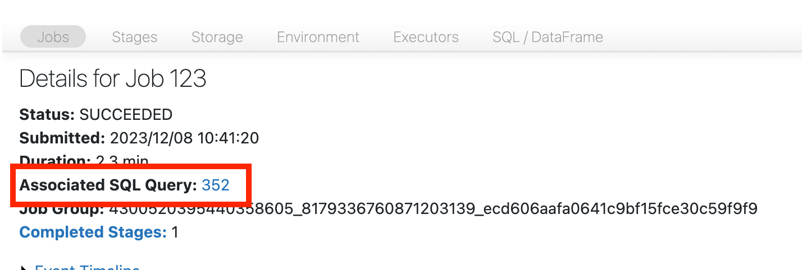
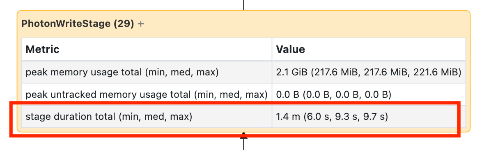

# Look for Other Causes of Slow Stage Runtime

> **Source:** [docs.databricks.com/aws/en/optimizations/spark-ui-guide/slow-spark-stage-low-io](https://docs.databricks.com/aws/en/optimizations/spark-ui-guide/slow-spark-stage-low-io)
> **Added:** 2026-06-17
> **Source updated:** (not shown on page)
> **Tags:** spark, spark-ui, performance, debugging, small-files, UDF, cartesian-join, explode, DAG, B2, B16
> **Type:** documentation

## Summary

Step 5 of the Spark UI diagnostic series — reached when Step 4 finds no high I/O. Read the SQL DAG to find where time accumulates, then diagnose one of five structural causes: small files on read, small files on write, slow UDFs, cartesian joins, or exploding joins/explode().

## Key points

- DAG times are **cumulative** (total across all tasks), not wall-clock.
- Small file threshold: tens of thousands of files, or files < 8 MB.
- Small file root cause: partitioning on too many columns or a high-cardinality column.
- UDF diagnosis: comment it out and see if pipeline speeds up.
- UDF fix 1: rewrite using native Spark/SQL functions.
- UDF fix 2: `repartition(num_cores)` before UDF if task count < core count (also resolves memory pressure).
- Cartesian/nested-loop join: always verify intent — extremely expensive.
- Exploding join: few rows in, many rows out — watch the row counts on DAG nodes.

## Notes

### Navigate to the SQL DAG

From the job page, click **Associated SQL Query** at the top.

[](assets/spark-ui-guide/14-stage-to-sql.png)
*Link from stage detail to the associated SQL query ID.*

[](assets/spark-ui-guide/15-sql-dag.png)
*The SQL DAG — timing shown per node. Times are cumulative across all tasks, correlating with cost.*

[](assets/spark-ui-guide/16-slow-stage-in-dag.png)
*Identify the node consuming the most time — that's the cause to diagnose.*

> "these times are cumulative, so it's the total time spent on all the tasks, not the clock time."

Some nodes show timing directly; others require expanding the node to reveal duration.

### Cause 1 — Reading many small files

> "If you're reading tens of thousands of files or more, you may have a small file problem. Your files should be no less than 8MB."

Root cause: "most often caused by partitioning on too many columns or a high-cardinality column."

Check the **scan operator** in the DAG for file counts.

[](assets/spark-ui-guide/18-many-files-read.png)
*Scan operator showing a high file count — sign of a small-file read problem.*

**Fixes:**

- Run `OPTIMIZE` to compact small files
- Enable **predictive optimization** (auto-runs OPTIMIZE)
- Reconsider file layout — fewer partition columns, lower-cardinality partition keys

### Cause 2 — Writing many small files

> "If you're writing tens of thousands of files or more, you may have a small file problem. Your files should be no less than 8MB."

Same root cause as reading: over-partitioning or high-cardinality partition columns. Check the write operator in the DAG.

[](assets/spark-ui-guide/19-many-files-write.png)
*Write operator showing excessive file count.*

[](assets/spark-ui-guide/17-slow-write-node.png)
*A slow write node in the DAG indicates the write itself is the bottleneck.*

**Fixes:**

- Enable **predictive optimization**
- Enable **optimized writes** (merges small shuffle outputs before writing)
- Reconsider file layout

### Cause 3 — Slow UDFs

UDFs appear as named nodes in the SQL DAG.

**Diagnose:** temporarily comment out the UDF and rerun — if the pipeline speeds up significantly, the UDF is the cause.

> "If the UDF is indeed where the time is being spent, your best bet is to rewrite the UDF using native functions."

**Fix 1 — rewrite with native functions** (eliminates Python/JVM serialization overhead entirely)

**Fix 2 — repartition before UDF** (when task count < cluster core count):

```python
(df
  .repartition(num_cores)
  .withColumn('new_col', udf_fn(...))
)
```

> "Each task may have to load all the data in its partition into memory. If this data is too big, things can get very slow or unstable. Repartition also can resolve this issue by making each task smaller."

> ⚠️ UDF node screenshot on this page is a base64-embedded image — not separately downloadable.

### Cause 4 — Cartesian join

Signal: `CartesianProduct` or `BroadcastNestedLoopJoin` node in the DAG.

> "If you see a cartesian join or nested loop join in your DAG, you should know that these joins are very expensive."

Action: verify the join is intentional; redesign to use an equi-join condition if possible.

### Cause 5 — Exploding join or `explode()`

Signal: few rows entering a DAG node, magnitudes more exiting.

> "If you see a few rows going into a node and magnitudes more coming out, you may be suffering from an exploding join or explode()."

[](assets/spark-ui-guide/20-exploding-join.png)
*Row count fan-out visible in the DAG — small input, massive output.*

Action: verify the fan-out is intentional; add filters or constraints before the explode/join to limit output rows. See [[optimize-data-workloads-guide]] data explosion section for mitigation options (`maxPartitionBytes`, `repartition()`).

## Open questions

- `predictive-optimization` page not yet captured (`/aws/en/optimizations/predictive-optimization`)

## Related sources

- [[spark-ui-guide]] — parent guide; this is Step 5 of 5
- [[long-spark-stage-io]] — Step 4 (I/O bound); "no high I/O" leads here
- [[optimize-data-workloads-guide]] — data layout, small files, UDF repartition pattern, explosion mitigations


## Images

[](assets/slow-spark-stage-low-io/01.png)
*SQL ID (1428×482)*

[](assets/slow-spark-stage-low-io/02.png)
*SLQ DAG (1546×1324)*

[](assets/slow-spark-stage-low-io/03.png)
*Slow Stage Node (2262×768)*

[](assets/slow-spark-stage-low-io/04.png)
*Slow Write Node (1196×368)*

[](assets/slow-spark-stage-low-io/05.png)
*Reading Many Files (1442×660)*

[](assets/slow-spark-stage-low-io/06.png)
*Writing many files (1082×692)*

[](assets/slow-spark-stage-low-io/07.png)
*Exploding Join (2312×512)*

