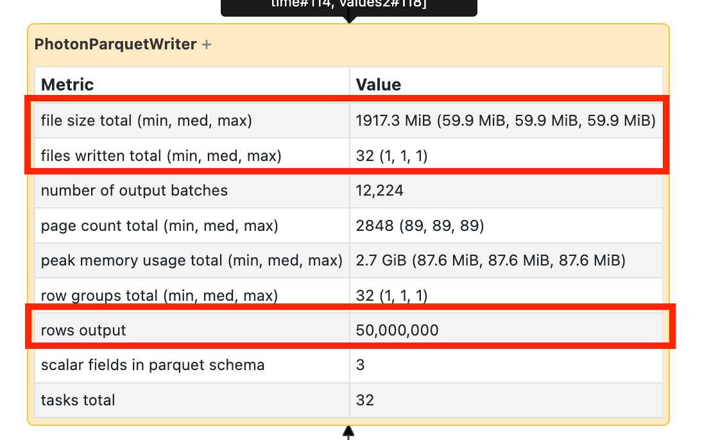

# How to Determine if Spark is Rewriting Data

> **Source:** [docs.databricks.com/aws/en/optimizations/spark-ui-guide/spark-rewriting-data](https://docs.databricks.com/aws/en/optimizations/spark-ui-guide/spark-rewriting-data)
> **Added:** 2026-06-17
> **Source updated:** (not shown on page)
> **Tags:** spark, spark-ui, debugging, delta, merge, delete, update, rewriting, B2, B12, B16
> **Type:** documentation

## Summary

Detection-only sub-page of the Spark UI Guide series, linked from the high-output branch of Step 4. Explains how to use the SQL DAG to confirm whether a write stage is rewriting more data than expected. No remediation here — fixes are in [[long-spark-stage-io]] (high output section) and [[optimize-data-workloads-guide]] (merge optimizations).

## Key points

- Navigate: job page → **Associated SQL Query** → SQL DAG.
- For Delete/Update: compare writer's output volume against expectation — more than expected = rewriting.
- For Merge: merge node shows explicit rewrite statistics.
- No numeric threshold defined — judgment against expectation only.

## Notes

### Navigate to the SQL DAG

From the job page, scroll to the top and click **Associated SQL Query**.

> "You should now see the DAG. If not, scroll around a bit and you should see it."

### Check write statistics

*Write node statistics — compare bytes written against what the operation should produce.*

**Delete or Update:**

> "Look at the amount of data being written by the writer versus what you expect. If you're seeing a lot more data being written than you expect, you're probably rewriting data."

**Merge:**

> "If you're doing a merge, the merge node has explicit statistics about how much data it's rewriting."

### What to do when rewriting is confirmed

This page covers detection only. For remediation:

- See [[long-spark-stage-io]] → High output section (optimize merges, deletion vectors, Photon)
- See [[optimize-data-workloads-guide]] → Delta Merge optimizations (small file sizes 16–64 MB, low-shuffle merge, partition filter in ON clause, broadcast small source)

## Related sources

- [[spark-ui-guide]] — parent guide
- [[long-spark-stage-io]] — Step 4; links here from high-output branch
- [[optimize-data-workloads-guide]] — merge internals and optimizations
