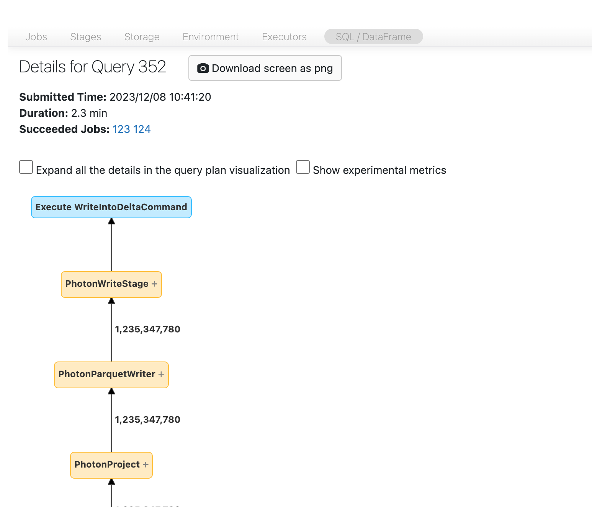

# How to Determine if Spark is Rewriting Data

> **Source:** [docs.databricks.com/aws/en/optimizations/spark-ui-guide/spark-rewriting-data](https://docs.databricks.com/aws/en/optimizations/spark-ui-guide/spark-rewriting-data)
> **Added:** 2026-06-17
> **Source updated:** 2024-04-15
> **Tags:** spark, spark-ui, debugging, delta, merge, delete, update, rewriting, B2, B12, B16
> **Type:** documentation

A detection-only sub-page of the Spark UI Guide series, linked from the high-output branch of Step 4. It explains how to use the SQL DAG to confirm whether a write stage is rewriting more data than expected. No remediation here — fixes are in [[long-spark-stage-io]] (high-output section) and [[optimize-data-workloads-guide]] (merge optimizations).

## Navigate to the SQL DAG

From the job page, scroll to the top and click **Associated SQL Query**.

> "You should now see the DAG. If not, scroll around a bit and you should see it."

## Check write statistics

*Compare bytes written against what the operation should produce.*

- **Delete or Update:** "Look at the amount of data being written by the writer versus what you expect. If you're seeing a lot more data being written than you expect, you're probably rewriting data."
- **Merge:** "the merge node has explicit statistics about how much data it's rewriting."

There's no numeric threshold — judge against expectation. When rewriting is confirmed, remediate via [[long-spark-stage-io]] (high output: optimize merges, deletion vectors, Photon) and [[optimize-data-workloads-guide]] (small target files 16–64 MB, low-shuffle merge, partition filter in the `ON` clause, broadcast small source).

Related: [[spark-ui-guide]], [[long-spark-stage-io]], [[optimize-data-workloads-guide]].
