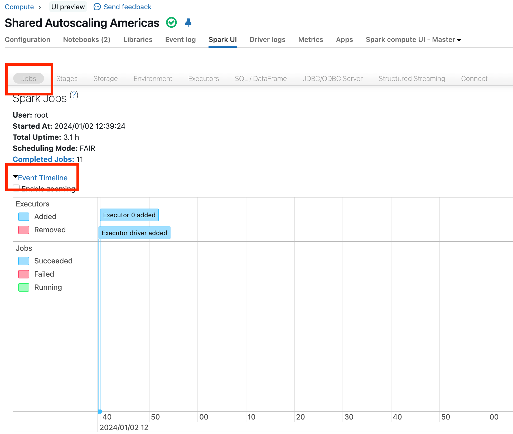
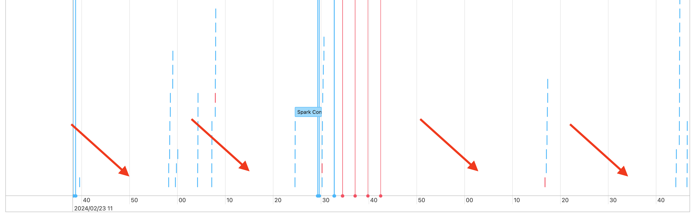
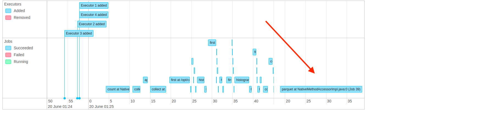
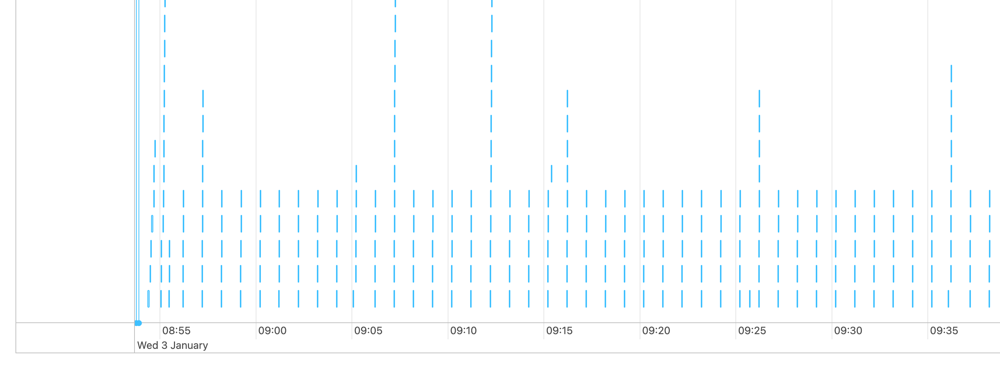
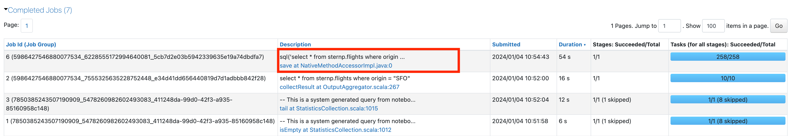
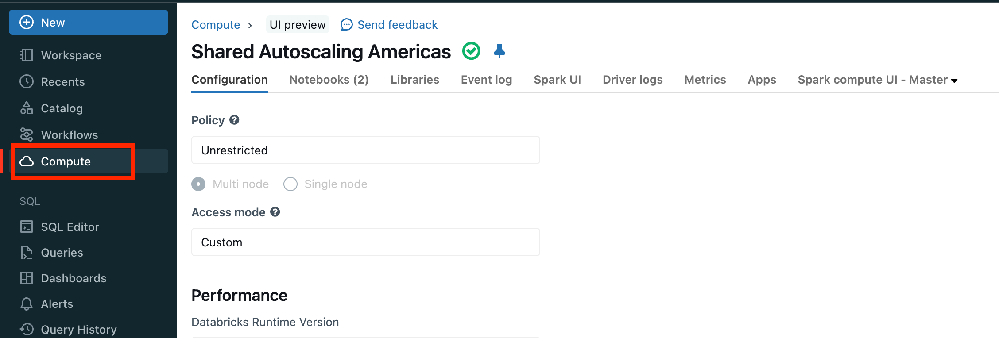
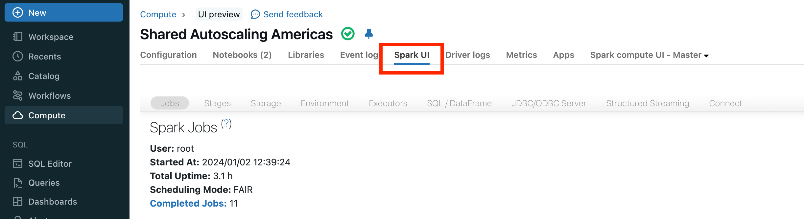

# Diagnose cost and performance issues using the Spark UI

> **Source:** [docs.databricks.com/aws/en/optimizations/spark-ui-guide](https://docs.databricks.com/aws/en/optimizations/spark-ui-guide)
> **Added:** 2026-06-17
> **Source updated:** 2024-04-19
> **Tags:** spark, spark-ui, performance, optimization, debugging, skew, spill, stages, tasks, B2, B16
> **Type:** documentation

## Summary

A practical five-step diagnostic workflow for using the Spark UI to identify performance and cost issues. Teaches *how to investigate* rather than just what each UI feature does: start at the Jobs Timeline, drill into the longest job, then the longest stage, check for spill and skew, quantify I/O, and finally look for structural causes (small files, UDFs, bad joins).

## Key points

- Start with the Jobs Timeline — classify what you see before drilling into details.
- One task in a stage is a red flag. Many tasks → check skew and spill first.
- Spill threshold: any spill statistics showing = spill. No stats = no spill.
- Skew threshold: `Max duration > 1.5× 75th-percentile duration` → probable skew.
- I/O bound test: `max_IO_column ÷ worker_cores ÷ duration_seconds ≈ 3 MB/s` → I/O bound.
- Small file floor: 8 MB per file; tens of thousands of files → small-file problem.
- `spark.sql.shuffle.partitions=auto` — always set for high-shuffle stages.
- SQL DAG times are *cumulative* (total across tasks), not clock time.

## Notes

### Step 1 — Jobs Timeline

Open via **Jobs → Event Timeline** in the Spark UI.

[](assets/spark-ui-guide/01-jobs-timeline.png)
*The Jobs Timeline view — starting point for all Spark performance diagnosis.*

Four diagnostic patterns:

**Failing jobs or executors** — red status in the timeline.

[](assets/spark-ui-guide/02-failing-jobs.png)
*Red entries indicate executor loss or job failures. See "Failing jobs or executors" doc.*

**Gaps ≥ 1 minute in the middle of a pipeline** — driver blocked or resource wait.

[](assets/spark-ui-guide/03-job-gaps.png)
*Long gaps mid-pipeline indicate the driver is waiting on something. Short gaps (driver coordinating work) are normal.*

**One or few long jobs dominating** — compute bottleneck.

[](assets/spark-ui-guide/04-long-jobs.png)
*Click the longest job to dig in.*

**Many tiny jobs (seconds each)** — over-orchestration or small-file reads.

[](assets/spark-ui-guide/05-small-jobs.png)
*Timeline dominated by tiny jobs → see "Many small Spark jobs".*

**Default case** — sort by duration, click longest job.

[](assets/spark-ui-guide/06-find-long-job.png)
*Sort the jobs table by Duration to find the worst offender.*

### Step 2 — Longest stage

Scroll to the stage list at the bottom of the job page. Sort by **Duration**.

[](assets/spark-ui-guide/07-long-stage.png)
*Stage list sorted by duration — the longest stage is the one to investigate.*

Note the four I/O metrics:

[](assets/spark-ui-guide/08-long-stage-io.jpeg)
*I/O columns: Input (storage reads), Output (storage writes), Shuffle Read, Shuffle Write.*

| Metric | Meaning |
|---|---|
| **Input** | Data read from storage (Delta, Parquet, CSV, …) |
| **Output** | Data written to storage |
| **Shuffle Read** | Shuffle data consumed by this stage |
| **Shuffle Write** | Shuffle data produced by this stage |

> ⚠️ Note these numbers — you'll need them in Step 4.

[](assets/spark-ui-guide/09-long-stage-tasks.jpeg)
*Task count is visible in the stage detail. One task = red flag.*

**Task count branch:**

- **1 task** → sign of a problem → see "One Spark task" guide
- **More than 1 task** → investigate further → click the stage description to open stage detail

[](assets/spark-ui-guide/10-long-stage-description.png)
*Click the stage description link to open stage detail page → then go to Step 3.*

### Step 3 — Skew or spill

**Spill**

Spill: Spark runs low on memory → moves data from RAM to disk. Expensive. Most common during shuffles.

[](assets/spark-ui-guide/11-spill-stats.png)
*If spill statistics appear in the stage detail, this stage has spill. No stats = no spill.*

**Skew**

Skew = one or a few tasks take far longer than the rest → poor cluster utilisation, long jobs.

Check **Summary Metrics** — compare Max duration against 75th percentile:

[](assets/spark-ui-guide/12-skew-stats.png)
*If Max duration > 1.5× 75th-percentile duration → probable skew.*

**No skew, no spill** → go back to the job page → click **Associated Job Ids**.

[](assets/spark-ui-guide/13-stage-to-job.png)
*Click "Associated Job Ids" to navigate back up to the job context → then go to Step 4.*

### Step 4 — Is the stage I/O bound?

**I/O bound formula:**

```
max_IO_column_bytes ÷ worker_core_count ÷ duration_seconds ≈ 3 MB/s → I/O bound
```

Each CPU core can read/write ~3 MB/s. If your per-core I/O rate approaches that ceiling, you're I/O bound.

Use the I/O numbers from Step 2 (same screenshot — the I/O columns on the stage list):

[](assets/spark-ui-guide/08-long-stage-io.jpeg)

**High input** (reading too much data) — fix options:

- Use Delta (columnar, indexed)
- Liquid clustering → better data skipping
- Photon → faster wide-table reads
- More selective predicates
- Delta cache for repeated reads
- Dynamic File Pruning for joins
- Increase cluster size / use serverless

**High output** (writing too much data) — fix options:

- Check for excessive rewriting → optimize merges or use deletion vectors
- Enable Photon for write speed
- Increase cluster size / use serverless

**High shuffle** — set:

```sql
SET spark.sql.shuffle.partitions = auto;
```

**No high I/O** → proceed to Step 5.

### Step 5 — Other causes (low I/O, slow stage)

Check the **SQL DAG** — navigate from the stage detail to the SQL plan.

[](assets/spark-ui-guide/14-stage-to-sql.png)
*Link from stage to the associated SQL query ID.*

[](assets/spark-ui-guide/15-sql-dag.png)
*The SQL DAG shows time accumulated at each node. Times are cumulative (total across all tasks, not wall-clock).*

[](assets/spark-ui-guide/16-slow-stage-in-dag.png)
*Identify which node in the DAG is consuming the most time.*

**1. Reading many small files**

- Signal: reading tens of thousands of files
- Threshold: files should be ≥ 8 MB each
- Root cause: partitioning on too many columns or a high-cardinality column
- Fix: `OPTIMIZE`, enable predictive optimization, reconsider partition layout

[](assets/spark-ui-guide/18-many-files-read.png)

**2. Writing many small files**

- Signal: writing tens of thousands of files

[](assets/spark-ui-guide/19-many-files-write.png)

- Root cause: same over-partitioning as reads
- Fix: enable predictive optimization, optimized writes, reconsider layout

[](assets/spark-ui-guide/17-slow-write-node.png)
*A slow write node in the DAG indicates output bottleneck.*

**3. Slow UDFs**

- Signal: UDF node consuming significant time in DAG
- Fix 1: `repartition(num_cores)` before the UDF if task count < cluster cores
- Fix 2: rewrite UDF using native Spark/SQL functions (eliminates serialization overhead)
- Note: repartitioning also prevents memory issues from large partition data loaded into UDF

**4. Cartesian join (nested loop join)**

- Signal: `CartesianProduct` or `BroadcastNestedLoopJoin` in DAG
- Impact: O(N×M) — extremely expensive for large tables
- Action: verify this is intentional; seek an equi-join alternative

**5. Exploding join or `explode()`**

- Signal: few rows entering a DAG node, magnitudes more exiting

[](assets/spark-ui-guide/20-exploding-join.png)
*The DAG shows row counts at each node — explosion is visible as a sudden fan-out.*

- Action: verify intent; watch for accidental cross-joins or unconstrained `explode()` on arrays

## Open questions

- "One Spark task", "Failing jobs or executors", "Gaps between Spark jobs", and "Many small Spark jobs" are referenced as separate linked pages — not captured here.
- UDF Node screenshot is a base64 data URI embedded in the page — not downloadable as a standalone file.

## Related sources

- [[classic-compute-overview]] — cluster architecture (drivers, workers, executors)
- [[photon]] — Photon helps with I/O-bound read and write stages
- [[sql-warehouse-types]] — serverless as alternative to resizing classic clusters


## Images

[](assets/spark-ui-guide/01.png)
*Navigate to Compute (2256×764)*

[](assets/spark-ui-guide/02.png)
*Navigate to SparkUI (2446×670)*

