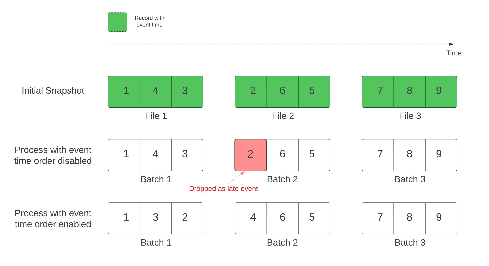

# Delta Lake table streaming reads and writes

> **Source:** [docs.databricks.com/aws/en/structured-streaming/delta-lake](https://docs.databricks.com/aws/en/structured-streaming/delta-lake)
> **Added:** 2026-06-30
> **Source updated:** 2026-06-16
> **Tags:** structured-streaming, delta-lake, streaming-source, streaming-sink, skipChangeCommits, foreachBatch, I2, I5
> **Type:** documentation

Delta Lake tables work as both Structured Streaming sources and sinks. Benefits: coalesce small files from low-latency ingest, exactly-once processing with multiple concurrent streams or batch jobs, efficient new-file discovery.

## Retention window warning (source)

A streaming query reading from a Delta table must run at least once within the source table's retention window:

- **7 days** — VACUUM-removed data files
- **30 days** — transaction log (`logRetentionDuration`)

Falling behind these windows → query fails with `DELTA_FILE_NOT_FOUND_DETAILED` and must be reset with a full refresh.

**Do not** set `spark.sql.files.ignoreMissingFiles = true` as a workaround — silently produces incorrect results. Instead increase the source table's retention.

## Delta Lake as a sink

Delta transaction log guarantees **exactly-once** processing even with concurrent streams or batch queries running against the same table.

Empty commits with `epochId = -1` are expected (not errors):
- First batch of each query run (every batch when using `Trigger.AvailableNow`)
- When a schema change occurs

**Checkpoint location:** store inside `<table-name>/_checkpoints` — VACUUM skips directories that begin with `_`.

## Backlog metrics

| Metric | Description |
|---|---|
| `numBytesOutstanding` | Bytes yet to be processed |
| `numFilesOutstanding` | Files yet to be processed |
| `numNewListedFiles` | Delta files listed to calculate backlog for this batch |
| `backlogEndOffset` | Delta table version used to calculate the backlog |

View in notebook under Raw Data tab of the streaming query progress dashboard.

## Output modes

**Append mode** (default) — adds new records only:

```python
events.writeStream \
    .outputMode("append") \
    .option("checkpointLocation", "/tmp/delta/events/_checkpoints/") \
    .toTable("events")
```

**Complete mode** — replaces entire table after every batch (use for aggregations):

```python
spark.readStream.table("events") \
    .groupBy("customerId").count() \
    .writeStream \
    .outputMode("complete") \
    .option("checkpointLocation", "/tmp/delta/eventsByCustomer/_checkpoints/") \
    .toTable("events_by_customer")
```

For non-latency-sensitive aggregation, use `Trigger.AvailableNow` to process only new data on a schedule (cheaper than continuous).

## Handle changes to source Delta tables

Structured Streaming only accepts append inputs. Any UPDATE, DELETE, MERGE INTO, or OVERWRITE on the source table fails the stream — unless one of these approaches is used:

| Approach | Pros | Cons |
|---|---|---|
| `skipChangeCommits` | Simple; no complex logic | Does not propagate changes; appends only |
| Full refresh | Simple | Expensive for large data; reprocesses all downstream |
| Change data feed | Handles all change types | Requires logic per change type |
| Materialized views | Automatic; simple | Higher latency; Lakeflow Declarative Pipelines / Databricks SQL only |

### `skipChangeCommits` (recommended for non-CDF workloads)

Ignores transactions that delete or modify existing records. Processes only appends. Can be toggled on/off temporarily.

```python
spark.readStream \
    .option("skipChangeCommits", "true") \
    .table("source_table")
```

**Schema mismatch:** if source schema changes after a streaming read begins, the query fails. Restart to resolve for most schema changes. DBR 12.2 LTS and below: can't stream from column-mapping tables with non-additive evolution (rename/drop columns).

### Legacy options (avoid for new workloads)

**`ignoreDeletes`** — only handles full partition drops. Use `skipChangeCommits` for non-partition deletes, updates, or modifications.

**`ignoreChanges`** — available in DBR 11.3 LTS and below only; replaced by `skipChangeCommits` in DBR 12.2+. Key difference: `ignoreChanges` re-emits rewritten data files (including unchanged rows → downstream must handle duplicates); `skipChangeCommits` ignores changed files entirely.

## foreachBatch — idempotent Delta writes

Use `txnAppId` + `txnVersion` to guarantee exactly-once when writing to multiple Delta tables in `foreachBatch`:

```python
app_id = ...  # unique string per application

def writeToDeltaLakeTableIdempotent(batch_df, batch_id):
    batch_df.write.format(...).option("txnVersion", batch_id).option("txnAppId", app_id).save(...)  # location 1
    batch_df.write.format(...).option("txnVersion", batch_id).option("txnAppId", app_id).save(...)  # location 2

streamingDF.writeStream.foreachBatch(writeToDeltaLakeTableIdempotent).start()
```

**Warning:** if you delete the streaming checkpoint and restart, you **must** provide a different `txnAppId`. New checkpoints start at `batchId = 0` — Delta uses `(txnAppId, batchId)` as a unique key and skips "already seen" pairs, which would silently drop the first batch.

## Upsert (merge) via foreachBatch

Cache the batch DataFrame before merge and uncache after — prevents input data rate metric multiplication (merge reads input data multiple times):

```python
def upsertToDelta(microBatchOutputDF, batchId):
    microBatchOutputDF.createOrReplaceTempView("updates")
    microBatchOutputDF.sparkSession.sql("""
        MERGE INTO aggregates t
        USING updates s
        ON s.key = t.key
        WHEN MATCHED THEN UPDATE SET *
        WHEN NOT MATCHED THEN INSERT *
    """)

streamingAggregatesDF.writeStream \
    .foreachBatch(upsertToDelta) \
    .outputMode("update") \
    .start()
```

Merge statement inside foreachBatch must be idempotent — streaming restarts replay the same batch.

## Set initial table version

By default, streams begin with the latest Delta version (current snapshot + all future changes).

**`startingVersion`** — start from a specific Delta version (all changes at or after that version):

```scala
spark.readStream.option("startingVersion", "5").table("user_events")
```

Use `"latest"` to return only future changes.

**`startingTimestamp`** — start from a timestamp; if it precedes all commits, uses earliest available:

```scala
spark.readStream.option("startingTimestamp", "2019-01-01").table("user_events")
```

Cannot set both at once. Settings apply to new queries only — ignored if a checkpoint already exists.

**Schema caveat:** the streaming source always uses the **latest schema** of the Delta table, regardless of `startingVersion`/`startingTimestamp`. Incompatible schema changes after the specified starting point → incorrect results.

## Process initial snapshot without dropping data (withEventTimeOrder)

*DBR 11.3 LTS+.*

Default initial snapshot processing order = file last-modified time. This doesn't match event time order → stateful queries with watermarks can **incorrectly mark records as late and drop them**.

`withEventTimeOrder = true` divides the initial snapshot into event-time buckets; each micro-batch processes one bucket:

```scala
spark.readStream
    .option("withEventTimeOrder", "true")
    .table("user_events")
    .withWatermark("event_time", "10 seconds")
```

Or set globally: `spark.databricks.delta.withEventTimeOrder.enabled true`

[](assets/structured-streaming-delta-lake/01-initial-snapshot.png)
*withEventTimeOrder divides initial snapshot into event-time buckets to prevent late-event data drops.*

**Constraints:**

- Cannot change `withEventTimeOrder` once initial snapshot is actively processing — delete checkpoint to restart
- Cannot downgrade DBR version until initial snapshot completes (or delete checkpoint)
- Not supported when: event time column is generated + non-projection transformations exist between Delta source and watermark; or watermark has >1 Delta source

**Performance:** scanning per micro-batch is slower. Improve with: Delta source column as event time (enables data skipping), partition table on event time column.

## Limit input rate

| Option | Default | Notes |
|---|---|---|
| `maxFilesPerTrigger` | 1000 | Max new files per micro-batch |
| `maxBytesPerTrigger` | (not set) | Soft max bytes per micro-batch; may slightly exceed limit |

Both can be set together — micro-batch stops when either limit is reached.

`failOnDataLoss = false` — ignore source versions cleaned up by `logRetentionDuration` and continue (default true = fail to prevent data loss).

[[structured-streaming-foreach]] · [[merge]] · [[batch-vs-streaming]]
