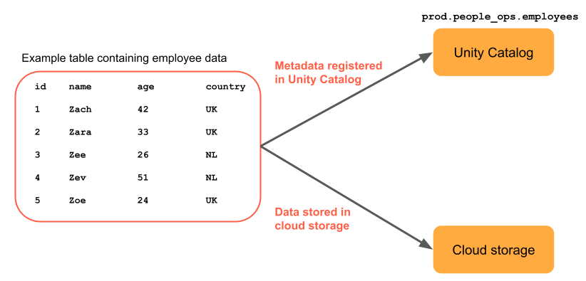
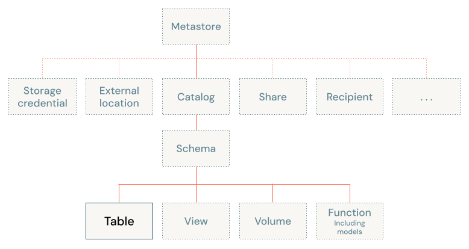

# Databricks tables concepts

> **Source:** [docs.databricks.com/aws/en/tables/tables-concepts](https://docs.databricks.com/aws/en/tables/tables-concepts)
> **Added:** 2026-06-22
> **Source updated:** 2026-06-17
> **Tags:** tables, unity-catalog, managed, external, foreign, temporary, delta, iceberg, three-level-namespace, permissions, B4
> **Type:** documentation

## Summary

Databricks defines tables along two axes: **three primary table types** (managed, external, foreign — plus session-scoped temporary) and **two open storage formats** (Delta Lake, Apache Iceberg). The table type is set by *which catalog owns the data files*; the format sets *how data is physically tracked*. The **default is a Unity Catalog managed Delta table**, and Databricks recommends managed for every new table. A table lives at the third level of the UC three-level namespace (`catalog.schema.table`).

> 📌 Corrects the DCDE-SG Ch 3 book (DBR 13.3-era): the book frames tables as **managed vs external on `hive_metastore`**. The current model is **three types under Unity Catalog**, managed is the recommended default (book leans external), and Iceberg is a first-class format. No `hive_metastore` in this page at all. See [Ch 3 reading notes](../dcde-sg/ch03-mastering-relational-entities.md).

## Key points

- **Default table** = Unity Catalog **managed** table, **Delta** format.
- **Table type is determined by which catalog owns/manages the underlying data files** — i.e. *who controls the files' lifecycle* (create, delete, location, layout, optimize), **not** the file format and **not** where the files physically sit. Quick test: *"If I drop this table, who deletes the data?"* — **Unity Catalog → managed**, **nobody (files stay in your bucket) → external**, **another system → foreign**.
- **Three primary types**: managed, external, foreign. Plus **temporary** (session-scoped).
- **Two formats**: Delta Lake (default) + Apache Iceberg.
- Databricks **recommends managed tables for all new tables** — auto performance + storage-cost optimization, plus external-system access (e.g. Trino).
- A table sits at level 3 of the namespace: `catalog.schema.table`.

## Notes

### Example managed table

`prod.people_ops_employees` — a managed table; data files sit in UC's managed storage location in cloud storage.

### Storage formats

How data is physically structured + tracked in object storage. Both formats add a transactional layer = ACID + time travel.

| Format | Supported on | Notes |
|---|---|---|
| **Delta Lake** | managed, external, foreign | **Default** for managed + external. |
| **Apache Iceberg** | managed, foreign | Use when integrating with the Iceberg ecosystem. |

> Note the asymmetry: **external tables = Delta only** (no Iceberg); **Iceberg has no external variant** on this page. Foreign supports both.

### Table types

Type = how data is **owned and accessed**, set by the managing catalog:

| Type | Managing catalog | Read/write | Perf optimization | Storage-cost optimization |
|---|---|---|---|---|
| **Managed** | Unity Catalog | Yes | Yes | Yes |
| **Temporary** | None (session-scoped managed table) | Yes | Yes | Yes |
| **External** | None (files only) | Yes | Manual only | Manual only |
| **Foreign** | An external system / catalog service | **Read only** | No | No |

- **Managed** — UC manages **both data files and metadata**. Data files in UC's managed storage location. Default + recommended. Auto-optimization, lower cost, external-system access (Trino).
- **External** (aka *unmanaged*) — references data in external storage (cloud object storage). Databricks registers **metadata only**, does not manage the files. Multiple formats incl. Delta → readable by external systems. Optimization is **manual only**.
- **Foreign** — data in external systems connected via **Lakehouse Federation**. **Read-only** on Databricks. (See learning-path I8.)
- **Temporary** — session-scoped, store intermediate results without a permanent table. **Auto-dropped at session end.** **No catalog/schema privileges needed** to create.

### Tables in Unity Catalog — permissions

A table is the third level of the UC namespace (`catalog.schema.table`):

Most table ops require **`USE CATALOG`** + **`USE SCHEMA`** on the containing catalog/schema, plus:

| Operation | Additional permission |
|---|---|
| Create a table | `CREATE TABLE` on the schema |
| Query a table | `SELECT` on the table |
| Update / delete / merge / insert | `SELECT` + `MODIFY` on the table |
| Drop a table | `MANAGE` on the table |
| Replace a table | `MANAGE` on the table + `CREATE TABLE` on the schema |

SQL syntax refs: `CREATE TABLE [USING]`, `ALTER TABLE`, `DROP TABLE`, `SHOW TABLES`.

## References

- [Databricks tables concepts](https://docs.databricks.com/aws/en/tables/tables-concepts) — this page
- [DCDE-SG Ch 3 reading notes](../dcde-sg/ch03-mastering-relational-entities.md) — the book chapter this corrects
- Learning path: **B4 — Spark SQL & Relational Entities**
