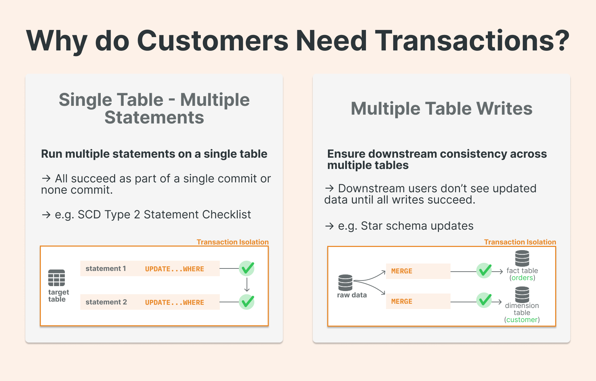
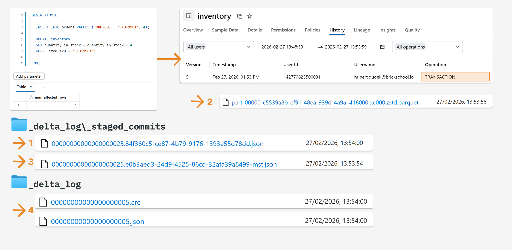
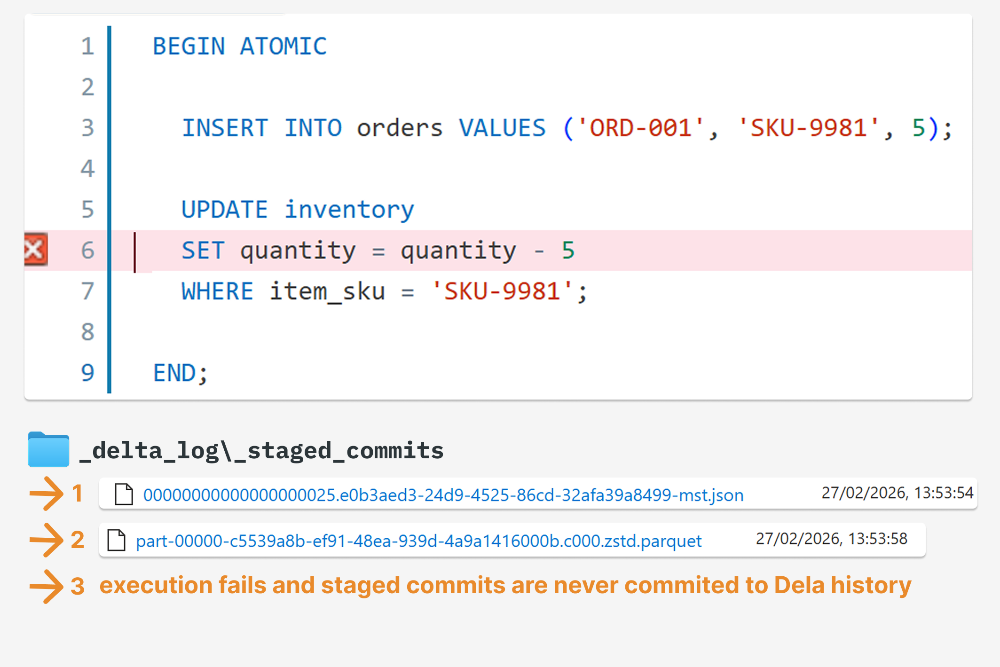

# Multi-statement transactions (MSTs) — atomic SQL across Delta tables

> **Source:** [SunnyData / Hubert Dudek (co-writer Benjamin Mathew) — "The Lakehouse Finally Has Real Transactions"](https://www.sunnydata.ai/blog/databricks-multi-statement-transactions)
> **Published:** 2026-03-10
> **Added:** 2026-06-26
> **Tags:** unity-catalog, transactions, multi-statement, catalog-commits, catalogManaged, staged-commits, begin-atomic, delta, iceberg, lakebase, B4
> **Type:** practitioner blog

## Summary

A practitioner deep-dive on **multi-statement, multi-table transactions (MSTs)** — grouping several SQL statements into one all-or-nothing unit so partial updates across tables never leak to downstream consumers. Databricks is positioned as the **first lakehouse to support MSTs on both Delta and Iceberg**. The piece pairs the *why* (a reliability gap that forced years of compensating logic and custom rollbacks) with the *how it actually lands on storage*: `BEGIN ATOMIC … END`, the `.mst.json` staged-commit file, and the success-vs-rollback walkthrough in the Delta log. Companion to the docs note [[transactions]] (full spec: `BEGIN ATOMIC`/`BEGIN TRANSACTION`, isolation, conflict detection, limits) and built directly on [[catalog-commits]] / [catalog-commits write mechanics](catalog-commits/) — read those for the coordination substrate; read this for the SQL surface and the on-storage mechanics.

## Key points

- **What it is:** group multiple SQL statements into one atomic unit with `BEGIN ATOMIC … END`. Either the whole block commits or none of it does — no intermediate cross-table state is visible to readers.
- **First lakehouse with MSTs on Delta *and* Iceberg** — unlocking mission-critical warehousing workloads and legacy-warehouse migrations on the lakehouse.
- **Powered by catalog-managed commits:** moving commit coordination to Unity Catalog is what lets UC orchestrate commits **across multiple tables within one transaction boundary** while keeping Delta's ACID guarantees.
- **SQL-only:** you get transactional behavior by executing SQL transaction blocks (inside `pyspark.sql()` if from Python) — **not** by wrapping DataFrame ops. Connectors (Python SQL connector, JDBC) get commit/rollback by disabling autocommit.
- **Boundaries:** not for OLTP (use **Lakebase**), not available in open-source Spark (Databricks-only).


*Single-table Delta commits were always atomic; MSTs add the missing cross-table coordination.*

## Notes

### What you get (conceptually)

- **Atomicity across statements** — the whole block succeeds, or none of it does.
- **Multi-table atomic updates** — one logical unit of work can update N tables with no intermediate states visible to downstream consumers.
- **Commit/rollback control from connectors** — Python SQL connector / JDBC: disable autocommit, execute multiple statements, then commit or rollback.

Example — if the `UPDATE` fails, the `INSERT` is never committed to Delta history:

```sql
BEGIN ATOMIC
  INSERT INTO sandbox_mst.orders VALUES ('ORD-001', 'SKU-9981', 4);

  UPDATE sandbox_mst.inventory
  SET quantity_in_stock = quantity_in_stock - 4
  WHERE item_sku = 'SKU-9981';
END;
```

### How it works — catalog-managed commits

The implementation idea is changing **who coordinates the commit**. **Catalog-managed commits** (an open-source Delta table feature) shift transaction coordination from the filesystem to the catalog, making the catalog the broker of table access *and* the source of truth for the table's latest metadata and commits. Unity Catalog is the first open lakehouse catalog to support catalog-managed tables. Databricks ties MSTs explicitly to this: moving coordination to the catalog "also allows Unity Catalog to orchestrate commits across multiple tables within a single transaction boundary while maintaining Delta Lake's ACID guarantees." (See [catalog-commits write mechanics](catalog-commits/) for the staged-commits write sequence this builds on.)

### Seeing it in action

Prerequisite — the table must be **managed** with catalog-managed commits enabled (not yet the default):

```sql
ALTER TABLE orders
SET TBLPROPERTIES ('delta.feature.catalogManaged' = 'supported');
```

#### Success path

On success, the new version appears in table history marked as a **transaction**. In the Delta log, the commit JSON is first written to the staged-commits directory as `<v>.<uuid>mst.json` before a Parquet data file is created; once the commit succeeds it is **published to `_delta_log`** as the latest version (e.g. moved to commit number 5). *(`mst` = multi-statement transaction — the shortcut makes these files easy to spot.)*


*Success path — the staged `.mst.json` is published to `_delta_log` as the latest version.*

#### Failure path

Force the second query to fail and the first rolls back. **Until a commit file is published to `_delta_log`, it does not define the table's state.** On rollback, only the `mst.json` (pointing to a Parquet file) is created in the staged-commits directory; a Parquet file is written but **never attached to a final commit**, so it's absent from Delta history. Those orphan Parquet files remain for debugging/validation and are **cleaned during the next file deletion**.


*Failure path — staged files are written but never published; the table's state is unchanged.*

### FAQs / boundaries

- **DataFrames / PySpark?** No — transactions are an **SQL feature**. Execute SQL blocks (`BEGIN ATOMIC … END`) via `pyspark.sql()`; you can't wrap DataFrame operations in a transaction.
- **OLTP?** No — MSTs target data-warehousing pipelines and migrations on SQL warehouses. For OLTP, Databricks positions **Lakebase** (its Postgres-based offering).
- **Open-source Spark?** No — Databricks-only.

## What this changes

MSTs are a **reliability** feature, not a flashy one: they close a gap that forced data engineers to write compensating logic, build custom rollback mechanisms, or accept that a failed pipeline could leave tables inconsistent. The result is fewer defensive workarounds, cleaner separation of business logic from failure handling, and data downstream consumers can trust — a meaningful step toward treating the lakehouse as a proper transactional system (though it won't replace every architectural pattern).

## Quotes worth keeping

> **Benjamin Mathew (Product Manager, Databricks):** "We've already seen many customers use transactions on the lakehouse to run foundational ETL workloads and simplify migrations from legacy warehouses. Native transactions on the lakehouse remove the need for brittle workarounds, allowing teams to apply familiar warehouse patterns and focus on delivering outcomes."

> "Moving coordination to the catalog also allows Unity Catalog to orchestrate commits across multiple tables within a single transaction boundary while maintaining Delta Lake's ACID guarantees."

## Related sources

- [[transactions]] — the **docs note** and full spec: `BEGIN ATOMIC` (row-level concurrency) vs `BEGIN TRANSACTION` (table-level), snapshot isolation, optimistic-concurrency conflicts, and the limit list (DML-only, ≤100 tables, 48 h, no DDL/streaming/time-travel/RLS). This SunnyData note is the *SQL-surface + on-storage* companion.
- [catalog-commits write mechanics](catalog-commits/) — the staged-commits write sequence (`stage → propose → UC winning commit → publish`) and `_delta_log/_staged_commits/` folder that MSTs ride on.
- [[catalog-commits]] — the docs note for the `catalogManaged` substrate MSTs require.
- [[managed-tables]] — MSTs need UC managed tables.

## References

- [The Lakehouse Finally Has Real Transactions — SunnyData / Hubert Dudek & Benjamin Mathew](https://www.sunnydata.ai/blog/databricks-multi-statement-transactions) — this post
- Learning path: **B4 — Spark SQL & Relational Entities** (reference #10, transactions)
